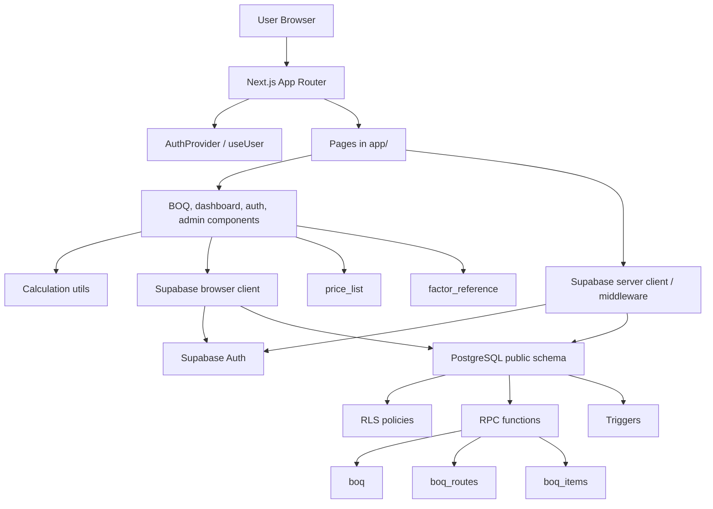
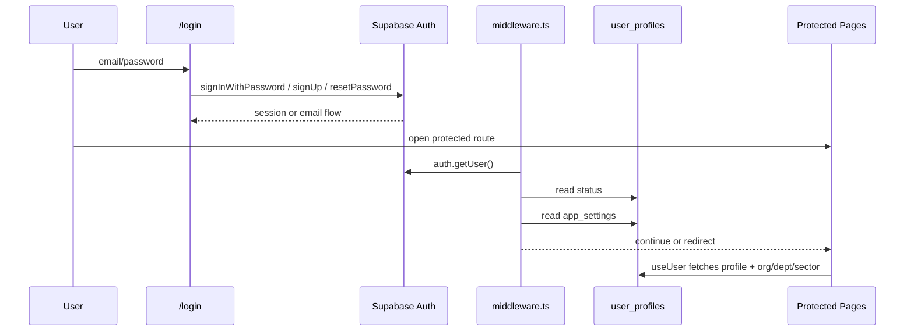
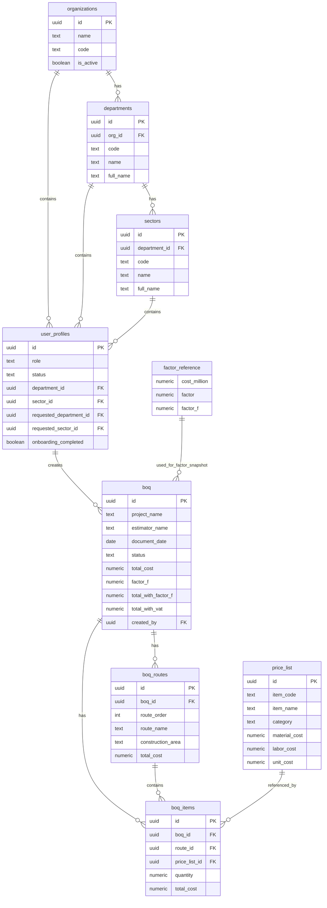
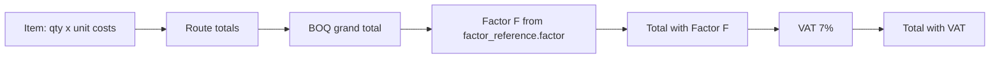

# Codebase and Database Map

**Project:** Conduit BOQ  
**Generated:** 2026-06-11  
**Scope:** อ่านจาก source code, docs, migrations, scripts, tests, และ production Supabase  
**Database source:** ตรวจสอบ production Supabase ผ่าน OAuth MCP project `Conduit Price List` (`otlssvssvgkohqwuuiir`) ณ 2026-06-11

---

## 1. Executive Summary

Conduit BOQ เป็น web application สำหรับจัดทำใบประมาณราคา BOQ งานท่อร้อยสายสื่อสารใต้ดินของ NT โดยแกนระบบคือ Next.js App Router + React + Supabase PostgreSQL/Auth/RLS

ภาพรวมของระบบปัจจุบัน:

- Frontend อยู่ใน `app/` และ `components/` เป็น client-heavy Next.js app
- Auth ใช้ Supabase Auth email/password และ session cookie ผ่าน `@supabase/ssr`
- Authorization มี 2 ชั้น: UI permission ใน `lib/permissions.ts` และ database RLS เป็นตัวบังคับจริง
- BOQ รองรับหลายเส้นทางผ่าน `boq_routes` และรายการต่อ route ผ่าน `boq_items.route_id`
- การ save BOQ edit ใช้ RPC `save_boq_with_routes(p_boq_id, p_boq_data, p_routes)` เพื่อ update BOQ, routes, items แบบ atomic
- Price list ปัจจุบันใช้ `price_list` ตรง ๆ โดยมีรายการมาตรฐานประมาณ 710 รายการตาม docs/scripts
- Factor F ใช้ `factor_reference.factor` เป็นตัวคูณหลัก ไม่ใช่ `factor_reference.factor_f`
- ระบบ print/export มี logic pagination, Factor F supplement, Thai baht text, และ Excel export
- Master Catalog versioning มี migration draft แล้ว แต่ app runtime ปัจจุบันยังไม่ได้ query version-aware catalog เป็นหลัก
- Production DB ยืนยันว่าตาราง public หลักเปิด RLS ครบ, มี BOQ 187 ชุด, routes 209 รายการ, items 1,475 รายการ, price list 710 รายการ และยังไม่มีตาราง Master Catalog versioning
- Production DB ยืนยัน risk สำคัญ: RPC `save_boq_with_routes` เป็น `SECURITY DEFINER`, Postgres privilege check รายงานว่า `public`/`anon`/`authenticated` execute ได้, definition ไม่มี `auth.uid()` guard และไม่มี `search_path` config

---

## 2. Tech Stack

อ้างอิงจาก `package.json` และ `docs/06_engineering/TECH_STACK.md`

| Layer | Technology |
|---|---|
| Framework | Next.js 16.1.1 App Router |
| UI | React 19.2.3, TypeScript 5 |
| Styling | Tailwind CSS 4, shadcn-style components, Radix UI, lucide-react |
| Auth | Supabase Auth |
| Database | Supabase PostgreSQL |
| Supabase SDK | `@supabase/supabase-js` 2.90.1, `@supabase/ssr` 0.8.0 |
| Export | `exceljs`, `file-saver`, `xlsx` |
| Tests | Vitest |
| Hosting target | Vercel |

Version notes:

- `package.json` says version `1.2.0`
- `README.md` badge says `1.4.0`
- `docs/05_calculation/CALCULATION_RULES.md` mentions `v1.6.2`
- Production Supabase reports PostgreSQL `17.6.1.063` / engine `17`
- `docs/06_engineering/TECH_STACK.md` says PostgreSQL 15.x, while `docs/04_data/DATABASE_SCHEMA.md` says PostgreSQL 17

These are documentation/version drift items, not necessarily runtime bugs.

---

## 2.1 Live Database Snapshot

Source: Supabase OAuth MCP against project `Conduit Price List` / `otlssvssvgkohqwuuiir`.

| Item | Production value |
|---|---|
| Project status | `ACTIVE_HEALTHY` |
| Region | `ap-south-1` |
| Database host | `db.otlssvssvgkohqwuuiir.supabase.co` |
| Database version | PostgreSQL `17.6.1.063` |
| Project created | `2026-01-10T08:43:09.069846Z` |
| Edge Functions | none |
| Installed extensions observed | `pgcrypto`, `pg_stat_statements`, `supabase_vault`, `uuid-ossp`, `plpgsql` |

Exact row counts from SQL, not MCP compact estimates:

| Table | Rows | Notes |
|---|---:|---|
| `price_list` | 710 | all 710 active; `ITEM-0001` through `ITEM-0710`; 52 categories |
| `factor_reference` | 37 | cost range 5m to 700m; factor at 30m = `1.1422`, 40m = `1.1359` |
| `boq` | 187 | all rows currently `draft` |
| `boq_routes` | 209 | 2 routes have route total mismatch vs item sums |
| `boq_items` | 1,475 | 5 items have `route_id IS NULL`; no missing BOQ or price list references found |
| `user_profiles` | 20 | 2 active admins, 14 active staff, 4 pending staff |
| `organizations` | 1 | seeded NT organization |
| `departments` | 1 | seeded department |
| `sectors` | 2 | two sector rows |
| `app_settings` | 2 | `allowed_email_domains`, `restrict_email_domain` |

Live data integrity snapshot:

- `price_list.unit_cost` matches `material_cost + labor_cost` for all 710 rows
- 113 BOQs have `total_with_factor_f` and `total_with_vat`
- 113 BOQs have Factor F snapshot columns populated
- 74 BOQs do not have Factor F snapshot columns populated
- 24 BOQs are legacy rows with `created_by IS NULL`
- No BOQ-level mismatch found between BOQ totals and route totals
- Master Catalog versioning tables are absent: `price_list_versions`, `price_list_default_version`, `price_list_audit_logs`
- `app_settings.allowed_email_domains` is `["ntplc.co.th"]`
- `app_settings.restrict_email_domain` is `true`

Security surface observed from production DB:

- All public application tables listed above have RLS enabled
- 28 public RLS policies were observed across app tables
- `boq_select`, `boq_items_select`, and `boq_routes_select` are scoped through policy conditions, not raw public table access
- `price_list` and `factor_reference` are selectable by authenticated users
- `app_settings_select` uses `USING true`, so settings are readable under its policy
- Triggers observed on public app tables:
  - `boq_routes.update_boq_routes_updated_at`
  - `user_profiles.trg_lock_org`
- Function privilege check reports `admin_approve_user`, `admin_reject_user`, `can_approve_boq`, `handle_new_user`, `lock_org_fields_after_onboarding`, `save_boq_with_routes`, and `update_boq_routes_updated_at` as executable by `public` / `anon` / `authenticated`
- Most security-definer functions set `search_path=public`; `save_boq_with_routes` does not
- `save_boq_with_routes` definition does not reference `auth.uid()` and does not raise authorization exceptions in production

## 3. Mental Model



Key idea: the app has almost no custom backend API except the admin delete route. Most data access goes directly from client components/hooks to Supabase, guarded by RLS and RPC authorization.

---

## 4. Repo Structure

| Path | Purpose |
|---|---|
| `app/` | Next.js App Router pages and route handlers |
| `components/boq/` | BOQ create/edit UI, route editor, item table, Factor F summary |
| `components/dashboard/` | Dashboard header, stats, recent BOQ list, action hub |
| `components/auth/` | Auth guard, user menu, user badges |
| `components/ui/` | shadcn/Radix-based UI primitives |
| `lib/supabase/` | SSR/browser/middleware Supabase clients |
| `lib/hooks/` | `useUser`, `useDashboardData` |
| `lib/context/` | Auth context provider |
| `lib/calculation.ts` | Money rounding, safe multiplication, VAT, route allocation |
| `lib/factorF.ts` | Factor F interpolation and snapshot validation |
| `lib/permissions.ts` | Client-side permission checks |
| `lib/printUtils.ts` | Print pagination and text chunking |
| `lib/exportBoqExcel.ts` | Excel workbook generation |
| `migrations/` | Main manual SQL migration ledger |
| `supabase/migrations/` | Schema-only Production baseline used for Local rebuilds |
| `supabase/legacy_migrations/` | Preserved timestamped scripts already applied historically |
| `scripts/` | Import/update/migration helper scripts |
| `tests/` | Vitest tests for calculations, print pagination, migration contracts |
| `docs/` | Canonical and historical documentation |

Approximate code footprint from `wc -l`: 16,427 lines across app/lib/components/tests/migrations.

---

## 5. Runtime Routes

| Route | File | Purpose |
|---|---|---|
| `/` | `app/page.tsx` | Dashboard, stats, recent BOQs, quick actions |
| `/login` | `app/login/page.tsx` | Login/signup/forgot password |
| `/auth/callback` | `app/auth/callback/route.ts` | Exchanges Supabase auth code for session |
| `/blocked` | `app/blocked/page.tsx` | Blocked-domain/user state page |
| `/profile` | `app/profile/page.tsx` | User profile, onboarding org request, password change |
| `/admin` | `app/admin/page.tsx` | Admin user management, approve/reject, domain setting |
| `/api/admin/users/[id]` | `app/api/admin/users/[id]/route.ts` | Admin-only user deletion using service role key |
| `/price-list` | `app/price-list/page.tsx` | Browse/search/paginate active price list |
| `/boq` | `app/boq/page.tsx` | BOQ list, duplicate, delete, search |
| `/boq/create` | `app/boq/create/page.tsx` | Create draft BOQ header |
| `/boq/[id]/edit` | `app/boq/[id]/edit/page.tsx` | Edit project info, routes, items, Factor F snapshot |
| `/boq/[id]/print` | `app/boq/[id]/print/page.tsx` | Print preview, print, Excel export |

---

## 6. Auth and Session Flow



Important files:

- `middleware.ts` delegates to `lib/supabase/middleware.ts`
- `lib/supabase/middleware.ts` refreshes session and redirects unauthenticated users
- `lib/hooks/useUser.ts` listens to `onAuthStateChange` and fetches profile relations
- `lib/context/AuthContext.tsx` exposes `user`, `isLoading`, `signOut`, `refreshProfile`

User statuses:

- `pending`: can access profile, BOQ list/create/edit/print, price list; admin page blocked
- `inactive` / `suspended`: redirected to profile only
- `active`: normal access based on role/RLS

---

## 7. Authorization Model

Client side:

- `lib/permissions.ts` contains `can(user, action, resource, context)`
- Used for UI visibility/hints, not security
- Supports roles: `admin`, `dept_manager`, `sector_manager`, `staff`, `procurement`
- Supports user status handling, pending users, and Separation of Duties checks

Database side:

- RLS policies are the real enforcement layer
- Main applied consolidation is `migrations/008_rls_and_trigger.sql`
- Earlier policies from `005` and `006` are partially superseded
- Draft `009_master_catalog_p0_containment.sql` further tightens `save_boq_with_routes` RPC and table privileges
- Production confirms RLS is enabled on all 10 public app tables: `app_settings`, `boq`, `boq_items`, `boq_routes`, `departments`, `factor_reference`, `organizations`, `price_list`, `sectors`, `user_profiles`
- Production policy snapshot shows 28 policies across these tables
- Production policy roles are mixed: several write policies still use role `public`, while core read policies for `boq`, `boq_items`, `price_list`, `factor_reference`, org tables, and profiles are scoped to `authenticated`

Access summary from canonical docs:

| Role/status | BOQ visibility |
|---|---|
| pending | own BOQ only |
| staff active | own + same sector |
| sector_manager active | sector scope |
| dept_manager active | department scope |
| procurement active | department read scope |
| admin active | all, including legacy |
| legacy BOQ (`created_by IS NULL`) | admin-only by security model |

Known UI mismatch:

- `components/boq/BOQAccessBanner.tsx` says legacy BOQ is "ทุกคนแก้ไขได้"
- `docs/04_data/SECURITY_MODEL.md` says legacy is admin-only and notes UI hint mismatch
- RLS should be treated as authoritative

---

## 8. Domain Model



---

## 9. Database Tables

### Organization and Users

`organizations`

- One top-level organization seeded as NT
- Referenced by departments and user profiles
- Production row count: 1

`departments`

- Division level, unique by `(org_id, code)`
- Default seeded: `ทฐฐ.` / ฝ่ายท่อร้อยสาย
- Production row count: 1

`sectors`

- Sub-division level, unique by `(department_id, code)`
- Default seeded: `วทฐฐ.` / ส่วนวิศวกรรมท่อร้อยสาย
- Production row count: 2

`user_profiles`

- One row per Supabase `auth.users`
- Stores employee profile, role, status, org/dept/sector, requested onboarding org, approval audit
- New users are created by trigger `handle_new_user()`
- `pending` users can request department/sector, but actual org fields are set by admin RPC
- Production row count: 20
- Production role/status split: 2 active admins, 14 active staff, 4 pending staff

### BOQ Core

`boq`

- Header/master record for one BOQ
- Stores project info, estimator, route/construction area legacy text, totals, Factor F snapshot, workflow status, ownership fields
- Important fields: `created_by`, `assigned_to`, `org_id`, `department_id`, `sector_id`
- Legacy support: rows with `created_by IS NULL`
- Production row count: 187, all with status `draft`
- Production legacy rows: 24 with `created_by IS NULL`
- Production Factor F snapshot coverage: 113 populated, 74 missing

`boq_routes`

- Route/segment records under one BOQ
- Added by `002_add_multi_route_support.sql`
- Has per-route totals and `construction_area`
- `ON DELETE CASCADE` from `boq`
- Production row count: 209

`boq_items`

- Line items under BOQ and optionally under route
- `route_id` is nullable for backward compatibility
- Current editor/print both include fallback behavior for legacy `route_id IS NULL` items
- Stores unit costs and total costs as snapshots, not just references
- Production row count: 1,475
- Production integrity: 5 rows have `route_id IS NULL`; no missing BOQ FK or missing price list FK found

### Catalog and Factor

`price_list`

- Standard price catalog, current app reads active items directly
- Fields: `item_code`, `item_name`, `unit`, `material_cost`, `labor_cost`, `unit_cost`, `category`, `is_active`
- Docs/scripts indicate 710 active/current items: base 682 + PN6 28
- Production row count: 710 active rows
- Production range: `ITEM-0001` to `ITEM-0710`
- Production category count: 52
- Production integrity: no mismatch between `unit_cost` and `material_cost + labor_cost`

`factor_reference`

- Reference table for Factor F lookup/interpolation
- App uses column `factor` as "รวมในรูป Factor"
- Column `factor_f` exists but is not the main BOQ multiplier
- Production row count: 37
- Production cost range: 5m to 700m baht
- Production examples: 30m factor = `1.1422`, 40m factor = `1.1359`

`app_settings`

- Stores feature/settings JSON values
- Used for email domain restriction
- Seeded keys: `restrict_email_domain`, `allowed_email_domains`
- Production row count: 2
- Production values: `restrict_email_domain = true`, `allowed_email_domains = ["ntplc.co.th"]`

### Planned Master Catalog Tables

Draft migrations introduce:

- `price_list_versions`
- `price_list_default_version`
- `price_list_audit_logs`
- `price_list.version_id`
- `boq.price_list_version_id`
- `boq_items.category` snapshot

These are draft/planned according to `docs/04_data/MIGRATIONS.md`.

---

## 10. Important RPC Functions and Triggers

Production public functions observed:

| Function | Args | Security | Search path config |
|---|---|---|---|
| `admin_approve_user` | `p_target_id uuid` | `SECURITY DEFINER` | `search_path=public` |
| `admin_reject_user` | `p_target_id uuid, p_note text` | `SECURITY DEFINER` | `search_path=public` |
| `can_approve_boq` | `p_boq_id uuid` | `SECURITY DEFINER` | `search_path=public` |
| `get_my_profile` | none | `SECURITY DEFINER` | `search_path=public` |
| `get_user_role` | `user_id uuid` | `SECURITY DEFINER` | `search_path=public` |
| `handle_new_user` | none | `SECURITY DEFINER` | `search_path=public` |
| `is_admin` | `user_id uuid` | `SECURITY DEFINER` | `search_path=public` |
| `lock_org_fields_after_onboarding` | none | invoker | `search_path=public` |
| `save_boq_with_routes` | `p_boq_id uuid, p_boq_data jsonb, p_routes jsonb` | `SECURITY DEFINER` | none observed |
| `update_boq_routes_updated_at` | none | invoker | `search_path=public` |

Production trigger snapshot on public app tables:

| Table | Trigger | Event | Function |
|---|---|---|---|
| `boq_routes` | `update_boq_routes_updated_at` | `BEFORE UPDATE` | `update_boq_routes_updated_at()` |
| `user_profiles` | `trg_lock_org` | `BEFORE UPDATE` | `lock_org_fields_after_onboarding()` |

Note: `handle_new_user()` is expected to be attached to `auth.users`, so it is not included in the public-table trigger snapshot above.

Repo/migration-derived function map:

| Object | Source | Purpose |
|---|---|---|
| `handle_new_user()` | `004_phase1a_auth_ownership.sql`, updated by `008_pending_user_status.sql` | Creates `user_profiles` row for new Supabase auth user |
| `update_updated_at()` | `004_phase1a_auth_ownership.sql` | Generic timestamp update helper |
| `update_boq_routes_updated_at()` | `002_add_multi_route_support.sql` | Maintains `boq_routes.updated_at` |
| `lock_org_fields_after_onboarding()` | `008_rls_and_trigger.sql` | Blocks users from changing org/request/audit fields after onboarding |
| `admin_approve_user(p_target_id)` | `008_rls_and_trigger.sql` | Admin atomically approves pending user by copying requested dept/sector |
| `admin_reject_user(p_target_id, p_note)` | `008_rls_and_trigger.sql` | Admin rejects user request and stores note |
| `can_approve_boq(p_boq_id)` | `006_phase1a_rls_write_and_approval.sql` | Approval helper with SoD checks |
| `save_boq_with_routes(p_boq_id, p_boq_data, p_routes)` | `20260317_factor_f_supplement.sql` | Saves BOQ header, deletes/recreates routes/items, stores Factor F snapshot |

Security note:

- Production `save_boq_with_routes` is `SECURITY DEFINER`, has no observed `search_path` config, does not reference `auth.uid()`, and Postgres privilege checks report EXECUTE for `public`, `anon`, and `authenticated`
- Applied `save_boq_with_routes` from `supabase/legacy_migrations/20260317_factor_f_supplement.sql` is also `SECURITY DEFINER` and has no explicit auth guard in that file
- Draft `migrations/009_master_catalog_p0_containment.sql` exists specifically to revoke broad EXECUTE, add auth checks, and tighten privileges
- Production evidence suggests draft 009 or an equivalent containment migration is not applied
- This RPC should be treated as the highest-priority database security review item before relying on UI-only edit restrictions
- `update_updated_at()` appears in repo migrations, but was not observed in the production public function list queried on 2026-06-11

---

## 11. BOQ Create/Edit Data Flow

```mermaid
sequenceDiagram
  participant User
  participant Create as /boq/create
  participant Edit as /boq/[id]/edit
  participant Editor as MultiRouteEditor
  participant Factor as FactorFSummary
  participant DB as Supabase DB
  participant RPC as save_boq_with_routes

  User->>Create: Enter estimator/project/date/department
  Create->>DB: insert boq draft with ownership fields
  DB-->>Create: new boq id
  Create-->>Edit: redirect

  Edit->>DB: select boq by id
  Editor->>DB: select boq_routes
  Editor->>DB: select boq_items + price_list(category)
  Editor->>Editor: fallback to default route for legacy items
  User->>Editor: add routes/items/quantities
  Factor->>DB: select factor_reference rows
  Factor->>Editor: emit factor snapshot
  User->>Edit: save
  Edit->>RPC: p_boq_id, p_boq_data, p_routes
  RPC->>DB: update boq
  RPC->>DB: delete old boq_items/routes
  RPC->>DB: insert new routes/items
```

Important implementation details:

- Create page inserts only BOQ header/draft
- Edit page owns final save
- `MultiRouteEditor` keeps routes and items in React state
- Item quantities update totals using `safeItemCalc`
- Route totals are recalculated when `routeItems` changes
- Grand totals feed `FactorFSummary`
- Factor snapshot is stored in `boq` when saving
- Route IDs in UI may be temporary UUIDs until save; RPC creates real route IDs

---

## 12. Calculation Rules



Core functions:

| Function | File | Meaning |
|---|---|---|
| `safeItemCalc(quantity, unitCost)` | `lib/calculation.ts` | Integer-scaled multiplication for item money |
| `multiplyFactor(cost, factor)` | `lib/calculation.ts` | Safe cost x Factor F multiplication |
| `roundMoney(value)` | `lib/calculation.ts` | Standard 2-decimal rounding |
| `calculateVAT(amountBeforeVAT)` | `lib/calculation.ts` | Rounds before VAT, VAT, and total consistently |
| `allocateToRoutes(routeCosts, factor)` | `lib/calculation.ts` | Allocates rounding difference back to final route |
| `calculateInterpolatedFactorFromRefs()` | `lib/factorF.ts` | Finds/interpolates Factor F and truncates to 4 decimals |
| `isFactorSnapshotUsable()` | `lib/factorF.ts` | Validates saved snapshot bracket covers current total |

Rules:

- Item total = quantity x unit cost
- Route total = sum item totals in route
- BOQ total = sum route totals
- Factor F uses `factor_reference.factor`
- Factor F interpolation result is truncated to 4 decimals, not rounded
- VAT is fixed at 7%
- Amount before VAT is rounded first, VAT is rounded second, final total is rounded sum
- No silent default Factor F fallback; missing factor data should block save/print/export

---

## 13. Print and Excel Flow

`app/boq/[id]/print/page.tsx`

- Loads BOQ, routes, items, factor reference
- Falls back to legacy one-route view if no `boq_routes`
- Uses saved Factor F snapshot first when valid
- Uses live factor lookup only for legacy/invalid snapshot fallback
- Builds:
  - route detail pages
  - consolidated item pages for multi-route BOQ
  - summary pages
  - Factor F supplement page
- Uses `lib/printUtils.ts` for chunking, row counts, Thai word segmentation, A4 landscape capacity

`lib/exportBoqExcel.ts`

- Dynamically imports `exceljs` and `file-saver`
- Creates route sheets, consolidated sheet, summary sheet, and Factor F sheet
- Performs integrity check: route totals must match item totals within 0.01 baht
- Downloads `BOQ_<project_name>.xlsx`

---

## 14. Price List and Item Search

Runtime price list usage:

- `app/price-list/page.tsx` loads all active `price_list` rows and paginates client-side
- `components/boq/ItemSearch.tsx` searches active `price_list` rows with category filter and search term
- Natural sort handles category prefixes such as `1.3`, `2.3.1`, `10.1`
- Special BOQ items beginning with `งานวางท่อ` / `งานดันท่อ` open a type modal:
  - Main Duct
  - Riser
  - Steel Pole
  - Riser Service

Data operations:

- `scripts/import-price-list.js` imports from `รายการราคา.xlsx`
- `scripts/update-price-list.js` updates prices from `public/price_list_2568.xlsx`
- `scripts/import-pn6-catalog.js` generates hardened SQL, rollback SQL, and verification manifest for 28 PN6 items
- `scripts/insert_pn6_items.sql` inserts `ITEM-0683` through `ITEM-0710`
- `scripts/verification_manifest.json` contains PN6 expected data

Note: older import/update scripts use anon Supabase client and may fail or become inappropriate under tighter catalog RLS.

---

## 15. Migrations Timeline

Production Supabase migration ledger observed through MCP:

| Version | Name |
|---|---|
| `20260302034458` | `add_fk_indexes` |
| `20260302034725` | `enable_rls_factor_reference` |
| `20260304105854` | `fix_function_search_path` |
| `20260304110029` | `fix_unqualified_table_references` |
| `20260306092423` | `fix_search_path_to_public` |
| `20260316154955` | `add_factor_f_snapshot_columns` |
| `20260316160554` | `update_save_boq_rpc_with_factor_f_snapshot` |

Interpretation:

- Production migration ledger is much shorter than the manual SQL history in `migrations/`
- Some schema objects clearly exist in production even though their original SQL files are not represented one-to-one in the Supabase migration ledger
- Treat repo migration docs as design/history, and treat the MCP ledger plus live schema as the source of truth for current production
- `009_master_catalog_p0_containment.sql`, `010_master_catalog_phase1a_versioning.sql`, and `011_master_catalog_phase1b_hardening.sql` are not reflected in production schema because their target version tables/constraints are absent

Applied / production-relevant according to `docs/04_data/MIGRATIONS.md`:

| File | Status | Summary |
|---|---|---|
| `001_backup_before_migration.sql` | Utility | Pre-migration backup queries |
| `002_add_multi_route_support.sql` | Applied | Adds `boq_routes`, `boq_items.route_id`, Factor F totals |
| `003_add_construction_area_to_routes.sql` | Applied | Adds route construction area |
| `004_phase1a_auth_ownership.sql` | Applied | Adds org/dept/sector/profile/BOQ ownership |
| `005_phase1a_seed_and_rls.sql` | Applied, partially superseded | Seeds NT org and initial RLS |
| `006_phase1a_rls_write_and_approval.sql` | Applied, partially superseded | Write policies and approval helper |
| `007_add_requested_org_columns.sql` | Applied | Onboarding request/audit columns |
| `007_app_settings.sql` | Applied | App settings and domain restriction settings |
| `007b_add_onboarding_completed.sql` | Applied manually | Adds onboarding completion flag |
| `008_pending_user_status.sql` | Applied | New signups default to pending |
| `008_rls_and_trigger.sql` | Applied | Consolidated BOQ select RLS, org lock trigger, admin RPC |
| `supabase/legacy_migrations/20260317_factor_f_supplement.sql` | Applied legacy artifact | Factor F snapshot columns and save RPC |
| `supabase/migrations/20260620100634_production_baseline.sql` | Local baseline only | Current schema snapshot for deterministic Local rebuilds |

Draft / planned:

| File | Status | Summary |
|---|---|---|
| `009_master_catalog_p0_containment.sql` | Draft | RPC containment and tighter RLS/privileges |
| `010_master_catalog_phase1a_versioning.sql` | Draft | Versioned price list schema and version-aware save RPC |
| `010a_master_catalog_phase1a_indexes.sql` | Draft runbook | Concurrent indexes |
| `011_master_catalog_phase1b_hardening.sql` | Draft | Enforce BOQ price list version and immutability |

Legacy/superseded:

- `supabase/legacy_migrations/20250115_rls_policies.sql` contains early broad/public policies and is superseded in part by later migrations

---

## 16. Master Catalog v26 State

Production state:

- `price_list_versions` does not exist
- `price_list_default_version` does not exist
- `price_list_audit_logs` does not exist
- `price_list` has 710 active rows and is still the direct runtime catalog
- No production evidence of version-bound BOQ/item saves was observed

Current app behavior:

- Reads `price_list` directly
- Does not bind new BOQs to `price_list_version_id` in create page
- Does not filter `ItemSearch` by BOQ price list version

Draft migration target:

- Add version tables
- Backfill 2568.0.0 version
- Add default version pointer
- Add `boq.price_list_version_id`
- Enforce `price_list.version_id` compatibility in save RPC
- Snapshot `boq_items.category`
- Later harden `boq.price_list_version_id NOT NULL`

Interpretation:

- The schema design for historical catalog stability is present
- Runtime code is still mostly pre-versioning
- Applying draft migrations requires corresponding app changes before hardening

---

## 17. Tests

Local verification run:

- `npm test` passed on 2026-06-11
- Result: 4 test files, 17 tests passed

Vitest test files:

| File | Coverage |
|---|---|
| `tests/calculation.test.ts` | rounding, Factor multiplication, VAT, item calc, route allocation |
| `tests/factor-f.test.ts` | interpolation, null ref behavior, snapshot validation |
| `tests/print-utils.test.ts` | print pagination helpers |
| `tests/master-catalog-migrations.test.ts` | SQL contract checks for draft migrations |

Manual/security tests:

- `scripts/test-rls-security.sql` documents 10 RLS regression scenarios, mostly manual impersonation tests

---

## 18. Key Observations and Risks

These are not edits, just reading notes from current repo state and production DB snapshot.

1. `save_boq_with_routes` security is the top production risk
   - Production RPC is `SECURITY DEFINER`
   - Postgres privilege check reports EXECUTE for `public`, `anon`, and `authenticated`
   - Production function definition does not reference `auth.uid()`
   - Production function has no observed `search_path` config
   - Draft 009 exists to close exactly this exposure, but production schema indicates draft 009 is not applied

2. UI read-only state is incomplete
   - `EditBOQPage` shows a read-only warning when `canEdit` is false
   - `MultiRouteEditor` still appears editable and save button remains available
   - Security must rely on RPC/RLS, not UI

3. BOQ list row actions are broad
   - `/boq` shows edit/print/copy/delete actions for every visible row
   - Delete/copy do not visibly call `can()` per row before rendering
   - RLS should block unauthorized database writes, but UX may confuse users

4. Domain setting key drift
   - `login` and `admin` use `restrict_email_domain`
   - migration seeds `restrict_email_domain` and `allowed_email_domains`
   - middleware reads `allowed_email_domain` singular and expects a lowercase string
   - Production settings contain plural `allowed_email_domains = ["ntplc.co.th"]`
   - This can make domain restriction behavior inconsistent between login UI and middleware

5. Legacy BOQ messaging drift
   - Security docs/RLS say legacy BOQ is admin-only
   - `BOQAccessBanner` copy says legacy BOQ is editable by everyone

6. Version/documentation drift
   - package/docs/README disagree on app version
   - PostgreSQL version differs between docs
   - Price list count differs in older domain docs: 682 vs newer docs 710

7. Supabase client duplication
   - Newer code uses `lib/supabase/client.ts` with browser singleton and env guard
   - `lib/supabase.ts` also creates a client at module load and exports interfaces
   - Several files import values from `lib/supabase.ts`; this can matter during build if env vars are missing

8. Master Catalog is half-designed but not fully runtime-integrated
   - Draft migrations are detailed and tested at SQL contract level
   - App code still uses the non-versioned `price_list` path
   - Production confirms versioning tables are absent

9. Production data is still mostly draft/work-in-progress
   - All 187 BOQs are `draft`
   - 24 BOQs are legacy rows with `created_by IS NULL`
   - 74 BOQs have no Factor F snapshot yet

10. Production line-item integrity is mostly healthy but has route cleanup work
   - No missing BOQ FK or missing price list FK found
   - No price list unit-cost mismatch found
   - 5 BOQ items still have `route_id IS NULL`
   - 2 route rows have total mismatch vs item sums, though BOQ-level route total mismatch count is 0

11. Production migration ledger drift should be reconciled
   - Supabase reports only seven timestamped migrations in its ledger
   - Repo contains a much longer manual SQL migration history
   - Future migrations should be applied through a single tracked path to avoid losing provenance

---

## 19. Recommended Reading Order

To understand the project fastest:

1. This file
2. `docs/01_overview/PROJECT_OVERVIEW.md`
3. `docs/02_architecture/ARCHITECTURE.md`
4. `docs/03_domain/DOMAIN_MODEL.md`
5. `docs/04_data/DATABASE_SCHEMA.md`
6. `docs/04_data/SECURITY_MODEL.md`
7. `docs/05_calculation/CALCULATION_RULES.md`
8. `docs/05_calculation/FACTOR_F.md`
9. `app/boq/[id]/edit/page.tsx`
10. `components/boq/MultiRouteEditor.tsx`
11. `app/boq/[id]/print/page.tsx`
12. `supabase/legacy_migrations/20260317_factor_f_supplement.sql`
13. `migrations/009_master_catalog_p0_containment.sql`
14. `migrations/010_master_catalog_phase1a_versioning.sql`

---

## 20. Quick File Index

Most important files for future changes:

- Auth/session: `lib/supabase/middleware.ts`, `lib/hooks/useUser.ts`, `lib/context/AuthContext.tsx`
- Permissions: `lib/permissions.ts`, `docs/04_data/SECURITY_MODEL.md`, `migrations/008_rls_and_trigger.sql`
- BOQ create/edit: `app/boq/create/page.tsx`, `app/boq/[id]/edit/page.tsx`, `components/boq/MultiRouteEditor.tsx`
- Item search/table: `components/boq/ItemSearch.tsx`, `components/boq/LineItemsTable.tsx`
- Calculation: `lib/calculation.ts`, `lib/factorF.ts`, `components/boq/FactorFSummary.tsx`
- Print/export: `app/boq/[id]/print/page.tsx`, `lib/printUtils.ts`, `lib/exportBoqExcel.ts`
- Database schema: `docs/04_data/DATABASE_SCHEMA.md`, `docs/04_data/MIGRATIONS.md`
- Applied save RPC: `supabase/legacy_migrations/20260317_factor_f_supplement.sql`
- Draft hardening/versioning: `migrations/009_master_catalog_p0_containment.sql`, `migrations/010_master_catalog_phase1a_versioning.sql`, `migrations/011_master_catalog_phase1b_hardening.sql`
