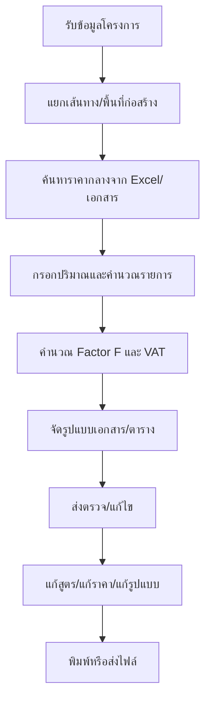
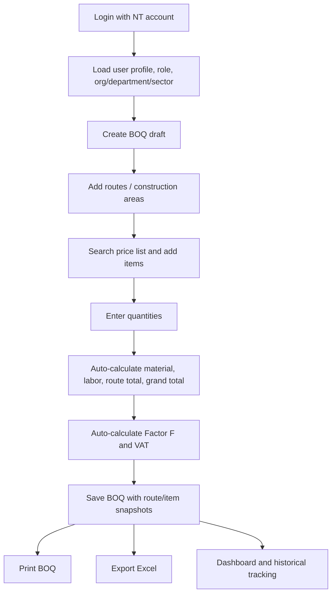
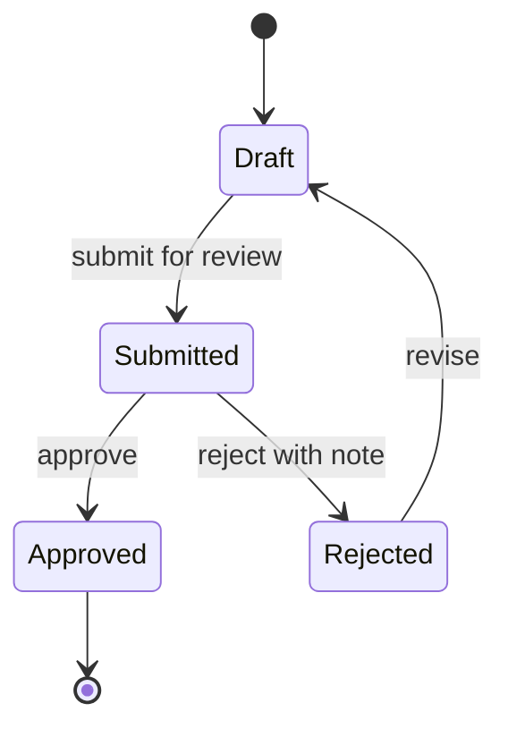

# Product Brief and Measurement Plan

**Project:** Conduit BOQ  
**Thai name:** ระบบประมาณราคาท่อร้อยสายสื่อสารใต้ดิน  
**Document type:** Product Brief / Business Case / Measurement Plan  
**Generated:** 2026-06-11  
**Source:** Repo documentation, source code review, and production Supabase snapshot from `Conduit Price List` (`otlssvssvgkohqwuuiir`)  

---

## 1. Executive Summary

Conduit BOQ เป็น web application สำหรับช่วยพนักงาน NT จัดทำ BOQ งานท่อร้อยสายสื่อสารใต้ดินให้เร็วขึ้น ถูกต้องขึ้น และตรวจสอบย้อนกลับได้มากขึ้น โดยระบบรวม price list มาตรฐาน, multi-route BOQ, การคำนวณ Factor F, VAT 7%, การพิมพ์เอกสาร, Excel export, authentication, RBAC และ Supabase RLS ไว้ใน workflow เดียว

ปัญหาหลักที่ระบบแก้คือการทำ BOQ แบบ manual ซึ่งใช้เวลานาน มีโอกาสคำนวณผิด ราคากลางอาจไม่ตรงกันระหว่างผู้ใช้งาน และยากต่อการควบคุมสิทธิ์ตามโครงสร้างองค์กร

เป้าหมายหลักของระบบคือทำให้การจัดทำ BOQ เปลี่ยนจากงานเอกสาร/Excel ที่พึ่งพาความจำและการคัดลอก เป็น workflow ที่มีข้อมูลมาตรฐาน คำนวณอัตโนมัติ และมีข้อมูลกลางสำหรับติดตามต่อยอด

สถานะ production ณ 2026-06-11:

| Area | Current production snapshot |
|---|---:|
| BOQ | 187 records |
| BOQ routes | 209 records |
| BOQ items | 1,475 records |
| Standard price list | 710 active items |
| Price categories | 52 categories |
| Factor F reference rows | 37 rows |
| User profiles | 20 users |
| Edge Functions | 0 |

---

## 2. Purpose of This Document

เอกสารนี้ใช้เพื่ออธิบายระบบในมุม product/business ไม่ใช่ technical spec ล้วน ๆ โดยตอบคำถามสำคัญเหล่านี้:

- ทำระบบนี้ไปเพื่ออะไร
- ระบบช่วยลด pain point อะไร
- ผู้ใช้งานหลักคือใคร
- Workflow ก่อนและหลังใช้ระบบต่างกันอย่างไร
- ข้อดีที่จับต้องได้คืออะไร
- จะวัดความสำเร็จของระบบอย่างไร
- ตอนนี้มี baseline อะไรแล้ว และยังขาดข้อมูลวัดผลอะไร
- ควรเดินต่อใน phase ถัดไปอย่างไร

เอกสารนี้เหมาะสำหรับ:

- ผู้บริหารหรือ stakeholder ที่ต้องเข้าใจเหตุผลของโครงการ
- Product owner หรือ project owner ที่ต้องกำหนด priority
- ทีมพัฒนา/ดูแลระบบที่ต้องรู้ว่าสิ่งที่ build อยู่ตอบโจทย์อะไร
- ทีมปฏิบัติงานที่ต้องเห็นภาพ workflow และประโยชน์การใช้งาน

---

## 3. Background and Problem

งานประมาณราคาท่อร้อยสายสื่อสารใต้ดินมีรายละเอียดสูง เพราะต้องประกอบด้วยรายการวัสดุ ค่าแรง ปริมาณงาน หลายเส้นทาง ราคามาตรฐาน Factor F และ VAT ก่อนออกเป็นเอกสารที่ใช้ต่อในงานงบประมาณหรือการพิจารณาโครงการ

ก่อนมีระบบกลาง งานลักษณะนี้มักมีปัญหา:

| Problem | Impact |
|---|---|
| ทำ BOQ ด้วย manual/Excel ใช้เวลานาน | พนักงานเสียเวลาซ้ำกับงานคำนวณและจัดรูปแบบเอกสาร |
| ราคากลางกระจายหลายไฟล์หรือหลาย version | BOQ แต่ละชุดอาจใช้ราคาคนละฐาน |
| คำนวณ Factor F/VAT ด้วยมือหรือสูตรเฉพาะไฟล์ | เสี่ยง error และตรวจสอบยาก |
| งานหลายเส้นทางรวมในไฟล์เดียวได้ยาก | รายละเอียด route/segment ไม่ชัดเจน |
| ไม่มี access control ตามฝ่าย/ส่วน | ควบคุมข้อมูลและความรับผิดชอบได้ยาก |
| ไม่มีฐานข้อมูลกลาง | วัดปริมาณงาน ยอดประมาณราคา adoption และคุณภาพข้อมูลได้ยาก |

---

## 4. Objectives

### 4.1 Primary Objective

ให้พนักงาน NT สามารถสร้าง BOQ งานท่อร้อยสายสื่อสารใต้ดินได้รวดเร็ว ถูกต้อง และใช้ราคามาตรฐานเดียวกัน โดยมีระบบกลางรองรับการจัดเก็บ ค้นหา พิมพ์/export และควบคุมสิทธิ์ตามโครงสร้างองค์กร

### 4.2 Product Objectives

| Objective | Meaning |
|---|---|
| ลดเวลาทำ BOQ | จากงาน manual 2-3 ชั่วโมง ให้เหลือเป้าหมายไม่เกิน 30 นาทีต่อ BOQ |
| เพิ่มความถูกต้อง | ใช้ price list มาตรฐานและ calculation logic เดียวกัน |
| รองรับงานจริงที่มีหลายเส้นทาง | 1 BOQ สามารถมีหลาย route/segment พร้อมยอดแยกและยอดรวม |
| ลดความผิดพลาดจากการคัดลอกไฟล์ | เก็บ BOQ, items, routes และ cost snapshot ในฐานข้อมูล |
| เพิ่ม visibility | dashboard แสดงจำนวน BOQ, มูลค่า, status และข้อมูลราคากลาง |
| ควบคุมสิทธิ์ตามองค์กร | ใช้ Supabase Auth, user profile, role, status, RLS |
| เตรียมต่อยอด governance | รองรับแนวทาง approval workflow, catalog versioning, audit log, analytics |

### 4.3 Non-Objectives

สิ่งต่อไปนี้ยังไม่ใช่ scope หลักของระบบปัจจุบัน:

- Inventory management หรือการตัด stock วัสดุจริง
- Procurement execution เช่น purchase order, vendor management
- Field operation เช่น work order, crew dispatch, as-built จากหน้างาน
- External API integration กับระบบอื่น
- Mobile-first/offline-first usage
- Full approval workflow แบบ submitted/approved/rejected ที่ enforce ครบทั้ง UI และ DB

---

## 5. Target Users and Stakeholders

| Role | Thai | Primary job in system | Value received |
|---|---|---|---|
| `staff` | พนักงาน | สร้างและแก้ไข BOQ ของตนเอง | ทำงานเร็วขึ้น ลดการคำนวณมือ |
| `sector_manager` | ผู้จัดการส่วน | ดู/ตรวจ BOQ ในส่วน | เห็นงานของทีมและมูลค่ารวม |
| `dept_manager` | ผู้จัดการฝ่าย | ดู/ตรวจ BOQ ระดับฝ่าย | เห็นภาพรวมฝ่ายและใช้ประกอบการตัดสินใจ |
| `procurement` | จัดซื้อจัดจ้าง | อ่านข้อมูล BOQ ที่ผ่าน workflow ในอนาคต | ใช้ข้อมูลมาตรฐานต่อในกระบวนการจัดซื้อ |
| `admin` | ผู้ดูแลระบบ | จัดการผู้ใช้ สิทธิ์ setting และข้อมูลรวม | ควบคุมระบบและสนับสนุนผู้ใช้ |
| Project owner | เจ้าของโครงการ | กำหนดทิศทางและประเมินผล | เห็น adoption, quality, impact, roadmap |

Production user baseline ณ 2026-06-11:

| User status/role | Count |
|---|---:|
| Active admins | 2 |
| Active staff | 14 |
| Pending staff | 4 |
| Total profiles | 20 |

---

## 6. Product Scope

### 6.1 In Scope Today

| Capability | Current behavior |
|---|---|
| Authentication | Email/password via Supabase Auth |
| Domain restriction | Configured through `app_settings` |
| User onboarding | New users can be pending before approval |
| Role-based access | UI permission + database RLS |
| BOQ create/edit | Create draft BOQ and edit project/routes/items |
| Multi-route BOQ | Store routes in `boq_routes` and items in `boq_items.route_id` |
| Price list lookup | 710 active standard items in production |
| Factor F calculation | Uses `factor_reference.factor`; stores snapshot on BOQ |
| VAT calculation | 7% VAT calculation for print/export |
| Print | BOQ print view with route detail, summary, Factor F supplement |
| Excel export | Export BOQ data to Excel workbook |
| Dashboard | Shows user/team stats, recent BOQs, price count/category count |

### 6.2 Planned or Partially Designed

| Area | Current status |
|---|---|
| Full approval workflow | Planned for Phase 3; production BOQs are all `draft` today |
| Master Catalog versioning | Draft migrations exist; production tables not yet present |
| Catalog audit log | Planned with Master Catalog/governance phase |
| Analytics/reporting | Basic dashboard exists; deeper reports planned |
| Notifications | Planned future enhancement |
| PWA/offline/mobile optimization | Planned future enhancement |

---

## 7. Workflow

### 7.1 Before: Manual / Spreadsheet Workflow



Pain points:

- ข้อมูลราคาและสูตรอาจอยู่หลายที่
- คัดลอกไฟล์เดิมแล้วเกิด error ได้ง่าย
- ตรวจสอบยากว่าค่าไหนมาจากสูตรหรือมาจากการแก้ด้วยมือ
- ถ้างานมีหลาย route การจัดรวม/แยกยอดซับซ้อนขึ้น
- ข้อมูลหลังจบงานไม่กลายเป็นฐานข้อมูลกลางโดยอัตโนมัติ

### 7.2 After: Conduit BOQ Workflow



What changes:

- Price list is selected from database, not copied manually
- Route totals and BOQ totals are calculated consistently
- Factor F and VAT follow shared logic
- BOQ can be printed/exported from saved data
- Access follows user role/status and organization structure
- Data becomes measurable because it is stored in structured tables

### 7.3 Future Workflow With Approval



Current note: production data shows all 187 BOQs are still `draft` as of 2026-06-11. Approval workflow should be treated as roadmap/future governance until status transitions are fully implemented and enforced.

---

## 8. Benefits

### 8.1 Benefits for Staff

- ลดเวลาค้นหาราคากลางและตั้งสูตรเอง
- ลดการคำนวณซ้ำซ้อนระหว่างวัสดุ ค่าแรง Factor F และ VAT
- จัดการ BOQ หลายเส้นทางในหน้าจอเดียว
- พิมพ์หรือ export เอกสารจากข้อมูลเดียวกัน
- ใช้ BOQ เดิมเป็นต้นแบบหรือคัดลอกงานใกล้เคียงได้ง่ายขึ้น

### 8.2 Benefits for Managers

- เห็นจำนวน BOQ และมูลค่ารวมตาม scope ที่มีสิทธิ์
- ตรวจสอบข้อมูลจากฐานเดียว ลดการไล่ถามไฟล์รายคน
- วางรากฐานสำหรับ approval workflow และ audit trail
- ช่วยเปรียบเทียบปริมาณงานหรือมูลค่างานระหว่างทีม/ช่วงเวลาในอนาคต

### 8.3 Benefits for Admin and Governance

- จัดการ user status และ role ได้จากระบบ
- จำกัดการเข้าถึงตามองค์กร/ฝ่าย/ส่วน
- มี production data กลางสำหรับวิเคราะห์คุณภาพข้อมูล
- เตรียมต่อยอด price catalog versioning และ audit log

### 8.4 Organizational Benefits

- ราคากลางเป็นมาตรฐานเดียวกัน
- ข้อมูล BOQ เก็บเป็น structured data ไม่ใช่แค่ไฟล์ปลายทาง
- ลดความเสี่ยงจาก manual calculation error
- สร้าง foundation สำหรับ budgeting, reporting, procurement handoff, GIS/as-built/asset management ในอนาคต

---

## 9. Measurement Framework

### 9.1 North Star Metric

**จำนวน BOQ ที่จัดทำสำเร็จด้วยข้อมูลราคามาตรฐานและผ่าน calculation integrity check**

เหตุผล: metric นี้สะท้อนทั้ง adoption, accuracy และความพร้อมของข้อมูลที่จะนำไปใช้ต่อ

### 9.2 KPI Summary

| KPI | Baseline / current signal | Target | Measurement source |
|---|---:|---:|---|
| Time to create BOQ | Manual baseline 2-3 hours from docs | < 30 minutes | Need event logging or user time study |
| BOQ adoption | 187 BOQs in production | 80% of BOQ-creating staff | `boq`, `user_profiles`, active creator count |
| Active user adoption | 20 profiles, 16 active users | Trend upward month over month | `user_profiles`, auth activity logs |
| Price list completeness | 710 active items, 52 categories | Maintained per official catalog | `price_list` |
| Price list calculation integrity | 0 unit-cost mismatch found | 0 mismatch | SQL check on `price_list` |
| Factor F reference integrity | 37 rows present | Complete verified reference table | `factor_reference` checksum/range checks |
| BOQ total integrity | 0 BOQ-vs-route mismatch found | 0 mismatch | SQL integrity checks |
| Route total integrity | 2 route mismatches found | 0 mismatch | SQL integrity checks |
| Legacy cleanup | 24 legacy BOQs with `created_by IS NULL` | Reduce or explicitly classify | `boq.created_by` |
| Factor F snapshot coverage | 113 populated, 74 missing | 100% for newly saved BOQs | `boq.factor_f_*` columns |
| Workflow maturity | All 187 BOQs are `draft` | Real submitted/approved flow after Phase 3 | `boq.status`, future audit log |
| System uptime | Not measured in repo | 99.5% | Vercel/Supabase monitoring |

### 9.3 Measurement Levels

| Level | What to measure | Why it matters |
|---|---|---|
| Adoption | users, BOQ count, repeat creators, monthly active users | Shows whether people actually use the system |
| Efficiency | time from create to first complete save/print/export | Shows whether workflow is faster than manual process |
| Accuracy | price integrity, route total integrity, BOQ total integrity | Shows whether system reduces calculation risk |
| Governance | role/status coverage, legacy BOQ count, approval status transitions | Shows whether control model is becoming real |
| Output | print/export count, completed BOQ count, total estimated value | Shows business throughput and downstream usefulness |
| Reliability | uptime, error rate, failed saves/exports | Shows whether system can be trusted operationally |

---

## 10. Measurement Plan

### 10.1 What Can Be Measured Today

These can be measured directly from the current production database:

| Metric | Query source |
|---|---|
| Total BOQs | `count(*) from boq` |
| BOQs by status | `boq.status` |
| BOQs by creator/department/sector | `boq.created_by`, `department_id`, `sector_id` |
| Total estimated value | `boq.total_with_vat`, fallback to `total_with_factor_f`, fallback to `total_cost` |
| Route/item volume | `boq_routes`, `boq_items` |
| Price list count/categories | `price_list` |
| Unit cost mismatch | compare `unit_cost` vs `material_cost + labor_cost` |
| Factor F reference coverage | `factor_reference` |
| User role/status | `user_profiles.role`, `user_profiles.status` |
| Legacy BOQ count | `boq.created_by is null` |

### 10.2 What Should Be Instrumented Next

The current schema can count records, but cannot fully explain user behavior or time-to-completion. Recommended measurement instrumentation:

| Event / data point | Recommended purpose |
|---|---|
| `boq_created` | Start time for time-to-create metric |
| `boq_first_item_added` | Whether users can find and add catalog items |
| `boq_saved_with_totals` | Completion signal for draft quality |
| `boq_printed` | Output/completion signal |
| `boq_exported_excel` | Downstream usage signal |
| `boq_submitted` | Future workflow signal |
| `boq_approved` / `boq_rejected` | Future governance signal |
| `price_item_search_no_result` | Catalog gap detection |
| `factor_reference_missing` | Calculation reference issue detection |
| `save_rpc_failed` | Reliability and security monitoring |

### 10.3 Suggested Product Analytics Tables

For future measurement without relying only on browser analytics:

| Table | Purpose |
|---|---|
| `boq_activity_events` | Append-only user/system events for create, save, print, export, submit, approve |
| `boq_status_history` | Track status transitions, actor, timestamp, note |
| `price_list_audit_logs` | Track catalog changes after Master Catalog phase |
| `system_health_daily` | Optional daily aggregate for uptime/errors if external monitoring is not enough |

Minimal `boq_activity_events` shape:

```sql
event_id uuid primary key,
boq_id uuid references boq(id),
actor_id uuid references auth.users(id),
event_type text not null,
event_at timestamptz not null default now(),
metadata jsonb not null default '{}'
```

---

## 11. Baseline Interpretation

Production data already shows that the product is being used:

- 187 BOQ records have been created
- 1,475 line items have been stored
- 209 route records exist, confirming multi-route usage
- 710 active price items are available
- 20 user profiles exist, with 16 active users and 4 pending users

However, current data also shows areas that need governance cleanup:

- All BOQs are `draft`, so approval workflow is not yet a real production process
- 24 BOQs are legacy records with no `created_by`
- 74 BOQs do not yet have Factor F snapshot fields populated
- 5 BOQ items still have no `route_id`
- 2 route rows have total mismatch vs item sums
- Master Catalog versioning tables are not present yet

Interpretation: the system has enough real usage to justify product hardening, but it should not be presented as a fully governed approval platform yet. It is currently strongest as a standardized BOQ creation, calculation, print, export, and data-centralization tool.

---

## 12. Success Criteria

### 12.1 Short-Term Success

Within the next operating cycle, the product should be considered successful if:

- Staff can create and print/export BOQ without relying on separate manual calculation files
- Price list count and unit-cost integrity remain clean
- New BOQs save Factor F snapshot consistently
- Route total mismatches are reduced to zero
- Active users continue using the system for real BOQ creation
- Admin can onboard/approve users without manual database edits

### 12.2 Medium-Term Success

The system becomes more valuable when:

- BOQ lifecycle moves beyond `draft` into real submitted/approved states
- Managers can review team/department BOQs from dashboard/reporting
- Price list versioning protects historical BOQs from future catalog changes
- Audit logs make changes explainable
- Time-to-create is measured with events, not only estimated by users

### 12.3 Long-Term Success

The system becomes a core operational data platform when:

- BOQ data connects to budgeting, procurement handoff, GIS/as-built, or asset management
- Managers can compare project cost patterns across time, department, route type, or catalog version
- Catalog governance is reliable enough for official yearly price updates
- Approval status and audit history are trusted as official workflow evidence

---

## 13. Risks and Mitigations

| Risk | Current signal | Recommended mitigation |
|---|---|---|
| RPC write security | `save_boq_with_routes` is `SECURITY DEFINER` and broad executable in production | Prioritize P0 containment migration and explicit auth/ownership checks |
| Domain setting drift | Production uses `allowed_email_domains`; middleware reads singular key | Align setting key usage across login/admin/middleware |
| Workflow overclaiming | Production BOQs are all `draft` | Present approval as roadmap until implemented end-to-end |
| Catalog version drift | Versioning migrations exist as drafts but production tables absent | Finish Master Catalog phase before official yearly catalog switching |
| Historical data quality | Legacy BOQs and missing route/snapshot rows exist | Run cleanup/backfill plan with audit trail |
| Measurement gaps | Time-to-create and output events are not logged | Add activity/status event tables |
| Documentation drift | Docs mention 682, 710, and multiple app versions | Treat live DB + current source as truth and refresh docs periodically |

---

## 14. Roadmap Framing

### Phase 1: Foundation

Current system foundation:

- Auth and user profiles
- BOQ CRUD
- Multi-route editor
- Standard price list
- Factor F and VAT calculation
- Print and Excel export
- Dashboard
- Admin user management
- RLS/RBAC foundation

### Phase 2: Governance and Catalog Hardening

Recommended next product/business framing:

- Secure `save_boq_with_routes`
- Reconcile RLS/function privileges
- Add Master Catalog versioning
- Add price list auditability
- Clean legacy data and route total mismatches
- Add event logging for measurement

### Phase 3: Approval and Reporting

Future workflow maturity:

- Submit/review/approve/reject lifecycle
- Status history and comments
- Department/sector reporting
- Notifications
- KPI dashboard
- Export/reporting for management

### Phase 4: Operational Platform

Longer-term expansion:

- Budget planning integration
- Procurement handoff
- GIS/route mapping linkage
- As-built and asset management integration
- Predictive/smart BOQ generation

---

## 15. Recommended Decision Points

Before presenting or scaling the system further, stakeholders should decide:

1. Should Conduit BOQ be positioned now as a BOQ creation/calculation system, or as an approval workflow system?
2. Who owns the official price list and yearly catalog update process?
3. What is the required evidence for an official BOQ: print output, Excel export, DB status, approval log, or signed document?
4. Which KPI matters most in the next phase: speed, accuracy, adoption, governance, or reporting?
5. Should legacy BOQs be migrated into full ownership/route/snapshot structure, or kept as historical admin-only data?
6. What security hardening must be completed before wider rollout?

Recommended answer for current state:

- Position the system as a standardized BOQ creation, calculation, print/export, and data-centralization product
- Treat approval workflow and catalog governance as next-phase product work
- Prioritize security containment and measurement instrumentation before broad operational claims

---

## 16. One-Page Narrative

Conduit BOQ ช่วยเปลี่ยนกระบวนการจัดทำประมาณราคางานท่อร้อยสายสื่อสารใต้ดินจากการทำงาน manual ที่กระจายอยู่ในไฟล์และสูตรเฉพาะบุคคล มาเป็นระบบกลางที่ใช้ราคามาตรฐานเดียวกัน คำนวณยอดวัสดุ ค่าแรง Factor F และ VAT อัตโนมัติ รองรับหลายเส้นทางในหนึ่งโครงการ และส่งออกเอกสารสำหรับใช้งานต่อได้

ประโยชน์หลักคือช่วยลดเวลาการทำ BOQ ลดความเสี่ยงจากการคำนวณผิด เพิ่มความสม่ำเสมอของราคากลาง และสร้างฐานข้อมูลกลางที่สามารถนำไปวิเคราะห์ต่อได้ ปัจจุบัน production มีข้อมูลใช้งานจริงแล้ว 187 BOQs, 1,475 line items, 710 price list items และ 20 user profiles แสดงว่าระบบเริ่มมีฐาน adoption สำหรับต่อยอด

อย่างไรก็ตาม ระบบควรถูกสื่อสารตามสถานะจริง: วันนี้ระบบแข็งแรงในฐานะเครื่องมือสร้าง/คำนวณ/พิมพ์/export BOQ แต่ approval workflow, catalog versioning, audit log และ measurement instrumentation ยังเป็นงาน phase ถัดไป การเดินหน้าควรเน้น hardening ด้าน security, ทำให้ price catalog versioning พร้อมใช้งาน, เพิ่ม event logging เพื่อวัด time-to-create และทำ reporting สำหรับผู้บริหาร

---

## 17. Related Documents

- [Codebase and Database Map](./CODEBASE_DATABASE_MAP.md)
- [Project Overview](./01_overview/PROJECT_OVERVIEW.md)
- [PRD](./PRD.md)
- [Domain Rules](./03_domain/DOMAIN_RULES.md)
- [Domain Model](./03_domain/DOMAIN_MODEL.md)
- [Implementation Plan](./01_overview/IMPLEMENTATION_PLAN.md)
- [Roadmap](./01_overview/ROADMAP.md)
