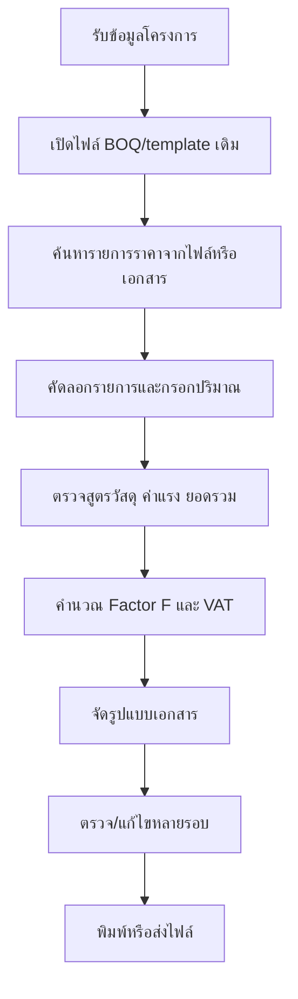
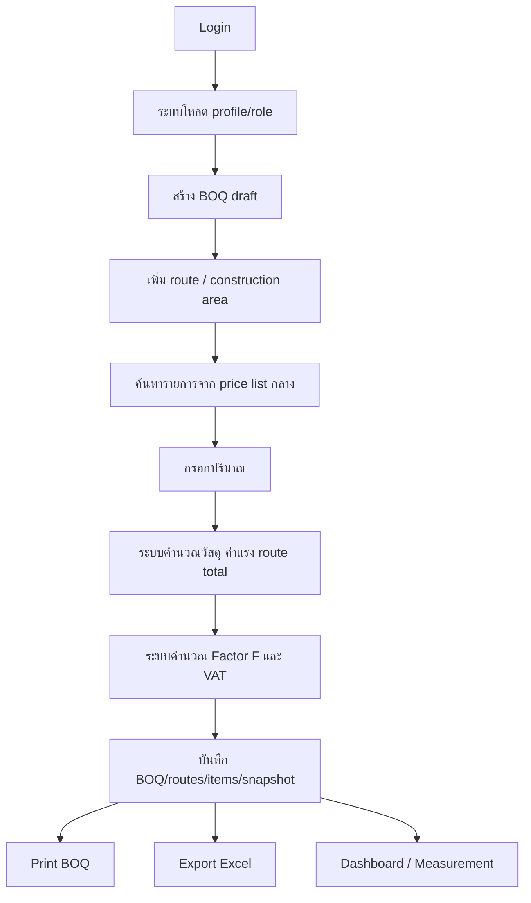
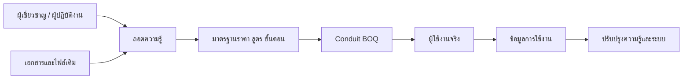

# Before / After Workflow

**หัวข้อ:** การเปลี่ยนกระบวนการจัดทำ BOQ จาก manual workflow เป็น digital knowledge workflow  

---

## 1. Workflow เดิม

### Pain Points

| จุดเสี่ยง | รายละเอียด |
|---|---|
| หลายไฟล์ หลาย version | ไม่แน่ใจว่าใช้ราคากลางล่าสุดหรือไม่ |
| สูตรคำนวณอยู่ในไฟล์ | เสี่ยงจากการคัดลอก cell หรือแก้สูตรผิด |
| ความรู้พึ่งพาบุคคล | ผู้เชี่ยวชาญต้องช่วยตรวจซ้ำ |
| ตรวจสอบย้อนกลับยาก | ไม่เห็นที่มาชัดเจนของรายการและราคา |
| วัดผลยาก | ไม่มี structured data สำหรับนับหรือวิเคราะห์ |

---

## 2. Workflow ใหม่ผ่าน Conduit BOQ

### Improvements

| ด้าน | ก่อน | หลัง |
|---|---|---|
| ราคากลาง | ไฟล์/เอกสารกระจาย | `price_list` กลาง 710 active items |
| การคำนวณ | สูตรในไฟล์ | calculation logic เดียวกัน |
| หลายเส้นทาง | จัดการยากในไฟล์ | `boq_routes` และ `boq_items.route_id` |
| Factor F/VAT | ตรวจเอง | คำนวณจาก reference และ snapshot |
| Output | จัดรูปแบบเอง | print/export จากข้อมูลเดียวกัน |
| การวัดผล | ทำได้จำกัด | production database นับ/ตรวจสอบได้ |
| การถ่ายทอด | อาศัยคนสอน | SOP + system workflow + docs |

---

## 3. Knowledge Flow

---

## 4. Resulting Knowledge Assets

| Asset | ใช้ทำอะไร |
|---|---|
| Price list database | ทำให้ราคากลางเป็นมาตรฐานเดียว |
| Calculation logic | ลดความผิดพลาดจากสูตร manual |
| Multi-route workflow | รองรับงานจริงที่มีหลายพื้นที่/เส้นทาง |
| Print/export output | ส่งต่อเอกสารจากข้อมูลเดียวกัน |
| Data integrity checks | ตรวจสอบคุณภาพข้อมูล |
| KM documents | ถ่ายทอดและต่อยอดความรู้ |

---

## 5. Committee Talking Point

ผลงานนี้ไม่ได้เป็นเพียงการสร้าง software แต่เป็นการเปลี่ยน workflow ของความรู้ จากความรู้ที่กระจายอยู่ในบุคคลและไฟล์ ให้กลายเป็นมาตรฐานการทำงานที่ใช้งานซ้ำได้ วัดผลได้ และตรวจสอบย้อนกลับได้

