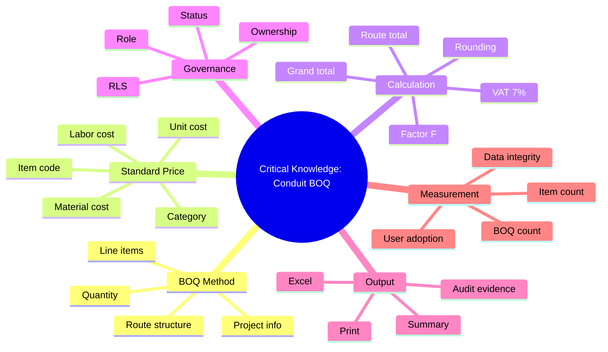

# Critical Knowledge Map

**หัวข้อ:** การจัดทำ BOQ และราคากลางงานก่อสร้างท่อร้อยสายสื่อสารใต้ดิน  
**ใช้ประกอบ:** รายงานประกวด KM / KM/IM Micro Team  

---

## 1. Knowledge Map Overview

---

## 2. Critical Knowledge Inventory

| Knowledge Area | รายละเอียด | Tacit / Explicit | Owner / Source | Digital Asset |
|---|---|---|---|---|
| BOQ structure | วิธีจัดทำหัว BOQ, รายการ, เส้นทาง, พื้นที่ก่อสร้าง | Tacit + Explicit | ผู้จัดทำ BOQ, เอกสารเดิม | `boq`, `boq_routes`, `boq_items` |
| Standard price list | ราคากลางรายการวัสดุและค่าแรง | Explicit | price list มาตรฐาน | `price_list` 710 active rows |
| Route estimation | การแบ่งงานตาม route/segment | Tacit | ประสบการณ์ผู้ปฏิบัติงาน | `boq_routes`, `route_id` |
| Unit cost calculation | material + labor + quantity | Tacit + Explicit | สูตรเดิม, validation | calculation utilities |
| Factor F | ตารางอ้างอิงและวิธีเลือก/คำนวณ | Explicit | Factor F reference | `factor_reference` 37 rows |
| VAT and totals | VAT 7%, total with factor, final amount | Explicit | calculation rules | print/export logic |
| Print document format | รูปแบบเอกสารที่ใช้ประกอบการทำงาน | Tacit + Explicit | เอกสารใช้งานจริง | print page |
| Excel handoff | การส่งออกข้อมูลสำหรับใช้งานต่อ | Explicit | user workflow | Excel export |
| Access control | สิทธิ์ตาม role/status/org | Tacit + System Knowledge | โครงสร้างองค์กร, security model | RLS, `user_profiles` |
| Data quality | การตรวจสอบ mismatch, missing route, snapshot | Explicit | SQL integrity checks | measurement reports |

---

## 3. Tacit to Explicit Conversion

| Tacit Knowledge เดิม | วิธีแปลงเป็น Explicit Knowledge | ผลลัพธ์ |
|---|---|---|
| ผู้เชี่ยวชาญรู้ว่าควรแยกงานเป็น route อย่างไร | ออกแบบ multi-route workflow และ route table | ผู้ใช้สร้างหลาย route ได้ในระบบเดียว |
| ผู้ใช้งานรู้รายการราคาที่ควรเลือกจากประสบการณ์ | ทำ price list searchable พร้อม category | ค้นหาและเลือก item จากฐานข้อมูลกลาง |
| ผู้จัดทำ BOQ รู้สูตรคำนวณจากไฟล์เดิม | เขียน calculation rules และ tests | ลด error จากสูตรไฟล์ |
| ผู้เชี่ยวชาญรู้วิธีตรวจยอดรวม | ทำ integrity checks และ totals summary | ตรวจสอบยอดรวมจาก data structure |
| ผู้ปฏิบัติงานรู้รูปแบบเอกสารปลายทาง | ทำ print/export จากระบบ | ลดงานจัดรูปแบบซ้ำ |

---

## 4. Knowledge Risk Assessment

| Knowledge Area | Risk Level | ความเสี่ยง | Mitigation |
|---|---|---|---|
| Price list | High | ใช้ราคาคนละชุดหรือแก้ราคาไม่ตรวจสอบ | Master Catalog versioning, audit log |
| Factor F | High | คำนวณผิดทำให้ยอดรวมคลาดเคลื่อน | reference table, validation, snapshot |
| BOQ route structure | Medium | ยอดรวมราย route ไม่ตรงกับรายการ | route integrity checks |
| User permissions | High | ผู้ไม่มีสิทธิ์เข้าถึง/แก้ไขข้อมูล | RLS hardening, RPC containment |
| Print/export format | Medium | เอกสารปลายทางไม่ตรงมาตรฐาน | template review, user acceptance |
| Staff know-how | Medium | บุคลากรใหม่เรียนรู้ช้า | SOP, training, knowledge sharing |

---

## 5. Knowledge Assets

| Knowledge Asset | File / System | Purpose |
|---|---|---|
| KM form | `docs/km/kmform.md` | แบบฟอร์มรายงานจัดตั้ง KM/IM Micro Team |
| KM competition report | `docs/km/KM_COMPETITION_REPORT.md` | รายงานหลักสำหรับส่งประกวด |
| Product brief | `docs/PRODUCT_BRIEF_AND_MEASUREMENT_PLAN.md` | วัตถุประสงค์ ประโยชน์ workflow KPI |
| Codebase/database map | `docs/CODEBASE_DATABASE_MAP.md` | หลักฐานระบบและ production database |
| Calculation rules | `docs/05_calculation/` | ความรู้ด้านสูตรและการคำนวณ |
| Domain docs | `docs/03_domain/` | ความรู้ด้าน domain, access, workflow |
| Conduit BOQ system | production app/database | Knowledge applied in real workflow |

---

## 6. Key Message for Committee

Critical Knowledge ของงานนี้ไม่ใช่เพียงรายการราคา แต่รวมถึงวิธีคิด วิธีแยกเส้นทาง วิธีคำนวณ วิธีตรวจเอกสาร และวิธีควบคุมข้อมูลให้เชื่อถือได้ ผลงาน Conduit BOQ ทำให้ความรู้เหล่านี้ไม่กระจายอยู่ในตัวบุคคลหรือไฟล์เดิม แต่ถูกแปลงเป็นระบบ ฐานข้อมูล และมาตรฐานการทำงานที่วัดผลและถ่ายทอดได้

