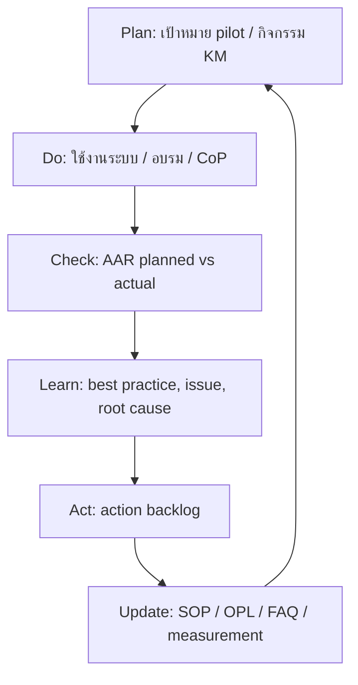

# แบบบันทึกการทบทวนหลังการปฏิบัติงาน

## After Action Review (AAR): การนำ Critical Knowledge ด้าน BOQ และราคากลางไปใช้ผ่านระบบ Conduit BOQ

**แบบฟอร์ม:** C - เครื่องมือการจัดการความรู้  
**หน่วยงาน:** ฝ่ายท่อร้อยสาย (ทฐฐ.) / สายงานโครงสร้างพื้นฐาน (ฐ.)  
**ทีม:** Conduit BOQ KM/IM Micro Team  
**สถานะ:** Template + baseline สำหรับใช้หลังงานนำร่องและกิจกรรม KM  
**ปรับปรุงล่าสุด:** 12 มิถุนายน 2569  

---

## 0. วิธีใช้เอกสารนี้

เอกสารนี้ใช้สำหรับทำ AAR หลังจบกิจกรรมที่เกี่ยวข้องกับ Conduit BOQ เช่น งานนำร่อง การอบรม การทดลอง workflow การตรวจ price list หรือกิจกรรม CoP/Morning Talk โดยมีเป้าหมายเพื่อสกัดบทเรียน ปรับปรุง SOP/OPL/ระบบ และเก็บหลักฐานประกอบชุดส่งประกวด KM

หลักการ AAR ที่ใช้ในเอกสารนี้:

- เทียบสิ่งที่ตั้งใจไว้กับสิ่งที่เกิดขึ้นจริง
- วิเคราะห์สาเหตุโดยไม่เน้นการโทษบุคคล
- แยกสิ่งที่ควรรักษาไว้ สิ่งที่ต้องปรับปรุง และสิ่งที่ต้องเริ่มทำ
- แปลงบทเรียนเป็น action item ที่มีผู้รับผิดชอบและกำหนดเวลา
- ส่งบทเรียนกลับเข้า knowledge repository และแผนปฏิบัติการ KM

เอกสารนี้สอดคล้องกับ:

- `docs/km/km_action_plan_Conduit_BOQ_2569.md`
- `docs/km/KM_COMPETITION_REPORT.md`
- `docs/km/KM_MEASUREMENT_AND_EVIDENCE.md`
- `docs/km/SOP_CONDUIT_BOQ_WORKFLOW.md`
- `docs/km/CRITICAL_KNOWLEDGE_MAP.md`
- `docs/km/BEFORE_AFTER_WORKFLOW.md`

---

## 1. ข้อมูลการทบทวน

| รายการ | รายละเอียด |
|---|---|
| ชื่อกิจกรรม / งานนำร่อง | `[เติมชื่อกิจกรรมหรือชื่อโครงการนำร่อง]` |
| ประเภท AAR | `[งานนำร่อง / อบรม / CoP / Morning Talk / ตรวจข้อมูล / อื่น ๆ]` |
| วันที่ทำกิจกรรม | `[เติมวันที่]` |
| วันที่ทำ AAR | `[เติมวันที่]` |
| สถานที่ / ช่องทาง | `[ประชุม onsite / online / hybrid]` |
| Facilitator / KM Agent | `[เติมชื่อ]` |
| ผู้สรุป AAR | `[เติมชื่อ]` |
| เอกสารอ้างอิง | `KM Action Plan 2569`, `SOP`, `Measurement Evidence`, `Critical Knowledge Map` |

### 1.1 ผู้ร่วม AAR

| ลำดับ | ชื่อ-นามสกุล | หน่วยงาน | บทบาทในกิจกรรม | บทบาทใน KM |
|---:|---|---|---|---|
| 1 | `[เติม]` | `[เติม]` | `[ผู้จัดทำ BOQ / ผู้ตรวจ / ผู้ดูแลระบบ / ผู้สังเกตการณ์]` | `[Team Lead / KM Agent / BOQ Expert / Pilot User]` |
| 2 | `[เติม]` | `[เติม]` | `[เติม]` | `[เติม]` |
| 3 | `[เติม]` | `[เติม]` | `[เติม]` | `[เติม]` |
| 4 | `[เติม]` | `[เติม]` | `[เติม]` | `[เติม]` |
| 5 | `[เติม]` | `[เติม]` | `[เติม]` | `[เติม]` |

---

## 2. เป้าหมายเดิมของกิจกรรม

### 2.1 เป้าหมายตาม KM Action Plan 2569

กิจกรรมหรืองานนำร่องนี้เชื่อมกับเป้าหมายต่อไปนี้:

| เป้าหมาย | เกณฑ์สำเร็จที่ใช้ทบทวน |
|---|---|
| นำ Critical Knowledge ด้าน BOQ และราคากลางไปใช้จริง | ผู้ใช้สามารถสร้าง BOQ จาก workflow มาตรฐานได้ |
| ใช้ price list กลาง | รายการที่ใช้มาจาก `price_list` และตรวจสอบที่มาได้ |
| คำนวณราคากลางอย่างถูกต้อง | pilot BOQ ต้องผ่านการสอบทาน 100% ก่อนนำไปใช้ |
| รองรับงานหลายเส้นทาง | route และ item อยู่ในโครงสร้าง `boq_routes` / `boq_items.route_id` |
| ถ่ายทอดความรู้ | ผู้เข้าร่วมเข้าใจขั้นตอนและสามารถสะท้อนปัญหาได้ |
| สร้างหลักฐาน KM | มี attendance, screenshot/output, issue log และ AAR |

### 2.2 เป้าหมายเฉพาะของกิจกรรมนี้

| เป้าหมายเฉพาะ | ตัวชี้วัด | Target | ผลจริง |
|---|---|---:|---:|
| สร้าง BOQ นำร่องด้วย Conduit BOQ | จำนวน BOQ pilot | `[เติม]` | `[เติม]` |
| ลดเวลาจัดทำ BOQ | เวลาเฉลี่ยต่อ BOQ | ไม่เกิน 30 นาทีหลัง workflow พร้อม | `[เติม]` |
| ตรวจความถูกต้องของรายการราคา | unit cost mismatch | 0 | `[เติม]` |
| ตรวจความถูกต้องของยอดรวม | BOQ/route/item mismatch | 0 critical mismatch | `[เติม]` |
| ตรวจความครบถ้วน Factor F snapshot | snapshot coverage | BOQ ใหม่ครบ 100% | `[เติม]` |
| เก็บบทเรียนจากผู้ใช้งาน | จำนวน issue/lesson | อย่างน้อย 3 ประเด็น | `[เติม]` |

---

## 3. สิ่งที่เกิดขึ้นจริง

### 3.1 สรุปผลการดำเนินงาน

| รายการ | ผลที่เกิดขึ้นจริง | หลักฐาน |
|---|---|---|
| BOQ ที่ทดลอง/ทบทวน | `[เติม BOQ id หรือชื่อโครงการ]` | `[link/screenshot/output]` |
| จำนวน route | `[เติม]` | `[DB/export/screenshot]` |
| จำนวน BOQ items | `[เติม]` | `[DB/export/screenshot]` |
| เอกสาร print/export | `[ทำได้ / ยังไม่ได้ / พบปัญหา]` | `[แนบหลักฐาน]` |
| ผู้เข้าร่วม | `[เติมจำนวน]` | attendance |
| ปัญหาที่พบ | `[สรุปสั้น ๆ]` | issue log |
| บทเรียนที่ได้ | `[สรุปสั้น ๆ]` | AAR notes |

### 3.2 Baseline จาก production snapshot

ใช้เป็นข้อมูลอ้างอิงร่วมกับผลกิจกรรมจริง:

| หลักฐานจากระบบ | Baseline ณ 11 มิถุนายน 2569 | ความหมายต่อ AAR |
|---|---:|---|
| BOQ records | 187 | ระบบมีการใช้งานจริงแล้ว |
| BOQ routes | 209 | workflow multi-route ถูกใช้งานแล้ว |
| BOQ items | 1,475 | ความรู้ BOQ ถูกแปลงเป็น structured data |
| Active price list | 710 | ราคากลางถูกจัดระบบเป็นฐานข้อมูลกลาง |
| Price categories | 52 | มีหมวดหมู่ความรู้สำหรับค้นหา |
| Factor reference rows | 37 | ตาราง Factor F พร้อมใช้เป็น reference |
| User profiles | 20 | มี community ผู้ใช้/ผู้ดูแลระบบ |
| Active users | 16 | มีฐานผู้ใช้งานจริง |
| Pending users | 4 | มีผู้ใช้รอ onboarding |
| Unit cost mismatch | 0 | price list ผ่าน integrity check |
| BOQ-level route mismatch | 0 | ยอดรวมระดับ BOQ ตรวจสอบได้ |

### 3.3 Data Quality Findings ที่ต้องติดตาม

| Finding | Current value | AAR interpretation | Action |
|---|---:|---|---|
| route total mismatch | 2 routes | ยังมีข้อมูล route บางส่วนต้อง cleanup | เพิ่ม validation / cleanup |
| items without route | 5 items | อาจเป็น legacy data หรือข้อมูลที่ควร backfill | classify/backfill |
| BOQs without Factor F snapshot | 74 | snapshot ยังไม่ครบในข้อมูลเก่า | validate on next save/backfill |
| legacy BOQs without creator | 24 | ต้องแยกวิเคราะห์ก่อนใช้ KPI adoption | classify/migrate ownership |

---

## 4. AAR Questions

### Q1: สิ่งที่ตั้งใจจะให้เกิดขึ้นคืออะไร

ตั้งใจให้กิจกรรมนี้ช่วยพิสูจน์ว่า Critical Knowledge ด้าน BOQ และราคากลางสามารถนำไปใช้จริงผ่านระบบ Conduit BOQ ได้ โดยผู้ใช้งานสามารถสร้าง BOQ หลายเส้นทาง เลือกรายการจาก price list กลาง กรอกปริมาณ ตรวจยอดรวม คำนวณ Factor F/VAT และสร้างเอกสาร print/export จากข้อมูลเดียวกัน

สิ่งที่คาดหวัง:

- ลดการพึ่งพาไฟล์ manual และสูตรเฉพาะบุคคล
- ใช้ราคากลางชุดเดียวกัน
- ตรวจสอบที่มาของรายการ ราคา และยอดรวมได้
- เก็บบทเรียนเพื่อนำไปปรับ SOP/OPL/FAQ
- ได้หลักฐานประกอบการส่งประกวด KM

### Q2: สิ่งที่เกิดขึ้นจริงคืออะไร

ผลจริงของกิจกรรมนี้:

| ประเด็น | ผลจริง | หลักฐาน |
|---|---|---|
| ผู้ใช้สร้าง BOQ ได้ตาม workflow หรือไม่ | `[เติม]` | `[เติม]` |
| price list ใช้งานได้ครบตามความต้องการหรือไม่ | `[เติม]` | `[เติม]` |
| route/item สอดคล้องกับงานจริงหรือไม่ | `[เติม]` | `[เติม]` |
| calculation ผ่านการตรวจหรือไม่ | `[เติม]` | `[เติม]` |
| print/export พร้อมใช้งานหรือไม่ | `[เติม]` | `[เติม]` |
| ผู้ใช้พบจุดสับสนตรงไหน | `[เติม]` | `[เติม]` |

ข้อสังเกตจาก baseline ปัจจุบัน:

- ระบบมีข้อมูลใช้งานจริงเพียงพอสำหรับใช้เป็น evidence ของ KM
- price list integrity อยู่ในสถานะดีเพราะไม่พบ unit cost mismatch
- ยังควร cleanup route-level mismatch, missing route, legacy BOQ และ Factor F snapshot coverage
- approval workflow, activity/event log, Master Catalog versioning และ audit log ยังควรสื่อสารเป็นงานต่อยอด ไม่ใช่สิ่งที่ production ทำครบแล้ว

### Q3: ทำไมจึงเกิดความแตกต่างระหว่างแผนกับผลจริง

| ความต่างที่พบ | สาเหตุที่เป็นไปได้ | ประเภท |
|---|---|---|
| `[เติม เช่น เวลาใช้งานจริงมากกว่าเป้าหมาย]` | `[ผู้ใช้ยังไม่คุ้น workflow / item search ยังต้องเรียนรู้]` | คน/กระบวนการ |
| `[เติม เช่น item บางรายการค้นหายาก]` | `[ชื่อรายการหรือ category ต้องปรับ FAQ/keyword]` | ความรู้/ข้อมูล |
| `[เติม เช่น route total ต้องตรวจเพิ่ม]` | `[ข้อมูล legacy หรือ validation ยังไม่ครอบคลุม]` | data quality |
| `[เติม เช่น print/export ต้องปรับรูปแบบ]` | `[template ยังต้องรับ feedback จากผู้ใช้จริง]` | output |
| `[เติม เช่น วัดเวลาจริงไม่ได้]` | `[ยังไม่มี event logging หรือ time study]` | measurement |

### Q4: อะไรที่ทำได้ดีและควรรักษาไว้

| Best Practice / Lesson Learned | เหตุผลที่ควรรักษาไว้ | นำไปใช้ต่ออย่างไร |
|---|---|---|
| ใช้ price list กลางเป็นแหล่งข้อมูลเดียว | ลดการใช้ราคาคนละชุด | รักษา integrity check และเตรียม catalog versioning |
| แยก BOQ เป็น route และ items | รองรับงานจริงที่มีหลายเส้นทาง | ทำ OPL เรื่องการแยก route |
| คำนวณยอดรวมจากระบบ | ลด manual calculation error | ทำ validation checklist สำหรับ pilot |
| print/export จากข้อมูลเดียวกัน | ลดการแก้ตัวเลขหลายไฟล์ | ทำ output checklist ก่อนใช้งานจริง |
| เก็บ AAR หลังใช้งาน | ทำให้ Tacit Knowledge กลับเข้า repository | แปลง lesson เป็น FAQ/OPL/backlog |

### Q5: อะไรที่ต้องปรับปรุงหรือเริ่มทำในรอบถัดไป

| Improvement | Priority | Owner | Due date | Evidence when done |
|---|---|---|---|---|
| ทำ data cleanup: route mismatch, items without route, legacy BOQ | High | System/Admin | `[เติม]` | data quality report |
| เพิ่ม event log หรือ time study เพื่อวัด time-to-create | High | KM Agent + System/Admin | `[เติม]` | measurement report |
| ทำ OPL/FAQ จากปัญหาที่ผู้ใช้พบ | Medium | KM Agent | `[เติม]` | OPL/FAQ |
| ตรวจและ harden RPC/RLS ก่อนขยายผล | High | System/Admin | `[เติม]` | security review |
| ทำ Master Catalog versioning | Medium/High | Price owner + System/Admin | `[เติม]` | migration plan |
| ออกแบบ approval workflow/status history | Medium | Team Lead + System/Admin | `[เติม]` | workflow spec |

---

## 5. O13-O18 Summary สำหรับรายงาน KM

### O13: ผลการดำเนินงานตามตัววัดผลลัพธ์และตัวชี้วัดในกระบวนการ

| ตัวชี้วัด | Baseline / Target | ผลจริงของกิจกรรม | สถานะ |
|---|---|---|---|
| Price list active items | baseline 710 | `[เติม]` | `[ผ่าน/ไม่ผ่าน/รอติดตาม]` |
| Unit cost mismatch | target 0 | `[เติม]` | `[เติม]` |
| BOQ pilot completed | target >= 2 ในแผนปี | `[เติม]` | `[เติม]` |
| Pilot calculation validation | target 100% | `[เติม]` | `[เติม]` |
| Training/CoP participation | target ตามแผนกิจกรรม | `[เติม]` | `[เติม]` |
| Time-to-create | target <= 30 นาทีหลัง workflow พร้อม | `[เติม]` | `[เติม]` |

### O14: ปัญหา / อุปสรรค

| ปัญหา | ผลกระทบ | แนวทางแก้ |
|---|---|---|
| ข้อมูล legacy บางส่วนยังไม่ครบ route/snapshot/owner | KPI และ data quality อาจตีความผิด | classify/backfill/cleanup |
| ยังไม่มี event logging สำหรับเวลาทำงานจริง | วัดการลดเวลายังไม่ชัด | time study หรือ activity event log |
| ผู้ใช้งานบางส่วนยังต้องเรียนรู้ workflow ใหม่ | adoption อาจช้า | training, clinic, peer coaching |
| approval/catalog governance ยังไม่สมบูรณ์ | ไม่ควร claim เป็น workflow อนุมัติเต็มรูปแบบ | แยกเป็น roadmap และทำ spec ต่อ |

### O15: Best Practice / Lesson Learned

| Best Practice | Lesson |
|---|---|
| ใช้ระบบเป็น single source สำหรับ price list และ calculation | KM ที่ดีควรฝังใน workflow จริง ไม่หยุดที่คู่มือ |
| เก็บข้อมูลเป็น structured data | ทำให้วัดผลและตรวจสอบ integrity ได้ |
| ทำ AAR หลัง pilot/กิจกรรม | ช่วยเปลี่ยน feedback เป็น knowledge asset |
| ใช้ baseline production database | ทำให้รายงาน KM มีหลักฐาน ไม่ใช่แค่คำบรรยาย |

### O16: ประเด็นความด้อยประสิทธิผล

| ประเด็น | สถานะ | ผลกระทบ |
|---|---|---|
| route mismatch 2 routes | ต้อง cleanup | กระทบความมั่นใจราย route |
| items without route 5 items | ต้อง classify/backfill | กระทบ multi-route completeness |
| BOQs without Factor F snapshot 74 | ส่วนใหญ่เป็น legacy/ข้อมูลเก่า | ต้องระบุข้อจำกัดเมื่อวัดผล |
| no time-to-create event log | measurement gap | ยังพิสูจน์เวลาลดลงด้วย DB ไม่ได้ |
| full approval workflow ยังไม่ production-ready | roadmap | ต้องไม่สื่อสารเกินจริง |

### O17: ข้อมูลจากการเรียนรู้

บทเรียนหลัก:

- Critical Knowledge ด้าน BOQ มีทั้ง Tacit Knowledge จากผู้เชี่ยวชาญและ Explicit Knowledge เช่น price list, Factor F และ calculation rules
- การแปลงความรู้เป็นระบบช่วยให้ความรู้ถูกใช้ซ้ำได้จริงและวัดผลได้
- ข้อมูล production ช่วยพิสูจน์ adoption และ data quality แต่ยังต้องเสริม event log เพื่อวัดประสิทธิภาพเชิงเวลา
- AAR ควรถูกทำซ้ำหลัง pilot, training และ CoP เพื่อให้เกิด improvement loop ตาม PDCA

### O18: แนวทางการปรับปรุงกระบวนการปฏิบัติงาน

| Action | Owner | Due | Link to KM pack |
|---|---|---|---|
| ปรับ SOP จากบทเรียน AAR | KM Agent | `[เติม]` | `SOP_CONDUIT_BOQ_WORKFLOW.md` |
| เพิ่ม FAQ/OPL จากปัญหาผู้ใช้ | KM Agent + BOQ Expert | `[เติม]` | `CRITICAL_KNOWLEDGE_MAP.md` |
| ทำ data quality cleanup | System/Admin | `[เติม]` | `KM_MEASUREMENT_AND_EVIDENCE.md` |
| ทำ time study/event logging | KM Agent + System/Admin | `[เติม]` | `km_action_plan_Conduit_BOQ_2569.md` |
| ทำ security/RPC/RLS review | System/Admin | `[เติม]` | `CODEBASE_DATABASE_MAP.md` |
| วางแผน Master Catalog versioning | Price owner + System/Admin | `[เติม]` | `KM Action Plan / Product Brief` |

---

## 6. Action Backlog

| ID | Action item | Priority | Owner | Due date | Status | Evidence |
|---|---|---|---|---|---|---|
| AAR-001 | `[เติม]` | `[High/Medium/Low]` | `[เติม]` | `[เติม]` | `[Open/In progress/Done]` | `[เติม]` |
| AAR-002 | `[เติม]` | `[เติม]` | `[เติม]` | `[เติม]` | `[เติม]` | `[เติม]` |
| AAR-003 | `[เติม]` | `[เติม]` | `[เติม]` | `[เติม]` | `[เติม]` | `[เติม]` |

---

## 7. Knowledge Capture Output

หลังจบ AAR ให้ตัดสินใจว่า lesson แต่ละข้อควรถูกเก็บไว้ที่ใด:

| Lesson / Knowledge | Format | Destination | Owner |
|---|---|---|---|
| `[เติม]` | `[SOP / OPL / FAQ / Checklist / Backlog / Training material]` | `[เติม path/link]` | `[เติม]` |
| `[เติม]` | `[เติม]` | `[เติม]` | `[เติม]` |
| `[เติม]` | `[เติม]` | `[เติม]` | `[เติม]` |

Recommended destinations:

- SOP update: `docs/km/SOP_CONDUIT_BOQ_WORKFLOW.md`
- Evidence update: `docs/km/KM_MEASUREMENT_AND_EVIDENCE.md`
- Knowledge map update: `docs/km/CRITICAL_KNOWLEDGE_MAP.md`
- Action plan update: `docs/km/km_action_plan_Conduit_BOQ_2569.md`
- Presentation update: `docs/km/PRESENTATION_OUTLINE.md`

---

## 8. AAR Flow

---

## 9. การรับรองผลการทบทวน

| รายการ | ชื่อ-นามสกุล / ลายมือชื่อ | วันที่ |
|---|---|---|
| ผู้สรุป AAR / KM Agent |  |  |
| หัวหน้าทีม |  |  |
| ผู้เชี่ยวชาญด้าน BOQ/ราคากลาง |  |  |
| ผู้บริหารส่วนงาน / Sponsor |  |  |

---

## 10. Checklist ก่อนปิด AAR

- [ ] ระบุวันที่และประเภทกิจกรรม
- [ ] ระบุรายชื่อและบทบาทผู้ร่วม AAR
- [ ] เติมผลจริงของกิจกรรมหรืองานนำร่อง
- [ ] แนบหลักฐาน screenshot/output/attendance/issue log
- [ ] ระบุ best practice และ lesson learned
- [ ] ระบุ action item พร้อม owner และ due date
- [ ] อัปเดต SOP/OPL/FAQ/measurement evidence ตามบทเรียน
- [ ] บันทึก AAR เข้าชุดเอกสาร KM
- [ ] เสนอผู้เกี่ยวข้องลงนามหรือรับรองผล

---

## 11. แหล่งอ้างอิง

เอกสารภายใน:

- `docs/km/km_action_plan_Conduit_BOQ_2569.md`
- `docs/km/KM_COMPETITION_REPORT.md`
- `docs/km/KM_MEASUREMENT_AND_EVIDENCE.md`
- `docs/km/SOP_CONDUIT_BOQ_WORKFLOW.md`
- `docs/km/CRITICAL_KNOWLEDGE_MAP.md`
- `docs/km/BEFORE_AFTER_WORKFLOW.md`

แนวคิด AAR ที่ใช้ประกอบ:

- After Action Review concept: https://en.wikipedia.org/wiki/After-action_review
- Analytical After Action Report structure: https://en.wikipedia.org/wiki/After_action_report
- Knowledge Management in Software Engineering review: https://arxiv.org/abs/1811.12278
