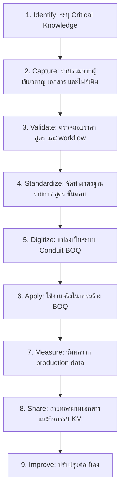

# รายงานผลงานประกวด Knowledge Management

## การนำ Critical Knowledge ด้านการจัดทำ BOQ และราคากลางงานก่อสร้างท่อร้อยสายสื่อสารใต้ดินไปใช้ผ่านระบบ Conduit BOQ

**หน่วยงาน:** สายงานโครงสร้างพื้นฐาน (ฐ.) / ฝ่ายท่อร้อยสาย (ทฐฐ.)  
**ทีม:** ทีมพัฒนาองค์ความรู้การจัดทำ BOQ และราคากลางงานก่อสร้างท่อร้อยสายสื่อสารใต้ดิน  
**วันที่จัดทำ:** 11 มิถุนายน 2569  
**ประเภทผลงาน:** การจัดการความรู้เพื่อนำ Critical Knowledge ไปใช้ปรับปรุงกระบวนการทำงานและพัฒนานวัตกรรม  

---

## 1. บทสรุปผู้บริหาร

การจัดทำ BOQ และราคากลางงานก่อสร้างท่อร้อยสายสื่อสารใต้ดินเป็นกระบวนการสำคัญของ NT เพราะส่งผลต่อการวางแผนงบประมาณ การจัดซื้อจัดจ้าง การตรวจสอบ และการบริหารโครงการ หากความรู้ด้านราคากลาง สูตรคำนวณ หรือวิธีแยกงานตามเส้นทางอยู่เฉพาะในตัวบุคคลหรือไฟล์เฉพาะทีม องค์กรจะมีความเสี่ยงด้านความคลาดเคลื่อน ความล่าช้า และการถ่ายทอดความรู้

KM/IM Micro Team จึงรวบรวม Critical Knowledge จากผู้ปฏิบัติงาน เอกสารเดิม และประสบการณ์ของผู้เชี่ยวชาญ แล้วแปลงเป็นมาตรฐานการทำงาน ฐานข้อมูลราคากลาง และระบบดิจิทัล **Conduit BOQ** เพื่อให้การจัดทำ BOQ ถูกต้อง โปร่งใส ตรวจสอบย้อนกลับได้ และใช้งานซ้ำได้ทั่วหน่วยงาน

ผลงานนี้สะท้อนการจัดการความรู้ครบวงจร:

1. ระบุความรู้สำคัญที่เสี่ยงสูญหาย
2. รวบรวมและตรวจสอบความรู้ร่วมกับผู้เชี่ยวชาญ
3. แปลง Tacit Knowledge เป็น Explicit Knowledge
4. นำความรู้ไปใช้ในระบบงานจริง
5. วัดผลด้วยข้อมูล production database
6. จัดทำคลังความรู้เพื่อถ่ายทอดและต่อยอด

หลักฐานเชิงประจักษ์ ณ 11 มิถุนายน 2569 พบว่าระบบมี BOQ 187 รายการ, BOQ items 1,475 รายการ, routes 209 รายการ, price list 710 รายการ, Factor F reference 37 รายการ และ user profiles 20 รายการ แสดงให้เห็นว่าความรู้ที่จัดการแล้วถูกนำไปใช้ในระบบจริง

---

## 2. ที่มาและปัญหา

### 2.1 ปัญหาก่อนดำเนินการ

ก่อนมีการจัดการความรู้และระบบกลาง การจัดทำ BOQ มีลักษณะพึ่งพาประสบการณ์รายบุคคลและไฟล์งานเดิมเป็นหลัก ทำให้พบปัญหา:

| ปัญหา | ผลกระทบต่อองค์กร |
|---|---|
| ความรู้การจัดทำ BOQ กระจายอยู่ในตัวบุคคล | บุคลากรใหม่เรียนรู้นาน และเกิดความเสี่ยงเมื่อผู้เชี่ยวชาญย้ายงาน |
| ใช้ไฟล์ Excel/template หลาย version | สูตรหรือราคากลางอาจไม่ตรงกัน |
| การคำนวณวัสดุ ค่าแรง Factor F และ VAT ต้องตรวจเอง | เพิ่มโอกาสเกิดความผิดพลาด |
| งานหลายเส้นทางจัดการยาก | ยอดรวมและยอดแยกราย route ตรวจสอบได้ยาก |
| เอกสารปลายทางไม่เชื่อมกับฐานข้อมูลกลาง | ติดตาม วิเคราะห์ และวัดผลย้อนหลังได้จำกัด |
| ไม่มีหลักฐาน structured data สำหรับ KM | ยากต่อการพิสูจน์ผลลัพธ์และการต่อยอด |

### 2.2 เหตุผลที่เป็น Critical Knowledge

ความรู้ด้าน BOQ และราคากลางถือเป็น Critical Knowledge เพราะ:

- ส่งผลโดยตรงต่อมูลค่าโครงการและการใช้งบประมาณ
- ต้องอาศัยทั้งราคามาตรฐาน สูตรคำนวณ และประสบการณ์หน้างาน
- เป็นความรู้เฉพาะของงานโครงสร้างพื้นฐานโทรคมนาคม
- หากคลาดเคลื่อนอาจก่อให้เกิดข้อสังเกตจากการตรวจสอบ
- เป็นฐานความรู้ที่สามารถต่อยอดสู่ budget planning, procurement, GIS/as-built และ asset management

---

## 3. วัตถุประสงค์

| วัตถุประสงค์ | ผลที่ต้องการ |
|---|---|
| รวบรวม Critical Knowledge ด้าน BOQ และราคากลาง | ได้ความรู้ที่จัดระบบและถ่ายทอดได้ |
| ยกระดับมาตรฐานการจัดทำ BOQ | ลดความแตกต่างระหว่างผู้จัดทำและไฟล์งาน |
| ลดความผิดพลาดจาก manual calculation | ใช้ logic คำนวณกลางในระบบ |
| เพิ่มการตรวจสอบย้อนกลับ | เก็บข้อมูล BOQ, routes, items, ราคา และ snapshot |
| สร้างนวัตกรรมจากความรู้ | พัฒนา Conduit BOQ เป็นระบบใช้งานจริง |
| สร้างฐานการวัดผล | ใช้ข้อมูล production database เป็นหลักฐาน |

---

## 4. ทีมและบทบาท

| บทบาท | หน้าที่ |
|---|---|
| ผู้สนับสนุนทีม | ให้ทิศทาง สนับสนุนทรัพยากร และผลักดันการขยายผล |
| หัวหน้าทีม | กำหนดเป้าหมาย วางแผน ควบคุม และประเมินผล |
| KM Agent | อำนวยความสะดวก บันทึกองค์ความรู้ จัดทำฐานความรู้ และเผยแพร่ |
| ผู้เชี่ยวชาญด้าน BOQ/ราคากลาง | ให้ความรู้เชิงลึก ตรวจสอบราคา สูตร และแนวปฏิบัติ |
| ผู้ใช้งานจริง | ทดลอง workflow ให้ feedback และสะท้อนปัญหาหน้างาน |
| ผู้ดูแลระบบ/ข้อมูล | ดูแลระบบ ฐานข้อมูล เอกสาร และหลักฐานเชิงประจักษ์ |

หมายเหตุ: ชื่อบุคคลจริงให้กรอกใน `kmform.md` ก่อนส่งประกวด

---

## 5. กระบวนการจัดการความรู้

### 5.1 การระบุความรู้

ทีมแยกองค์ความรู้สำคัญเป็น 7 กลุ่ม:

- การจัดทำ BOQ งานท่อร้อยสาย
- บัญชีราคากลางมาตรฐาน
- การแยก route/พื้นที่ก่อสร้าง
- การคำนวณวัสดุ ค่าแรง และราคาต่อหน่วย
- Factor F และ VAT
- การจัดรูปแบบเอกสาร print/export
- การควบคุมสิทธิ์และตรวจสอบย้อนกลับ

### 5.2 การแปลงความรู้เป็นระบบงาน

| ความรู้เดิม | สิ่งที่แปลงเป็นในระบบ |
|---|---|
| price list ในเอกสาร/ไฟล์ | ตาราง `price_list` 710 active items |
| สูตรคำนวณวัสดุ/ค่าแรง | calculation logic ใน code |
| ตาราง Factor F | ตาราง `factor_reference` และ logic interpolation |
| การแบ่งงานหลายเส้นทาง | ตาราง `boq_routes` และ `boq_items.route_id` |
| รูปแบบเอกสาร BOQ | print page และ Excel export |
| สิทธิ์ตามองค์กร | user profile, role/status, RLS |

---

## 6. ผลผลิตความรู้และนวัตกรรม

| ผลผลิต | รายละเอียด | คุณค่าต่อองค์กร |
|---|---|---|
| ระบบ Conduit BOQ | Web application สำหรับสร้าง BOQ หลายเส้นทาง | ลด manual work และสร้างฐานข้อมูลกลาง |
| ฐานข้อมูลราคากลาง | 710 active items, 52 categories | ใช้ราคามาตรฐานเดียวกัน |
| Calculation standard | วัสดุ ค่าแรง Factor F VAT | ลดความผิดพลาดและเพิ่มความสม่ำเสมอ |
| Print/Excel output | เอกสารสร้างจากข้อมูลเดียวกัน | ลดการแก้หลายไฟล์ |
| Knowledge repository | เอกสาร product, technical, domain, KM | ถ่ายทอดความรู้และใช้อ้างอิง |
| Measurement baseline | production snapshot | ใช้พิสูจน์ผลลัพธ์และกำหนด KPI |

---

## 7. ผลลัพธ์เชิงประจักษ์

ข้อมูล production database ณ 11 มิถุนายน 2569:

| หลักฐาน | จำนวน/สถานะ | ความหมายด้าน KM |
|---|---:|---|
| BOQ | 187 รายการ | ความรู้ถูกนำไปใช้สร้างงานจริง |
| BOQ routes | 209 รายการ | ระบบรองรับความรู้เรื่อง multi-route |
| BOQ items | 1,475 รายการ | รายการความรู้ถูกแตกเป็น structured data |
| Price list | 710 active items | ราคากลางถูกจัดระบบเป็นฐานข้อมูล |
| Price categories | 52 categories | มีหมวดหมู่ความรู้ให้ค้นหา |
| Factor F reference | 37 rows | ตารางความรู้ด้าน Factor F ถูกใช้อ้างอิง |
| User profiles | 20 profiles | มี community ผู้ใช้งานและผู้ดูแล |
| Unit cost integrity | ไม่พบ mismatch | ความรู้ด้านราคากลางผ่านการตรวจสอบเชิงข้อมูล |
| BOQ vs route total | ไม่พบ mismatch ระดับ BOQ | ยอดรวมหลักตรวจสอบได้ |

---

## 8. ผลสัมฤทธิ์

### 8.1 ระดับบุคคล

- ผู้จัดทำ BOQ มีแนวทางและระบบกลาง ลดการพึ่งพาความจำ
- บุคลากรใหม่เรียนรู้ได้เร็วขึ้นจากเอกสารและ workflow ที่เป็นมาตรฐาน
- ผู้เชี่ยวชาญสามารถถ่ายทอดความรู้ผ่านระบบและคู่มือได้

### 8.2 ระดับกระบวนการ

- กระบวนการจัดทำ BOQ เปลี่ยนจาก manual/spreadsheet เป็น digital workflow
- ข้อมูลราคากลาง สูตร และ output ใช้แหล่งเดียวกัน
- ตรวจสอบย้อนกลับได้จาก BOQ, routes, items และ snapshots

### 8.3 ระดับองค์กร

- องค์กรมีคลังความรู้ด้าน BOQ งานท่อร้อยสาย
- ข้อมูลสามารถวัดผล วิเคราะห์ และต่อยอดสู่ระบบอื่นได้
- สนับสนุนวัฒนธรรมการแลกเปลี่ยนเรียนรู้และพัฒนานวัตกรรม

---

## 9. ตัวชี้วัดและแผนการวัดผล

| ตัวชี้วัด | Current baseline | Target |
|---|---:|---:|
| เวลาเฉลี่ยในการจัดทำ BOQ | manual baseline 2-3 ชั่วโมง | ไม่เกิน 30 นาที |
| จำนวน BOQ ในระบบ | 187 | เพิ่มขึ้นตาม adoption |
| จำนวน active users | 16 active จาก 20 profiles | เพิ่มขึ้นในกลุ่มผู้จัดทำ BOQ |
| price list integrity | 0 mismatch | 0 mismatch ต่อเนื่อง |
| route/item data quality | 5 items ไม่มี route, 2 route mismatch | ลดเหลือ 0 |
| Factor F snapshot coverage | 113 มี snapshot, 74 ยังไม่มี | BOQ ใหม่ครบ 100% |
| กิจกรรมถ่ายทอดความรู้ | ยังต้องบันทึกเพิ่มเติม | อย่างน้อย 2 ครั้ง |

ข้อเสนอเพิ่มเติม: เพิ่ม event logging เช่น `boq_created`, `boq_saved_with_totals`, `boq_printed`, `boq_exported_excel` เพื่อวัดเวลาใช้งานจริงและพฤติกรรมผู้ใช้

---

## 10. การเผยแพร่และต่อยอด

ช่องทางเผยแพร่:

- เอกสาร KM/IM Micro Team
- Critical Knowledge Map
- SOP การจัดทำ BOQ ผ่านระบบ
- Before/After Workflow
- Measurement and Evidence Report
- การสาธิต workflow การสร้าง BOQ
- การอบรม/แลกเปลี่ยนเรียนรู้กับผู้ปฏิบัติงาน

แนวทางต่อยอด:

- ทำ Master Catalog versioning เพื่อรองรับราคากลางรายปี
- ทำ approval workflow และ status history
- ทำ activity/event log เพื่อวัดผลชัดเจน
- ทำ dashboard สำหรับผู้บริหาร
- ต่อเชื่อมกับ budgeting, procurement handoff, GIS/as-built หรือ asset management ในอนาคต

---

## 11. บทเรียนที่ได้รับ

| บทเรียน | ความหมาย |
|---|---|
| ความรู้สำคัญไม่ได้อยู่แค่ในเอกสาร | หลายส่วนเป็น tacit knowledge จากผู้ปฏิบัติงาน |
| การทำ KM ให้เกิดผลต้องเชื่อมกับ workflow จริง | คู่มืออย่างเดียวไม่พอ ต้องมีระบบหรือกระบวนการรองรับ |
| Data structure ทำให้ KM วัดผลได้ | เมื่อ BOQ เป็นฐานข้อมูล จึงนับ วิเคราะห์ และตรวจสอบได้ |
| การนำความรู้ไปใช้ต้องมี governance | ต้องดูแลสิทธิ์ versioning audit และ data quality |
| KM เป็นกระบวนการต่อเนื่อง | หลังระบบใช้งานแล้วต้องวัดผลและปรับปรุงต่อ |

---

## 12. สรุปผลงาน

ผลงานนี้เป็นตัวอย่างของการนำ Critical Knowledge ที่สำคัญต่อการดำเนินงานขององค์กรมาใช้จริง ไม่ใช่เพียงการจัดเก็บความรู้ในรูปแบบเอกสาร แต่เป็นการเปลี่ยนความรู้จากผู้เชี่ยวชาญและไฟล์งานเดิมให้กลายเป็น workflow มาตรฐาน ระบบดิจิทัล ฐานข้อมูลกลาง และหลักฐานที่วัดผลได้

Conduit BOQ จึงเป็นทั้งเครื่องมือปฏิบัติงานและ Knowledge Asset ขององค์กร ช่วยให้การจัดทำ BOQ งานท่อร้อยสายสื่อสารใต้ดินมีความถูกต้อง โปร่งใส ตรวจสอบย้อนกลับได้ และพร้อมต่อยอดสู่การบริหารโครงการเชิงข้อมูลในอนาคต

