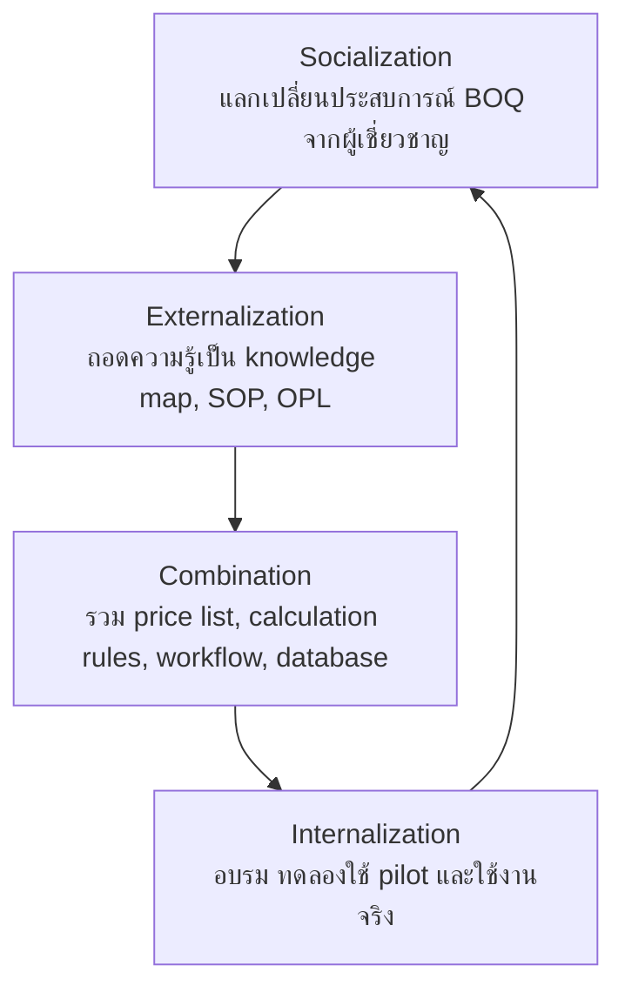
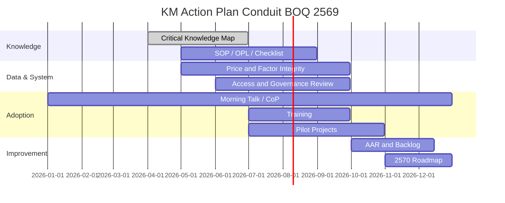

# แผนปฏิบัติการจัดการความรู้ ประจำปี 2569

## การนำ Critical Knowledge ด้านการจัดทำ BOQ และราคากลางงานท่อร้อยสายสื่อสารใต้ดินไปใช้ผ่านระบบ Conduit BOQ

> **หน่วยงาน:** ฝ่ายท่อร้อยสาย (ทฐฐ.) / สายงานโครงสร้างพื้นฐาน (ฐ.)  
> **KM/IM Micro Team:** Conduit BOQ KM/IM Micro Team  
> **ระบบที่ใช้:** Conduit BOQ  
> **ประเภทแผน:** KM Action Plan + Digital Workflow Adoption + Measurement Plan  

---

## 1. บทสรุปผู้บริหาร

แผนปฏิบัติการจัดการความรู้ฉบับนี้มีเป้าหมายเพื่อยกระดับ Critical Knowledge ด้านการจัดทำ BOQ และราคากลางงานก่อสร้างท่อร้อยสายสื่อสารใต้ดิน จากความรู้ที่กระจายอยู่ในตัวบุคลากร เอกสารเดิม และไฟล์ manual ให้กลายเป็นมาตรฐานการทำงาน ฐานข้อมูลกลาง ระบบดิจิทัล และคลังความรู้ที่สามารถถ่ายทอด ใช้งานซ้ำ ตรวจสอบย้อนกลับ และวัดผลได้

ระบบ Conduit BOQ ถูกใช้เป็นกลไกในการนำความรู้ไปใช้จริง โดยแปลงองค์ความรู้สำคัญ เช่น บัญชีราคากลาง การถอดปริมาณงานหลายเส้นทาง การคำนวณวัสดุ ค่าแรง Factor F และ VAT การจัดรูปแบบเอกสาร และการควบคุมสิทธิ์ ให้เป็น workflow ที่ผู้ปฏิบัติงานสามารถใช้สร้าง BOQ ได้ในระบบเดียว

ข้อมูล production snapshot ณ 11 มิถุนายน 2569 แสดงว่ามีการนำความรู้ไปใช้จริงแล้ว:

| หลักฐาน | จำนวน/สถานะ |
|---|---:|
| BOQ ในระบบ | 187 รายการ |
| เส้นทางก่อสร้างใน BOQ | 209 รายการ |
| รายการ BOQ items | 1,475 รายการ |
| รายการราคากลาง active | 710 รายการ |
| หมวดหมู่ราคากลาง | 52 หมวดหมู่ |
| Factor F reference | 37 รายการ |
| User profiles | 20 profiles |
| Price list unit-cost mismatch | 0 |
| BOQ-level route total mismatch | 0 |

แผนปี 2569 จึงไม่ควรเน้นเพียง “ทำระบบ” หรือ “จัดอบรม” แต่ควรเน้น 5 ผลลัพธ์หลัก:

1. จัดระบบ Critical Knowledge ให้ชัดเจน
2. ทำให้ workflow การจัดทำ BOQ เป็นมาตรฐานเดียวกัน
3. เพิ่มความถูกต้องและตรวจสอบย้อนกลับได้ของราคากลาง
4. ถ่ายทอดความรู้ให้ผู้ใช้งานทุกบทบาท
5. วัดผลและปรับปรุงต่อเนื่องด้วยข้อมูลจริง

---

## 2. หลักคิดที่ใช้ในการปรับปรุงแผน

แผนฉบับนี้อ้างอิง 3 แนวคิดที่เหมาะกับการประกวด KM และการบริหารงานจริง:

| Framework | ใช้ในแผนนี้อย่างไร |
|---|---|
| SECI Model | ใช้อธิบายการเปลี่ยน Tacit Knowledge จากผู้เชี่ยวชาญให้เป็น Explicit Knowledge เช่น SOP, price list, calculation rules และระบบ Conduit BOQ |
| PDCA | ใช้จัดรอบการดำเนินงานเป็น Plan, Do, Check, Act เพื่อให้แผนมีการวัดผลและปรับปรุงจริง |
| AAR | ใช้ทบทวนหลังงานนำร่องและกิจกรรม KM เพื่อสกัดบทเรียน ปรับคู่มือ และปรับระบบ |

### 2.1 SECI Mapping

### 2.2 PDCA Mapping

| PDCA | งานในแผน |
|---|---|
| Plan | ระบุ Critical Knowledge, baseline, KPI, RACI, risk, pilot scope |
| Do | จัดกิจกรรม KM, ปรับเอกสาร, ใช้ระบบกับงานนำร่อง, อบรม |
| Check | ตรวจ data quality, user adoption, calculation integrity, AAR |
| Act | ปรับ SOP, OPL, workflow, backlog และ roadmap ระยะถัดไป |

---

## 3. ขอบเขตและนิยามความสำเร็จ

### 3.1 ขอบเขตของแผน 2569

ครอบคลุม:

- การรวบรวมและจัดระบบ Critical Knowledge ด้าน BOQ และราคากลาง
- การใช้งานระบบ Conduit BOQ เป็น workflow กลาง
- การจัดทำ/ปรับปรุงคู่มือ SOP, OPL, FAQ, checklist และสื่ออบรม
- การอบรมและกิจกรรมแลกเปลี่ยนเรียนรู้
- การทดลองใช้งานนำร่องและทำ AAR
- การวัดผลด้วยข้อมูลจากระบบและหลักฐาน KM
- การวางแผนต่อยอดด้าน governance, catalog versioning, audit log และ reporting

ไม่ครอบคลุม:

- procurement execution หรือ purchase order
- inventory/stock management
- field operation/as-built workflow เต็มรูปแบบ
- external integration กับระบบอื่น
- mobile/offline-first workflow

### 3.2 นิยามความสำเร็จ

แผนนี้จะถือว่าสำเร็จเมื่อ:

- มีชุดความรู้และเอกสารมาตรฐานครบตามรายการในแผน
- ผู้ใช้งานเป้าหมายผ่านการอบรมและทดลอง workflow ได้
- งานนำร่องอย่างน้อย 2 งานผ่านการตรวจสอบ calculation และ output
- ข้อมูลราคากลางและยอดรวมสำคัญไม่มี mismatch ใน integrity checks
- มี AAR และ improvement backlog ที่นำไปปรับปรุงจริง
- มีหลักฐานสำหรับส่งประกวด KM ครบถ้วน

---

## 4. เป้าหมายเชิงกลยุทธ์และ KPI ปี 2569

### 4.1 เป้าหมายหลัก

| เป้าหมาย | ตัวชี้วัด | Target 2569 | หลักฐาน |
|---|---|---:|---|
| ทำให้ราคากลางเป็นมาตรฐานเดียวกัน | active price list และ category ครบถ้วน | อย่างน้อย 710 รายการ / 52 หมวดหมู่ | database snapshot, price list report |
| เพิ่มความถูกต้องของราคากลาง | unit cost mismatch | 0 mismatch | SQL integrity check |
| เพิ่มความถูกต้องของ BOQ pilot | calculation validation ในงานนำร่อง | 100% ของ pilot ผ่านการสอบทาน | pilot validation sheet |
| ลดข้อผิดพลาดจาก manual workflow | route/item data quality issues | ลด missing route และ route mismatch เหลือ 0 หลัง cleanup | data quality report |
| ถ่ายทอดความรู้ | กิจกรรม KM / CoP / Morning Talk | อย่างน้อย 12 ครั้ง/ปี | minutes, attendance, photos |
| พัฒนาสื่อความรู้ | SOP, OPL, FAQ, video, checklist | อย่างน้อย 6 knowledge assets | repository links |
| สร้างการใช้งานจริง | งานนำร่อง | อย่างน้อย 2 โครงการ | BOQ ids, print/export evidence |
| ยกระดับ adoption | ผู้เข้าอบรมผ่านเกณฑ์ | ไม่น้อยกว่า 80% ของกลุ่มเป้าหมาย | pre/post test, attendance |
| วัดผลความเร็ว | เวลาเฉลี่ยสร้าง BOQ | เป้าหมายไม่เกิน 30 นาทีต่อ BOQ หลัง workflow พร้อม | time study/event log |

> ปรับปรุงจากแผนเดิม: ตัวชี้วัด “คำนวณ Factor F/VAT ถูกต้อง 80%” ถูกยกระดับเป็น **100% สำหรับงานนำร่องที่นำไปใช้จริง** เพราะราคากลางเป็นงานที่ควร fail closed และต้องตรวจสอบได้ครบถ้วน

### 4.2 KPI แยก Leading / Lagging Indicators

| ประเภท | KPI | เหตุผล |
|---|---|---|
| Leading | จำนวนกิจกรรม KM, จำนวน OPL/FAQ, ผู้เข้าอบรม, pilot started | บอกว่าแผนกำลังขับเคลื่อน |
| Lagging | BOQ ที่สร้างจริง, error reduction, time-to-create, data quality, adoption | บอกผลลัพธ์ที่เกิดขึ้นจริง |
| Control | price mismatch, route mismatch, snapshot coverage, permission review | บอกความน่าเชื่อถือและความพร้อมขยายผล |

---

## 5. Critical Knowledge และ Knowledge Assets

### 5.1 Critical Knowledge Inventory

| Critical Knowledge | ประเภท | สิ่งที่จะทำในปี 2569 | Output |
|---|---|---|---|
| วิธีจัดทำ BOQ งานท่อร้อยสาย | Tacit + Explicit | ถอดขั้นตอนจากผู้เชี่ยวชาญและงานจริง | SOP, checklist, OPL |
| บัญชีราคากลางมาตรฐาน | Explicit | ตรวจสอบ/รักษาฐาน price list 710 รายการ | price list report |
| การแยก route/พื้นที่ก่อสร้าง | Tacit | ทำ OPL และตัวอย่างงานหลายเส้นทาง | route estimation guide |
| การคำนวณวัสดุ ค่าแรง unit cost | Tacit + Explicit | ทำ validation checklist และ integrity check | calculation checklist |
| Factor F และ VAT | Explicit | ทำคู่มือการอ่านผลคำนวณและตรวจ snapshot | Factor F OPL |
| Print/Excel output | Tacit + Explicit | ทำคู่มือการตรวจเอกสารก่อนนำไปใช้ | output checklist |
| สิทธิ์และการตรวจสอบย้อนกลับ | System Knowledge | ทบทวน role/status/RLS/RPC ก่อนขยายผล | access control review |
| Measurement | Explicit | กำหนด KPI, evidence, cadence | measurement dashboard/report |

### 5.2 Knowledge Assets ที่ต้องมีภายในปี

| ลำดับ | Knowledge Asset | Owner | Deadline | Evidence |
|---:|---|---|---|---|
| 1 | Critical Knowledge Map | KM Agent | Q2 | `CRITICAL_KNOWLEDGE_MAP.md` |
| 2 | SOP Conduit BOQ Workflow | KM Agent + ผู้เชี่ยวชาญ | Q2 | `SOP_CONDUIT_BOQ_WORKFLOW.md` |
| 3 | OPL: การเลือก item จาก price list | วิศวกรประมาณราคา | Q2 | OPL PDF/Markdown |
| 4 | OPL: การแยก route หลายเส้นทาง | วิศวกรอาวุโส | Q2 | OPL PDF/Markdown |
| 5 | OPL: Factor F และ VAT | วิศวกรประมาณราคา | Q3 | OPL PDF/Markdown |
| 6 | Checklist ก่อน print/export | ผู้ใช้งานนำร่อง | Q3 | checklist |
| 7 | FAQ จากกิจกรรม CoP | KM Agent | Q3-Q4 | FAQ document |
| 8 | AAR Report งานนำร่อง | หัวหน้าทีม | Q4 | AAR report |

---

## 6. Workstreams และแผนกิจกรรมหลัก

### Workstream A: Knowledge Capture and Standardization

| กิจกรรม | ช่วงเวลา | Owner | Output | KPI |
|---|---|---|---|---|
| ระบุ Critical Knowledge และ knowledge risk | Q2 | KM Agent | Knowledge map | map approved |
| สัมภาษณ์/แลกเปลี่ยนกับผู้เชี่ยวชาญ BOQ | Q2 | หัวหน้าทีม + KM Agent | interview notes | อย่างน้อย 3 sessions |
| ถอด workflow เดิมและ pain points | Q2 | KM Agent | before/after workflow | document completed |
| จัดทำ SOP และ checklist | Q2-Q3 | KM Agent + ผู้ใช้งาน | SOP/checklist | reviewed by experts |

### Workstream B: Price Catalog and Calculation Integrity

| กิจกรรม | ช่วงเวลา | Owner | Output | KPI |
|---|---|---|---|---|
| ตรวจนับ price list และหมวดหมู่ | Q2 | ผู้ดูแล price list | price list report | 710 active items / 52 categories |
| ตรวจ unit cost = material + labor | Q2-Q4 | ผู้ดูแลข้อมูล | integrity report | 0 mismatch |
| ตรวจ Factor F reference | Q2 | วิศวกรประมาณราคา | factor reference report | 37 rows verified |
| ตรวจ calculation งานนำร่อง | Q3 | วิศวกรประมาณราคา | pilot validation sheet | 100% pilot passed |

### Workstream C: Workflow, Access, and Governance

| กิจกรรม | ช่วงเวลา | Owner | Output | KPI |
|---|---|---|---|---|
| กำหนด workflow ผู้จัดทำ/ผู้ตรวจ/ผู้อนุมัติ | Q2 | หัวหน้าทีม | workflow diagram | approved workflow |
| ทบทวน role/status และสิทธิ์เข้าถึง | Q2-Q3 | ผู้ดูแลระบบ | access review | gap list closed |
| ทบทวน RPC/RLS ก่อนขยายผล | Q2-Q3 | ผู้ดูแลระบบ | security review | high-risk issues mitigated |
| กำหนดหลักฐานตรวจสอบย้อนกลับ | Q3 | KM Agent + Admin | evidence register | register completed |

### Workstream D: Training and Community of Practice

| กิจกรรม | ช่วงเวลา | Owner | Output | KPI |
|---|---|---|---|---|
| จัด Morning Talk | ทุกเดือน | KM Agent | minutes | อย่างน้อย 8 ครั้ง |
| จัด CoP / Q&A clinic | รายไตรมาส | หัวหน้าทีม | CoP notes | อย่างน้อย 4 ครั้ง |
| จัดอบรมผู้ใช้งาน | Q3 | หัวหน้าทีม + KM Agent | training record | 80% ผ่านเกณฑ์ |
| ทำ peer coaching ระหว่างผู้จัดทำ/ผู้ตรวจ | Q3-Q4 | วิศวกรอาวุโส | coaching notes | อย่างน้อย 4 sessions |

### Workstream E: Pilot, AAR, and Improvement

| กิจกรรม | ช่วงเวลา | Owner | Output | KPI |
|---|---|---|---|---|
| เลือกงานนำร่อง | Q2-Q3 | หัวหน้าทีม | pilot list | อย่างน้อย 2 โครงการ |
| ใช้ Conduit BOQ กับงานนำร่อง | Q3 | ผู้ใช้งานนำร่อง | BOQ records/output | 2 pilot BOQs completed |
| ทำ AAR หลังงานนำร่อง | Q3-Q4 | KM Agent | AAR report | AAR completed |
| ปรับ SOP/OPL/ระบบจากบทเรียน | Q4 | ทีม Conduit BOQ | improvement backlog | backlog prioritized |

---

## 7. Roadmap รายไตรมาส

| ไตรมาส | Theme | งานสำคัญ | Evidence |
|---|---|---|---|
| Q1 | เตรียมฐานความรู้และข้อมูลตั้งต้น | รวบรวมเอกสารเดิม, ตรวจสถานะระบบ, เตรียม template KM | baseline docs |
| Q2 | Standardize & Control | knowledge map, SOP, price/factor integrity, workflow/access review | knowledge assets, integrity reports |
| Q3 | Train & Pilot | อบรม, Morning Talk/CoP, งานนำร่อง 2 โครงการ, print/export validation | attendance, pilot evidence |
| Q4 | Measure & Improve | AAR, data quality cleanup, update SOP/FAQ, roadmap ปีถัดไป | AAR report, improvement backlog |

### Timeline แบบ Mermaid

---

## 8. แผนกิจกรรมแลกเปลี่ยนเรียนรู้ 12 ครั้ง

| ครั้ง | เดือน | รูปแบบ | หัวข้อ | Output |
|---:|---|---|---|---|
| 1 | ม.ค. | Morning Talk | ปัญหา BOQ manual และ pain points | pain point list |
| 2 | ก.พ. | Morning Talk | Critical Knowledge ด้านราคากลาง | knowledge notes |
| 3 | มี.ค. | CoP | การแยก route/พื้นที่ก่อสร้าง | route OPL draft |
| 4 | เม.ย. | Morning Talk | การค้นหา item และ category ใน price list | FAQ |
| 5 | พ.ค. | Workshop | ตรวจ unit cost และ price list integrity | integrity report |
| 6 | มิ.ย. | CoP | Factor F, VAT และ snapshot | Factor F OPL |
| 7 | ก.ค. | Training | สร้าง BOQ ตั้งแต่ต้นจนบันทึก | attendance + test |
| 8 | ส.ค. | Clinic | ปัญหาจากงานนำร่องรอบแรก | issue log |
| 9 | ก.ย. | Workshop | Print/Excel output และ checklist | output checklist |
| 10 | ต.ค. | CoP | AAR งานนำร่อง | AAR notes |
| 11 | พ.ย. | Morning Talk | Data quality และ improvement backlog | backlog |
| 12 | ธ.ค. | Knowledge Sharing | สรุปบทเรียนและ roadmap ปี 2570 | lessons learned |

> หากเริ่มดำเนินการจริงกลางปี ให้รวมกิจกรรม ม.ค.-มิ.ย. เป็น retrospective workshop 1-2 ครั้ง แล้วเดินกิจกรรม ก.ค.-ธ.ค. ตามแผน

---

## 9. RACI Matrix

| งาน | Sponsor | Team Lead | KM Agent | BOQ Expert | System/Admin | Pilot Users |
|---|---|---|---|---|---|---|
| กำหนดเป้าหมายและ scope | A | R | C | C | C | I |
| Critical Knowledge Map | I | A | R | C | C | C |
| Price list validation | I | A | C | R | R | I |
| Calculation validation | I | A | C | R | C | C |
| SOP/OPL/FAQ | I | A | R | C | C | C |
| Access/RLS/RPC review | I | A | C | C | R | I |
| Training | I | A | R | C | C | R |
| Pilot execution | I | A | C | C | C | R |
| AAR | I | A | R | C | C | R |
| Final KM report | A | R | R | C | C | C |

Legend:

- R = Responsible
- A = Accountable
- C = Consulted
- I = Informed

---

## 10. Measurement Plan

### 10.1 Data Sources

| Metric | Source | Frequency |
|---|---|---|
| BOQ count/status | `boq` | monthly |
| route/item volume | `boq_routes`, `boq_items` | monthly |
| price list count/category | `price_list` | quarterly |
| unit cost mismatch | SQL integrity check | monthly/quarterly |
| Factor F reference | `factor_reference` | quarterly |
| user adoption | `user_profiles`, auth activity if available | monthly |
| training completion | attendance/test records | per activity |
| time-to-create | time study or event log | pilot and after rollout |
| output usage | print/export event log if implemented | monthly |

### 10.2 KPI Dashboard Template

| KPI | Baseline | Current | Target | Status | Evidence |
|---|---:|---:|---:|---|---|
| Active price items | 710 | [เติม] | >= 710 | [R/Y/G] | price report |
| Unit cost mismatch | 0 | [เติม] | 0 | [R/Y/G] | SQL check |
| BOQ count | 187 | [เติม] | trend upward | [R/Y/G] | DB count |
| Pilot BOQs completed | 0 planned | [เติม] | >= 2 | [R/Y/G] | pilot BOQ ids |
| Training participants passed | n/a | [เติม] | >= 80% | [R/Y/G] | test/attendance |
| KM activities held | n/a | [เติม] | >= 12 | [R/Y/G] | minutes/photos |
| AAR completed | 0 | [เติม] | >= 2 | [R/Y/G] | AAR report |
| Data quality issues closed | n/a | [เติม] | 100% critical closed | [R/Y/G] | backlog |

---

## 11. Evidence Register

| Evidence | Owner | Storage / Link | Required for competition |
|---|---|---|---|
| KM form | KM Agent | `docs/km/kmform.md` | yes |
| Competition report | KM Agent | `docs/km/KM_COMPETITION_REPORT.md` | yes |
| Critical Knowledge Map | KM Agent | `docs/km/CRITICAL_KNOWLEDGE_MAP.md` | yes |
| Before/After Workflow | KM Agent | `docs/km/BEFORE_AFTER_WORKFLOW.md` | yes |
| Measurement Evidence | KM Agent | `docs/km/KM_MEASUREMENT_AND_EVIDENCE.md` | yes |
| SOP | KM Agent | `docs/km/SOP_CONDUIT_BOQ_WORKFLOW.md` | yes |
| Screenshot ระบบ | System/Admin | [เติม link/path] | yes |
| ตัวอย่าง BOQ output | Pilot Users | [เติม link/path] | yes |
| Training attendance | KM Agent | [เติม link/path] | yes |
| AAR report | KM Agent | [เติม link/path] | yes |
| Integrity reports | System/Admin | [เติม link/path] | yes |

---

## 12. Risk and Control Plan

| Risk | Impact | Control / Mitigation | Owner |
|---|---|---|---|
| ใช้ราคากลางผิด version | ประมาณราคาคลาดเคลื่อน | ทำ Master Catalog versioning และระบุวันที่มีผลใช้ | Price owner |
| สูตรคำนวณผิดหรือไม่ครบ | เอกสาร BOQ ไม่น่าเชื่อถือ | validation checklist + automated tests + pilot review | BOQ Expert |
| สิทธิ์การบันทึก/แก้ไขไม่รัดกุม | เสี่ยงข้อมูลถูกแก้โดยไม่เหมาะสม | ทบทวน RLS/RPC และ role/status ก่อนขยายผล | System/Admin |
| ผู้ใช้งานไม่ยอมรับ workflow ใหม่ | adoption ต่ำ | training, clinic, peer coaching, feedback loop | Team Lead |
| วัดผลเวลาไม่ได้ | พิสูจน์ outcome ยาก | time study หรือ event logging | KM Agent |
| ข้อมูล legacy ทำให้ KPI เพี้ยน | วิเคราะห์ผิด | แยก legacy records และทำ cleanup/backfill plan | System/Admin |
| เอกสาร KM ไม่มีหลักฐานกิจกรรม | ประกวดเสียคะแนน | evidence register + attendance + photos + minutes | KM Agent |

---

## 13. AAR Template สำหรับงานนำร่อง

ใช้หลังจบงานนำร่องหรือกิจกรรม KM ทุกครั้ง:

| คำถาม | คำตอบ |
|---|---|
| เป้าหมายเดิมคืออะไร | [เติม] |
| สิ่งที่เกิดขึ้นจริงคืออะไร | [เติม] |
| อะไรทำได้ดีและควรรักษาไว้ | [เติม] |
| อะไรไม่เป็นไปตามแผน | [เติม] |
| สาเหตุหลักคืออะไร | [เติม] |
| ต้องปรับ SOP/OPL/ระบบตรงไหน | [เติม] |
| ใครรับผิดชอบ action ต่อ | [เติม] |
| กำหนดเสร็จเมื่อใด | [เติม] |
| ความรู้ใหม่ที่ต้องบันทึกคืออะไร | [เติม] |

---

## 14. Checklist ติดตามความก้าวหน้า

### 14.1 Knowledge Assets

- [ ] Critical Knowledge Map reviewed
- [ ] SOP approved
- [ ] OPL price list completed
- [ ] OPL route estimation completed
- [ ] OPL Factor F/VAT completed
- [ ] FAQ from CoP completed
- [ ] Output checklist completed

### 14.2 System and Data

- [ ] Price list active count >= 710
- [ ] Price category count = 52 or explained
- [ ] Unit cost mismatch = 0
- [ ] Factor reference rows verified
- [ ] route/item quality issues reviewed
- [ ] Factor F snapshot coverage monitored
- [ ] RLS/RPC/access review completed

### 14.3 Adoption and KM Activities

- [ ] Morning Talk >= 8
- [ ] CoP/Q&A clinic >= 4
- [ ] Training completed
- [ ] 80% target users passed
- [ ] Pilot projects >= 2
- [ ] AAR completed
- [ ] Evidence register complete

---

## 15. สรุปแผนสำหรับผู้บริหาร

แผนปี 2569 ของ Conduit BOQ KM/IM Micro Team มีเป้าหมายเพื่อทำให้ Critical Knowledge ด้านการจัดทำ BOQ และราคากลางงานท่อร้อยสายสื่อสารใต้ดินกลายเป็นองค์ความรู้ที่ใช้งานจริงได้ทั่วหน่วยงาน โดยมีระบบ Conduit BOQ เป็นเครื่องมือหลักในการนำความรู้ไปใช้ วัดผล และต่อยอด

แผนนี้ยกระดับจากการ “อบรมการใช้ระบบ” ไปสู่การจัดการความรู้ครบวงจร ตั้งแต่การระบุความรู้สำคัญ การถอดความรู้จากผู้เชี่ยวชาญ การจัดทำมาตรฐาน การทดลองใช้งานจริง การวัดผลด้วยข้อมูล production และการทำ AAR เพื่อปรับปรุงต่อเนื่อง

ผลลัพธ์ที่ต้องการคือระบบงานที่ช่วยลดเวลา ลดความผิดพลาด เพิ่มความโปร่งใส ตรวจสอบย้อนกลับได้ และสร้างคลังความรู้ที่รองรับการพัฒนางานท่อร้อยสายของ NT ในระยะยาว

---

## 16. แหล่งอ้างอิงและข้อมูลประกอบ

### เอกสารภายในโครงการ

- `docs/km/kmform.md`
- `docs/km/KM_COMPETITION_REPORT.md`
- `docs/km/CRITICAL_KNOWLEDGE_MAP.md`
- `docs/km/KM_MEASUREMENT_AND_EVIDENCE.md`
- `docs/PRODUCT_BRIEF_AND_MEASUREMENT_PLAN.md`
- `docs/CODEBASE_DATABASE_MAP.md`

### แหล่งอ้างอิงภายนอกที่ใช้ประกอบแนวคิด

- SECI Model: https://en.wikipedia.org/wiki/SECI_model_of_knowledge_dimensions
- After Action Review: https://en.wikipedia.org/wiki/After-action_review
- ISO 30401 / Knowledge Management System and PDCA integration discussion: https://arxiv.org/abs/2507.18197

---

## 17. หมายเหตุการปรับปรุงจากแผนเดิม

จุดที่ปรับให้แข็งแรงขึ้น:

- เปลี่ยนเป้าหมาย calculation accuracy จาก 80% เป็น 100% สำหรับงานนำร่อง
- เพิ่ม baseline จาก production database
- เพิ่ม SECI/PDCA/AAR เพื่อให้แผนมีกรอบ KM ชัดเจน
- เพิ่ม Workstreams, RACI, evidence register และ risk/control
- แยก KPI เป็น leading/lagging/control indicators
- เพิ่ม AAR template เพื่อให้เกิดการเรียนรู้หลังใช้งานจริง
- เพิ่ม checklist ที่ใช้ติดตามความก้าวหน้าและเตรียมส่งประกวดได้
