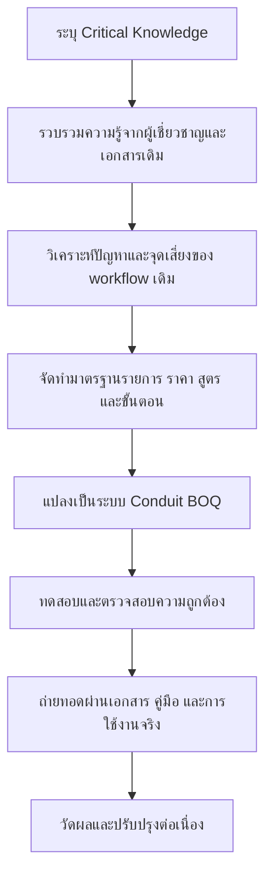

# แบบฟอร์มรายงานการจัดตั้ง KM/IM Micro Team

## ชื่อเรื่อง

**การนำ Critical Knowledge ด้านการจัดทำ BOQ และราคากลางงานก่อสร้างท่อร้อยสายสื่อสารใต้ดิน มาพัฒนาเป็นมาตรฐานการทำงานและระบบดิจิทัล Conduit BOQ**

---

## 1. ข้อมูลทั่วไปของ KM/IM Micro Team

| รายการ | รายละเอียด |
|---|---|
| ชื่อ KM/IM Micro Team | ทีมพัฒนาองค์ความรู้การจัดทำ BOQ และราคากลางงานก่อสร้างท่อร้อยสายสื่อสารใต้ดิน |
| สายงาน | สายงานโครงสร้างพื้นฐาน (ฐ.) |
| หน่วยงาน | ฝ่ายท่อร้อยสาย (ทฐฐ.) |
| วันที่จัดตั้ง | 9 มิถุนายน 2569 |
| หัวข้อเรื่องที่ดำเนินการ | การยกระดับองค์ความรู้การจัดทำ BOQ และราคากลางงานก่อสร้างท่อร้อยสายสื่อสารใต้ดิน ให้ถูกต้อง โปร่งใส ตรวจสอบย้อนกลับได้ และถ่ายทอดใช้งานซ้ำได้ |
| กระบวนการที่เกี่ยวข้อง | การวางแผน ออกแบบ ประมาณราคา จัดทำ BOQ จัดทำราคากลาง และเตรียมเอกสารประกอบการดำเนินโครงการก่อสร้างท่อร้อยสายสื่อสารใต้ดิน |
| สอดคล้องกับ Critical Knowledge | ความรู้ด้านการจัดทำ BOQ, บัญชีราคากลาง, การคำนวณต้นทุนวัสดุ/ค่าแรง, Factor F, VAT, การแยกเส้นทางก่อสร้าง, การควบคุมความถูกต้องของข้อมูล และการตรวจสอบย้อนกลับ |
| ผลงาน/นวัตกรรมที่เกิดขึ้น | ระบบ Conduit BOQ และคลังความรู้ประกอบการใช้งาน |

---

## 1.1 โครงสร้างทีมและบทบาท

> หมายเหตุ: ส่วนนี้เว้นชื่อบุคคลไว้เพื่อให้กรอกข้อมูลจริงก่อนส่งประกวด

| บทบาท | ผู้รับผิดชอบ | หน้าที่ใน KM/IM Micro Team |
|---|---|---|
| ผู้สนับสนุนทีม | [ระบุชื่อ/ตำแหน่ง] | ให้ทิศทาง สนับสนุนทรัพยากร สื่อสารให้เกิดการยอมรับ และสนับสนุนการขยายผล |
| หัวหน้าทีม | [ระบุชื่อ/ตำแหน่ง] | กำหนดเป้าหมาย วางแผนกิจกรรม ควบคุมการดำเนินงาน และประเมินผล |
| ผู้ประสานงานทีม / KM Agent | [ระบุชื่อ/ตำแหน่ง] | อำนวยความสะดวกในการแลกเปลี่ยนเรียนรู้ บันทึกองค์ความรู้ จัดทำฐานความรู้ และเผยแพร่ผลลัพธ์ |
| ผู้เชี่ยวชาญด้าน BOQ/ราคากลาง | [ระบุชื่อ/ตำแหน่ง] | ให้ความรู้เชิงลึก ตรวจสอบสูตร รายการราคา และแนวปฏิบัติ |
| ผู้ใช้งาน/ตัวแทนผู้ปฏิบัติงาน | [ระบุชื่อ/ตำแหน่ง] | ทดลองใช้งานจริง ให้ feedback และร่วมปรับ workflow |
| ผู้ดูแลระบบ/ข้อมูล | [ระบุชื่อ/ตำแหน่ง] | ดูแลฐานข้อมูล ระบบ เอกสาร และหลักฐานเชิงประจักษ์ |

---

## 2. เหตุผลและความเป็นมาในการจัดตั้งทีม

การจัดทำ BOQ และราคากลางงานก่อสร้างท่อร้อยสายสื่อสารใต้ดินเป็นกระบวนการที่มีผลโดยตรงต่อการวางแผนงบประมาณ การจัดซื้อจัดจ้าง การอนุมัติโครงการ และความน่าเชื่อถือของข้อมูลต้นทุน หากการประมาณราคามีความคลาดเคลื่อน อาจส่งผลให้เกิดความล่าช้า การใช้งบประมาณไม่เหมาะสม หรือเกิดข้อสังเกตจากหน่วยงานตรวจสอบ

เดิมองค์ความรู้ที่ใช้ในการจัดทำ BOQ กระจายอยู่ในตัวบุคลากร เอกสาร Excel เดิม ประสบการณ์ของผู้เชี่ยวชาญ และแนวปฏิบัติที่ใช้กันภายในทีม ทำให้เกิดความเสี่ยงสำคัญ ได้แก่ ราคากลางไม่เป็นมาตรฐานเดียวกัน การคำนวณผิดพลาดจากสูตรหรือการคัดลอกไฟล์เดิม การตรวจสอบย้อนกลับทำได้ยาก และการถ่ายทอดความรู้ให้บุคลากรใหม่ใช้เวลานาน

จึงมีการจัดตั้ง KM/IM Micro Team เพื่อรวบรวม จัดระบบ ตรวจสอบ และแปลง Critical Knowledge ที่จำเป็นต่อการทำ BOQ ให้เป็นความรู้ที่ใช้ซ้ำได้ในรูปแบบคู่มือ มาตรฐานการปฏิบัติงาน ฐานข้อมูลราคากลาง และระบบดิจิทัล Conduit BOQ ซึ่งช่วยให้การทำงานมีมาตรฐานเดียวกัน ลดความผิดพลาด และสร้างฐานข้อมูลกลางสำหรับการวัดผลและต่อยอดในอนาคต

---

## 3. Critical Knowledge ที่นำมาใช้

| Critical Knowledge | ประเภทความรู้ | ที่มาของความรู้ | ความเสี่ยงหากไม่จัดการ |
|---|---|---|---|
| วิธีจัดทำ BOQ งานท่อร้อยสายสื่อสารใต้ดิน | Tacit + Explicit | ประสบการณ์ผู้ปฏิบัติงาน, เอกสาร BOQ เดิม, แนวปฏิบัติของหน่วยงาน | บุคลากรใหม่ทำงานช้า, รูปแบบ BOQ ไม่สม่ำเสมอ |
| บัญชีราคากลางมาตรฐาน | Explicit | price list มาตรฐานของหน่วยงาน | ใช้ราคาคนละชุด, ประมาณราคาคลาดเคลื่อน |
| การแยกงานตามเส้นทาง/พื้นที่ก่อสร้าง | Tacit | ประสบการณ์วิศวกรและผู้จัดทำ BOQ | รวมยอดผิด, เปรียบเทียบต้นทุนรายเส้นทางไม่ได้ |
| การคำนวณวัสดุ ค่าแรง และราคาต่อหน่วย | Tacit + Explicit | สูตรคำนวณ, template เดิม, validation จากผู้เชี่ยวชาญ | เกิด error จากสูตรหรือการคัดลอก |
| การคำนวณ Factor F และ VAT | Explicit | ตารางอ้างอิง Factor F และกติกาคำนวณภาษี | ยอดรวมไม่ตรง, เอกสารขาดความน่าเชื่อถือ |
| การควบคุมสิทธิ์และการตรวจสอบย้อนกลับ | Tacit + System Knowledge | โครงสร้างองค์กร, role, user profile, RLS | ข้อมูลสำคัญถูกแก้ไขหรือเข้าถึงไม่เหมาะสม |
| การจัดรูปแบบเอกสารสำหรับพิมพ์/export | Tacit + Explicit | เอกสารใช้งานจริงและ feedback จากผู้ใช้ | เอกสารปลายทางไม่พร้อมใช้งาน |

---

## 4. ความเชื่อมโยงกับแนวคิด KM/IM Micro Team

| องค์ประกอบ | การดำเนินการในโครงการนี้ |
|---|---|
| Domain | การจัดทำ BOQ และราคากลางงานก่อสร้างท่อร้อยสายสื่อสารใต้ดิน |
| Community | รวมผู้มีประสบการณ์ด้านงานท่อร้อยสาย ประมาณราคา พัฒนา workflow ระบบ และผู้ใช้งานจริง เพื่อแลกเปลี่ยนปัญหาและแนวทางปฏิบัติ |
| Practice | แปลงความรู้จากประสบการณ์และเอกสารเดิมเป็นมาตรฐานการทำงาน ฐานข้อมูลราคากลาง ระบบคำนวณอัตโนมัติ และเอกสารความรู้ที่ถ่ายทอดต่อได้ |

---

## 5. วัตถุประสงค์ เป้าหมาย และตัวชี้วัด

| วัตถุประสงค์ | เป้าหมาย/ตัววัดความสำเร็จ | หลักฐานที่ใช้ประกอบ |
|---|---|---|
| รวบรวมองค์ความรู้สำคัญด้าน BOQ และราคากลาง | มีเอกสารสรุป Critical Knowledge และคู่มือ/แนวปฏิบัติอย่างน้อย 1 ชุด | เอกสาร KM, knowledge map, คู่มือการใช้งาน |
| ทำให้ราคากลางและรายการ BOQ เป็นมาตรฐานเดียวกัน | มี price list กลางที่ใช้งานในระบบ 710 รายการ 52 หมวดหมู่ | ฐานข้อมูล `price_list`, รายงานตรวจสอบความครบถ้วน |
| ลดความผิดพลาดจากการคำนวณด้วยมือ | ระบบคำนวณวัสดุ ค่าแรง Factor F และ VAT ด้วย logic เดียวกัน | ผลทดสอบระบบ, calculation rules, validation report |
| ลดระยะเวลาในการจัดทำ BOQ | เป้าหมายไม่เกิน 30 นาทีต่อ BOQ จากเดิมประมาณ 2-3 ชั่วโมง | time study หรือ event log ในระบบ |
| เพิ่มความสามารถในการตรวจสอบย้อนกลับ | BOQ มีข้อมูล routes, items, unit cost, totals และ snapshot การคำนวณ | ข้อมูลในฐานข้อมูล, เอกสาร print/export |
| ส่งเสริมการถ่ายทอดและใช้งานซ้ำ | มีคลังความรู้และเอกสารที่บุคลากรใหม่ใช้เรียนรู้ได้ | docs, SOP, training material |
| สร้างฐานข้อมูลเพื่อวัดผลการใช้งาน | สามารถนับ BOQ, routes, items, users และ integrity checks ได้ | production database snapshot |

---

## 6. ขอบเขตการดำเนินงาน

### 6.1 ขอบเขตที่ดำเนินการในปัจจุบัน

- รวบรวมบัญชีราคากลางและจัดเก็บเป็นฐานข้อมูลกลาง
- สร้าง workflow การจัดทำ BOQ แบบหลายเส้นทาง
- คำนวณราคาวัสดุ ค่าแรง ยอดรวม Factor F และ VAT อัตโนมัติ
- บันทึกข้อมูล BOQ, routes และ items ในฐานข้อมูล
- พิมพ์เอกสาร BOQ และ export เป็น Excel
- จัดการผู้ใช้งานและสิทธิ์การเข้าถึงตาม role/status
- จัดทำเอกสารความรู้สำหรับการถ่ายทอดและต่อยอด

### 6.2 ขอบเขตที่ยังไม่รวมในระยะนี้

- ระบบอนุมัติเต็มรูปแบบตั้งแต่ submit/review/approve/reject
- ระบบจัดซื้อจัดจ้างหรือ purchase order
- ระบบบริหาร stock วัสดุจริง
- ระบบภาคสนามหรือ as-built
- การเชื่อมต่อระบบภายนอก
- mobile/offline-first workflow

---

## 7. วิธีดำเนินการจัดการความรู้

แนวทางที่ใช้:

1. รวบรวม pain point จากการทำ BOQ แบบ manual และไฟล์เดิม
2. แยกความรู้เป็นหมวด เช่น รายการราคา เส้นทาง ปริมาณ สูตรคำนวณ Factor F และรูปแบบเอกสาร
3. ตรวจสอบความถูกต้องของข้อมูลราคากลางและสูตรกับผู้มีประสบการณ์
4. ออกแบบ workflow ให้รองรับหลายเส้นทางในหนึ่ง BOQ
5. แปลงความรู้เป็นฐานข้อมูลและ logic ในระบบ Conduit BOQ
6. สร้างเอกสารความรู้และคู่มือประกอบ
7. เก็บผลการใช้งานจริงเพื่อวัดผลและปรับปรุง

### 7.1 แผนกิจกรรมแลกเปลี่ยนเรียนรู้

| กิจกรรม | วัตถุประสงค์ | ผลลัพธ์ที่คาดหวัง | หลักฐาน |
|---|---|---|---|
| Workshop 1: ระบุปัญหาและ Critical Knowledge | รวบรวมปัญหาจาก workflow เดิมและความรู้สำคัญที่ต้องรักษา | รายการ critical knowledge และ pain point | บันทึกประชุม, knowledge map |
| Workshop 2: ตรวจสอบราคากลางและสูตรคำนวณ | ตรวจสอบความถูกต้องของ price list, unit cost, Factor F และ VAT | calculation rules และ validation checklist | ตารางตรวจสอบ, test result |
| Workshop 3: ทดลอง workflow Conduit BOQ | ทดลองสร้าง BOQ หลายเส้นทางและ print/export | feedback จากผู้ใช้งานจริง | บันทึก feedback, screenshot/output |
| Knowledge Sharing | ถ่ายทอดขั้นตอนการใช้งานและแนวปฏิบัติ | คู่มือ/เอกสารเผยแพร่ และผู้ใช้งานเข้าใจ workflow | เอกสารอบรม, รายชื่อผู้เข้าร่วม |
| Retrospective | สรุปสิ่งที่ได้เรียนรู้และ backlog ปรับปรุง | action plan ระยะถัดไป | lesson learned, improvement list |

---

## 8. ผลผลิตความรู้และนวัตกรรมที่เกิดขึ้น

| ผลผลิต | รายละเอียด | ประโยชน์ |
|---|---|---|
| ฐานข้อมูลราคากลาง | price list กลาง 710 รายการ 52 หมวดหมู่ | ลดความคลาดเคลื่อนจากการใช้ราคาคนละชุด |
| ระบบ Conduit BOQ | web application สำหรับสร้าง BOQ หลายเส้นทาง | ลดเวลาและลด error จาก manual workflow |
| Calculation rules | กติกาคำนวณวัสดุ ค่าแรง Factor F และ VAT | ทำให้ผลลัพธ์คำนวณสม่ำเสมอ |
| Print/Excel workflow | เอกสาร BOQ และไฟล์ Excel จากข้อมูลเดียวกัน | ลดการจัดรูปแบบซ้ำและลดความผิดพลาด |
| Access control model | role, user status, organization structure, RLS | เพิ่มความปลอดภัยและความรับผิดชอบของข้อมูล |
| Knowledge repository | เอกสาร product, technical, domain, calculation, KM | ถ่ายทอดความรู้และใช้ต่อยอดได้ |

---

## 9. ผลลัพธ์และหลักฐานเชิงประจักษ์

ข้อมูลจาก production database ณ 11 มิถุนายน 2569 แสดงให้เห็นว่าความรู้ที่รวบรวมถูกนำมาใช้ในระบบจริงแล้ว:

| รายการ | จำนวน/สถานะ |
|---|---:|
| BOQ ที่ถูกสร้างในระบบ | 187 รายการ |
| เส้นทางก่อสร้างใน BOQ | 209 รายการ |
| รายการ BOQ items | 1,475 รายการ |
| รายการราคากลางที่ active | 710 รายการ |
| หมวดหมู่ราคากลาง | 52 หมวดหมู่ |
| ตาราง Factor F reference | 37 รายการ |
| ผู้ใช้งานในระบบ | 20 profiles |
| ความถูกต้องของ unit cost ใน price list | ไม่พบ mismatch จากการตรวจสอบ |
| BOQ-level route total mismatch | ไม่พบ mismatch จากการตรวจสอบ |

ผลลัพธ์ที่เกิดขึ้น:

- ผู้ใช้งานมีระบบกลางสำหรับจัดทำ BOQ แทนการพึ่งพาไฟล์เฉพาะบุคคล
- รายการราคากลางถูกจัดเก็บและค้นหาได้จากฐานข้อมูลเดียวกัน
- การคำนวณยอดวัสดุ ค่าแรง Factor F และ VAT ทำด้วย logic มาตรฐาน
- ข้อมูล BOQ ถูกจัดเก็บเป็น structured data สามารถนับ วิเคราะห์ และตรวจสอบย้อนหลังได้
- เอกสาร print/export สร้างจากข้อมูลเดียวกัน ลดความเสี่ยงจากการแก้ไขหลายไฟล์

---

## 10. ผลสัมฤทธิ์ที่คาดหวัง

### ระยะสั้น

- ลดเวลาการจัดทำ BOQ และราคากลาง
- ลดความคลาดเคลื่อนจากการคำนวณด้วยมือ
- ลดการใช้ไฟล์ซ้ำหลาย version
- สร้างมาตรฐานการทำงานร่วมกันภายในทีม
- ทำให้บุคลากรใหม่เรียนรู้ขั้นตอนการจัดทำ BOQ ได้เร็วขึ้น

### ระยะกลาง

- ใช้ข้อมูล BOQ ในระบบเพื่อวิเคราะห์ปริมาณงานและมูลค่างานตามช่วงเวลา
- พัฒนาระบบอนุมัติและประวัติการเปลี่ยนสถานะ
- พัฒนา catalog versioning เพื่อรองรับราคากลางรายปี
- เพิ่ม audit log เพื่อยกระดับการตรวจสอบย้อนกลับ

### ระยะยาว

- เกิดคลังความรู้ด้าน BOQ และราคากลางของงานท่อร้อยสายสื่อสารใต้ดิน
- ยกระดับมาตรฐานการบริหารโครงการก่อสร้างโครงสร้างพื้นฐานโทรคมนาคม
- เชื่อมโยงต่อยอดสู่ budgeting, procurement handoff, GIS/as-built หรือ asset management ในอนาคต
- สนับสนุนวัฒนธรรมการแลกเปลี่ยนเรียนรู้และการสร้างนวัตกรรมในองค์กร

---

## 11. แผนการวัดผล

| ตัวชี้วัด | ค่าเริ่มต้น/ข้อมูลปัจจุบัน | เป้าหมาย | วิธีวัด |
|---|---:|---:|---|
| เวลาเฉลี่ยในการจัดทำ BOQ | เดิมประมาณ 2-3 ชั่วโมงจากการทำ manual | ไม่เกิน 30 นาที | เก็บ time study หรือ event log |
| จำนวน BOQ ที่สร้างในระบบ | 187 รายการ | เพิ่มขึ้นต่อเนื่องตามการใช้งานจริง | query จาก `boq` |
| จำนวนผู้ใช้งาน active | 16 active users จาก 20 profiles | เพิ่ม adoption ในกลุ่มผู้จัดทำ BOQ | query จาก `user_profiles` |
| ความถูกต้องของราคากลาง | ไม่พบ unit cost mismatch | 0 mismatch | integrity check ใน `price_list` |
| ความถูกต้องของยอด BOQ | ไม่พบ BOQ-level route mismatch | 0 mismatch | integrity check ระหว่าง `boq`, `boq_routes`, `boq_items` |
| ความครบถ้วนของ Factor F snapshot | 113 populated, 74 missing | BOQ ใหม่ควรครบ 100% | query snapshot columns |
| การลดข้อผิดพลาด route/item | พบ 5 items ไม่มี route และ 2 route total mismatch | ลดเหลือ 0 หลัง cleanup | data quality report |
| การถ่ายทอดความรู้ | เอกสารและระบบพร้อมใช้งาน | จัดกิจกรรม KM อย่างน้อย 2 ครั้ง | บันทึกกิจกรรม/ผู้เข้าร่วม |

---

## 12. การเผยแพร่และถ่ายทอดความรู้

ช่องทางเผยแพร่:

- คู่มือและเอกสารใน knowledge repository ของโครงการ
- การสาธิต workflow การสร้าง BOQ ตั้งแต่ต้นจน print/export
- การประชุมแลกเปลี่ยนปัญหาและข้อเสนอแนะจากผู้ใช้งานจริง
- การจัดทำ checklist สำหรับตรวจสอบ BOQ ก่อนนำไปใช้งาน
- การนำผลการวัดผลจากระบบมาปรับปรุงกระบวนการอย่างต่อเนื่อง

กลุ่มเป้าหมายในการถ่ายทอด:

- พนักงานผู้จัดทำ BOQ
- ผู้จัดการส่วน/ฝ่ายที่ต้องตรวจสอบงาน
- ผู้ดูแลระบบและผู้รับผิดชอบราคากลาง
- บุคลากรใหม่ที่ต้องเรียนรู้งานประมาณราคา

---

## 13. ปัจจัยความสำเร็จ

- มีผู้เชี่ยวชาญด้าน BOQ และราคากลางร่วมตรวจสอบความถูกต้อง
- มีทีมปฏิบัติงานจริงให้ feedback ต่อ workflow
- มีฐานข้อมูลราคากลางที่เป็นมาตรฐานและควบคุม version ได้
- มีผู้ดูแลระบบและเจ้าของกระบวนการชัดเจน
- มีการวัดผลอย่างต่อเนื่อง ไม่จบแค่การทำระบบ
- มีการจัดการความเสี่ยงด้าน security และ data quality ก่อนขยายผล

---

## 14. ประเด็นที่ควรพัฒนาต่อ

| ประเด็น | เหตุผล |
|---|---|
| Harden RPC และสิทธิ์การบันทึก BOQ | เพิ่มความปลอดภัยและความน่าเชื่อถือของระบบ |
| แก้ domain setting ให้ใช้ key เดียวกัน | ลดความเสี่ยงด้านการจำกัด domain ผู้ใช้งาน |
| ทำ Master Catalog versioning | รองรับราคากลางรายปีและรักษาประวัติ BOQ เดิม |
| ทำ activity/event log | วัดเวลาใช้งานจริงและพฤติกรรมผู้ใช้ |
| ทำ approval workflow | ยกระดับจากระบบจัดทำ BOQ เป็นระบบควบคุมกระบวนการ |
| ทำ data cleanup | ลด legacy/missing-route/mismatch records |

---

## 15. สรุปสำหรับการส่งประกวด

KM/IM Micro Team นี้มีเป้าหมายในการนำ Critical Knowledge ที่สำคัญต่อการดำเนินงานขององค์กร คือองค์ความรู้ด้านการจัดทำ BOQ และราคากลางงานก่อสร้างท่อร้อยสายสื่อสารใต้ดิน มารวบรวม ตรวจสอบ จัดระบบ และแปลงเป็นมาตรฐานการทำงานพร้อมระบบดิจิทัล Conduit BOQ

จุดเด่นของผลงานคือไม่ได้หยุดอยู่ที่การจัดทำคู่มือหรือ template เท่านั้น แต่มีการนำความรู้ไปใช้จริงในระบบงาน ทำให้เกิดฐานข้อมูลราคากลาง 710 รายการ ระบบจัดทำ BOQ หลายเส้นทาง การคำนวณ Factor F/VAT อัตโนมัติ การพิมพ์/export เอกสาร และข้อมูล production ที่สามารถใช้วัดผลได้ เช่น BOQ 187 รายการ รายการ BOQ items 1,475 รายการ และผู้ใช้งาน 20 profiles

ผลงานนี้จึงสะท้อนการจัดการความรู้ครบวงจร ตั้งแต่การระบุ Critical Knowledge การแลกเปลี่ยนเรียนรู้ การแปลง tacit knowledge เป็น explicit knowledge การนำไปใช้ในกระบวนการทำงานจริง การวัดผลด้วยข้อมูล และการต่อยอดสู่มาตรฐานองค์กรในอนาคต
