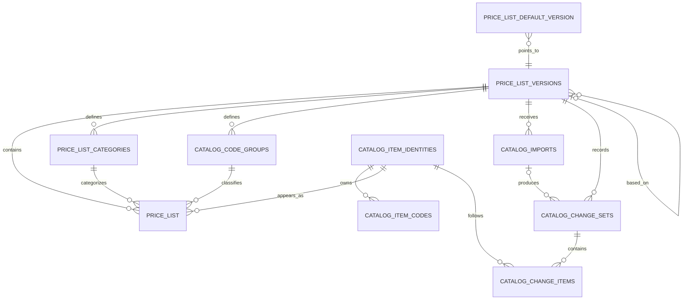

# Phase 4 Database and Security Contract

**Status:** Draft for owner and technical review

**Prepared:** 2026-06-22

**Production project:** `otlssvssvgkohqwuuiir`

**Applies to:** Phase 4A additive database foundation and every Phase 4 write
path. Factor F changes are governed by
[ADR-005](../../02_architecture/ADR/ADR-005-versioned-factor-f-reference.md)
and the separate
[Factor F Change Request](../factor-f/01-versioned-factor-f-change-request.md);
this contract records only the boundary with Master Catalog work.

## 1. Purpose and authority

This document is the implementation-level database contract beneath
[ADR-004](../../02_architecture/ADR/ADR-004-phase4-catalog-governance-and-official-publication.md)
and the
[Phase 4 architecture plan](./08-phase4-architecture-ci-plan.md). It converts
the approved architecture into explicit tables, constraints, indexes, grants,
RLS behavior, function boundaries, transaction order, and migration gates.

If this contract conflicts with an approved ADR, the ADR wins and this contract
must be revised before implementation. SQL, generated database types, tests,
and verification evidence must remain consistent with the approved revision of
this document.

This document does not authorize a Production migration.

Supabase MCP verified Production on 2026-06-28: latest migration ledger
`20260621104056_master_catalog_phase1b_hardening` corresponds to root
migration `011`. Owner direction is to ship Factor F first, so Factor F
reserves `012`, `013`, `014`, and `015`; Master Catalog Phase 4 database migrations
start at `016+`.

## 2. Verified Production baseline

Read-only Supabase MCP inspection on 2026-06-22 confirmed:

| Object | Current state |
|---|---|
| `price_list_versions` | 1 row; `2568.0.0` is `active` and legacy `is_default = true` |
| `price_list_default_version` | Singleton row points to `2568.0.0` |
| `price_list` | 710 rows; `version_id NOT NULL`; `UNIQUE (version_id, item_code)` |
| `price_list_audit_logs` | Exists but empty; legacy three-action contract |
| RLS | Enabled on current catalog tables |
| Current catalog read | `authenticated` may read versions, pointer, and price rows |
| Current catalog write | Active admins currently have direct table-write policy |
| Current costs | No null required cost and no unit-cost mismatch in baseline |
| Current row identity | `price_list.id` is version-row UUID, not stable cross-version identity |

Current `price_list` has nullable cost, `is_active`, and timestamp declarations
at schema level even though verified rows are populated. Phase 4 must harden the
official write path and may harden these columns only after preflight and Local
rehearsal pass.

The current direct active-admin table-write policies are compatible with the
baseline but are not sufficient for Phase 4 audit guarantees. Phase 4 replaces
catalog mutation with exact functions and revokes direct application writes.

Current `factor_reference` remains a separate reference table outside
`price_list_versions`. Do not change Factor F values under this Master Catalog
contract. If Factor F must change, apply ADR-005 first: add a dedicated factor
version/pointer model, keep old BOQs snapshot-only unless exact source evidence
exists, and publish the new factor version through its own gate.

## 3. Logical model



The diagram is semantic. Exact foreign keys and deletion behavior are defined
below.

## 4. Design principles

1. Published database versions are authoritative and immutable.
2. Draft mutation is possible only through reviewed functions.
3. Stable item identity is separate from the version-row UUID and business code.
4. Codes are append-only reservations and cannot move between identities.
5. The singleton pointer is the authoritative current-default source.
6. Legacy `is_default` is a temporary mirror synchronized transactionally.
7. Direct writes to import/audit/catalog tables are unavailable to application
   roles.
8. Explicit grants and RLS are separate required controls.
9. Privileged functions live in an unexposed `private` schema.
10. External calls, workbook parsing, and export generation never occur while
    database locks are held.
11. Every foreign key and common RLS/filter path is indexed.
12. No partitioning, background jobs, `pg_trgm`, or generic workflow engine is
    added at the current scale.

### 4.1 Factor F companion boundary

Master Catalog tables do not own Factor F rows. The target Factor F foundation
belongs to the separate Factor F change track:

| Object | Contract |
|---|---|
| `factor_reference_versions` | Published Factor F metadata, source/effective date, approval evidence, row count, dataset hash |
| `factor_reference_rows` | Immutable published Factor F rows scoped by `version_id` |
| `factor_reference_default_version` | Singleton pointer for new BOQs |
| `boq.factor_reference_version_id` | Nullable FK; required for new BOQs after F1, left null for legacy snapshot-only BOQs unless exact evidence exists |

Rules:

- Do not update published Factor F rows in place.
- Do not backfill historical BOQs with a factor version by assumption.
- Do not auto-reprice old, submitted, approved, printed, or exported BOQs.
- New BOQs after the Factor F foundation bind the factor default pointer at
  creation time.
- Version-bound BOQ calculation reads the bound factor version. Legacy
  snapshot-only calculation uses valid saved snapshots or fails closed.
- The BOQ multiplier is `factor`, sourced from the Thai column
  `รวมในรูป Factor`. The Thai column `Factor F` is stored as `factor_f` for
  reference/provenance and must not be substituted as the main multiplier.
- The 26 June 2026 Factor F source-table annex belongs to the Factor F track;
  missing row-level component percentages must not be invented to satisfy a
  legacy shape.
- Factor F publication must not be hidden inside a Master Catalog migration or
  catalog publish transaction.

## 5. Changes to existing tables

### 5.1 `price_list_versions`

Add:

| Column | Type/nullability | Contract |
|---|---|---|
| `based_on_version_id` | `uuid null` | Self-FK, `ON DELETE RESTRICT`; required for Phase 4-created drafts |
| `effective_date` | `date null` | Required before publish |
| `approval_reference` | `text null` | Trimmed, bounded, required before publish |
| `approval_document_date` | `date null` | Required before publish |
| `published_at` | `timestamptz null` | Set only by publish function |
| `published_by` | `uuid null` | FK to `auth.users(id) ON DELETE SET NULL` |
| `published_by_display_name` | `text null` | Immutable readable actor snapshot; required before publish |
| `dataset_hash` | `text null` | `sha256:` plus 64 lowercase hex characters |
| `item_count` | `integer null` | Positive count computed by publish function |
| `lock_version` | `integer not null default 0` | Optimistic concurrency token; nonnegative |

Rules:

- Existing version-number uniqueness remains `UNIQUE (major, minor, patch)`.
- Status remains `draft`, `active`, or `archived` in Phase 4 Core.
- Phase 4 Core publishes to `active` and does not expose a new archive
  transition. Former current versions remain active/published; the singleton
  pointer alone identifies Current. Existing archived rows remain
  readable/immutable. Archive mutation is deferred to Phase 4.2 or a separate
  owner-approved maintenance contract.
- Phase 4-created drafts require a valid `based_on_version_id` referencing a
  published version.
- A newly active/archived Phase 4 version requires complete publication
  metadata, hash, count, and approval evidence.
- Current legacy `2568.0.0` must receive owner-approved baseline metadata before
  the new publication-completeness constraint is validated. Do not invent an
  approval reference or effective date.
- Published metadata is immutable except an audited pointer restore does not
  mutate it.
- `updated_at` changes only for allowed draft metadata changes and the publish
  transition.

### 5.2 `price_list`

Add:

| Column | Type/nullability | Contract |
|---|---|---|
| `identity_id` | `uuid` | Stable identity FK; backfill all 710 rows before `NOT NULL` |
| `category_id` | `uuid` | Version-safe category FK; backfill before structured publish |
| `code_group_id` | `uuid null` | May remain null for legacy `2568.0.0`; required for structured versions |
| `display_order` | `integer` | Explicit nonnegative presentation order; never physical row order |

Keep during the first stable Production cycle:

- `price_list.category` compatibility text;
- `price_list.is_active`;
- `price_list_versions.is_default` and its legacy check/index;
- the legacy `price_list_audit_logs` table, read-only and unused by new writes.

Constraints after verified backfill:

- `UNIQUE (version_id, identity_id)`;
- existing `UNIQUE (version_id, item_code)`;
- composite FK `(item_code, identity_id)` to the code registry;
- composite FK `(version_id, category_id)` to versioned category;
- composite FK `(version_id, code_group_id)` to versioned code group;
- nonnegative material/labor/unit costs;
- `unit_cost = material_cost + labor_cost`;
- nonnegative `display_order`;
- required official text rejects blank-after-trim through server validation and
  publish validation.

Backfill `display_order` for `2568.0.0` from the numeric suffix of `ITEM-####`
after confirming all 710 codes match and suffixes have complete unique
coverage. Clones preserve the value; a new item receives
`max(display_order) + 1`. Do not use database physical order or workbook row
order, and do not add a Phase 4 Core reorder UI.

This rule is deliberately mechanical: it reproduces the legacy business code
sequence without treating an unstable source row position as authority.

Phase 4 should set `material_cost`, `labor_cost`, `unit_cost`, `is_active`,
`created_at`, and `updated_at` to `NOT NULL` only after the preflight confirms
zero nulls and Local rehearsal proves current application compatibility.

## 6. New tables

### 6.1 `catalog_item_identities`

| Column | Type | Constraint |
|---|---|---|
| `id` | `uuid` | PK, `default gen_random_uuid()` |
| `created_at` | `timestamptz` | `not null default now()` |
| `created_by` | `uuid null` | FK `auth.users(id) ON DELETE SET NULL` |

Do not store mutable name, unit, category, price, or current code here.

### 6.2 `catalog_item_codes`

| Column | Type | Constraint |
|---|---|---|
| `item_code` | `text` | PK |
| `identity_id` | `uuid` | FK identity, `ON DELETE RESTRICT`, not null |
| `code_kind` | `text` | `legacy` or `canonical` |
| `first_seen_version_id` | `uuid` | FK version, `ON DELETE RESTRICT` |
| `created_at` | `timestamptz` | `not null default now()` |
| `created_by` | `uuid null` | FK auth user, `ON DELETE SET NULL` |

Additional unique key `(item_code, identity_id)` supports the composite FK from
`price_list`. Registry rows are append-only. There is no normal delete/update
path.

Format checks:

- legacy: `^ITEM-[0-9]{4}$`;
- canonical: `^[A-Z0-9]{3}-[A-Z0-9]{3}-[0-9]{3}$`.

### 6.3 `price_list_categories`

| Column | Type | Constraint |
|---|---|---|
| `id` | `uuid` | PK |
| `version_id` | `uuid` | FK version, `ON DELETE RESTRICT` |
| `code` | `text` | Trimmed nonblank |
| `name` | `text` | Trimmed nonblank |
| `display_order` | `integer` | Nonnegative |

Unique keys: `(version_id, code)` and `(version_id, id)`.

### 6.4 `catalog_code_groups`

| Column | Type | Constraint |
|---|---|---|
| `id` | `uuid` | PK |
| `version_id` | `uuid` | FK version, `ON DELETE RESTRICT` |
| `work_context_code` | `text` | Three uppercase alphanumeric characters |
| `item_type_code` | `text` | Three uppercase alphanumeric characters |
| `work_context_name_th` | `text` | Required |
| `work_context_name_en` | `text null` | Optional |
| `item_type_name_th` | `text` | Required |
| `item_type_name_en` | `text null` | Optional |
| `display_order` | `integer` | Nonnegative |

Unique keys:

- `(version_id, work_context_code, item_type_code)`;
- `(version_id, id)`.

### 6.5 `catalog_imports`

| Column | Type | Constraint |
|---|---|---|
| `id` | `uuid` | PK |
| `version_id` | `uuid` | Draft version FK, `ON DELETE RESTRICT` |
| `mode` | `text` | `full` or `supplement` |
| `parser_profile_id` | `text` | Required; initially `nt-item-master-2568` |
| `parser_profile_version` | `text` | Required; initially `1` |
| `source_filename` | `text` | Required, basename only, escaped on display |
| `source_file_size` | `bigint` | Client-reported; `0 < size <= 20 MB` |
| `source_file_sha256` | `text` | Client-computed supporting fingerprint; 64 lowercase hex characters |
| `physical_archive_reference` | `text` | Required, bounded |
| `retirement_approval_reference` | `text null` | Required when Full-import retirement count reaches the contract threshold |
| `normalized_payload_hash` | `text` | 64 lowercase hex characters |
| `status` | `text` | `validated`, `applied`, or `rejected` |
| `error_summary` | `jsonb null` | Bounded summary only; no raw workbook/payload |
| `request_id` | `uuid` | Unique |
| `created_by` | `uuid` | FK auth user, `ON DELETE RESTRICT` |
| `created_at` | `timestamptz` | `not null default now()` |
| `applied_at` | `timestamptz null` | Set once on successful apply |

Manual-only changes do not create fictional import rows.

Status lifecycle:

- browser-local parsing/preview creates no row;
- a server validation request inserts `validated` or `rejected` using the
  import `request_id`;
- apply accepts only `validated`, uses a separate change-set request ID, and
  transitions the same import once to `applied`;
- apply must resubmit the normalized payload/source metadata, recompute its
  hash, and match the existing `normalized_payload_hash` before mutation; Phase
  4 Core does not add a raw-file store or normalized-row staging table;
- `previewing` is UI state only and is not persisted.

For Full import, every omission is surfaced. When
`retire_count >= max(10, ceil(active_base_item_count * 0.02))`, the server
rejects apply until `retirement_approval_reference` is nonblank and the admin
confirms the exact count. At the verified 710-row baseline the threshold is 15.
Publish rechecks that the version approval covers this retirement total.

Because raw workbook bytes never reach the server, `source_file_size` and
`source_file_sha256` are evidence claims supplied by the authenticated admin,
not server-verifiable file custody. The server validates their type/format and
records the actor. An independent verifier must hash the filed source and
compare it before publication. `normalized_payload_hash` and the published
`dataset_hash` are computed by trusted server/database code and have stronger
integrity meaning.

### 6.6 `catalog_change_sets`

| Column | Type | Constraint |
|---|---|---|
| `id` | `uuid` | PK |
| `version_id` | `uuid` | FK version, `ON DELETE RESTRICT` |
| `import_id` | `uuid null` | FK import, `ON DELETE RESTRICT` |
| `change_type` | `text` | `clone`, `import`, `manual`, `publish`, or `restore` |
| `reason` | `text` | Required, trim-nonblank, bounded |
| `request_id` | `uuid` | Unique |
| `actor_id` | `uuid` | FK auth user, `ON DELETE RESTRICT` |
| `actor_display_name` | `text` | Immutable snapshot |
| `before_lock_version` | `integer null` | Required when a draft existed before action |
| `after_lock_version` | `integer null` | Required when a draft exists after action |
| `created_at` | `timestamptz` | `not null default now()` |

`import_id` is required only when `change_type = 'import'` and prohibited for
other types.

A clone creates one `clone` change set and zero `catalog_change_items` because
unchanged copied rows are lineage, not business additions. Actual later field
changes append item snapshots. This avoids 710 false “add” history entries.

### 6.7 `catalog_change_items`

| Column | Type | Constraint |
|---|---|---|
| `id` | `uuid` | PK |
| `change_set_id` | `uuid` | FK change set, `ON DELETE RESTRICT` |
| `identity_id` | `uuid` | FK identity, `ON DELETE RESTRICT` |
| `action` | `text` | `add`, `update`, `retire`, or `recode` |
| `old_values` | `jsonb null` | Null only for `add` |
| `new_values` | `jsonb null` | Null only for `retire` |

Snapshots use the fixed canonical keys defined in the
[parser/hash specification](./14-phase4-parser-and-canonical-hash-spec.md).
Functions, not ad hoc client code, create these append-only rows.

## 7. Index contract

Create and verify at minimum:

| Table | Index |
|---|---|
| `price_list_versions` | `(based_on_version_id)` |
| `catalog_item_codes` | `(identity_id)`, `(first_seen_version_id)` |
| `price_list` | unique `(version_id, identity_id)`, `(version_id, category_id)`, `(version_id, code_group_id)`, `(version_id, is_active, display_order, item_code)` |
| `price_list_categories` | unique `(version_id, code)`, index `(version_id, display_order)` |
| `catalog_code_groups` | unique `(version_id, work_context_code, item_type_code)`, index `(version_id, display_order)` |
| `catalog_imports` | `(version_id, created_at desc)`, unique `(request_id)` |
| `catalog_change_sets` | `(version_id, created_at desc)`, `(import_id)`, unique `(request_id)` |
| `catalog_change_items` | `(change_set_id)`, `(identity_id, change_set_id)` |

Every new FK must be checked for a supporting index after migration. Avoid
duplicate indexes already covered by a unique key or another leftmost prefix.

At the current size, ordinary transactional `CREATE INDEX` is acceptable in
Local rehearsal and likely Production. Use a separate concurrent-index runbook
only when preflight lock/availability evidence justifies the extra operational
complexity.

## 8. Grants and RLS contract

All new `public` tables enable RLS. Migration SQL grants access explicitly;
automatic Data API exposure is never assumed.

| Object group | `anon` | Authenticated staff | Active admin | Direct write |
|---|---:|---:|---:|---:|
| Published versions/pointer/items/categories/groups | No rows | Select published/current permitted | Select all permitted | None |
| Draft catalog data | No | No | Select permitted | None |
| Identities/code registry | No | Select only as needed for published views | Select all | None |
| Imports/change sets/change items | No | No | Select | None |
| Public wrapper functions | No execute | No high-impact execute unless wrapper self-check rejects | Exact execute | Function-controlled |
| Private schema/functions | No access | No Data API exposure | Invoked only through exact wrapper path | Function-controlled |

Policy requirements:

- active admin means `user_profiles.role = 'admin'` and
  `user_profiles.status = 'active'` for `(select auth.uid())`;
- never use editable `user_metadata` for authorization;
- wrap stable auth functions in `select` where appropriate for RLS performance;
- ensure `user_profiles.id` remains indexed by its primary key;
- UPDATE policies require matching SELECT visibility, though normal application
  table UPDATE is revoked;
- any view exposed to the API uses `security_invoker = true` or is not granted
  to application roles;
- audit/import tables have no application UPDATE/DELETE policy;
- table owner/service roles are not used by browser clients.

Recommended migration posture:

```text
PUBLIC/anon: no catalog table/function privileges
authenticated: SELECT only on approved public catalog tables
authenticated: EXECUTE only on exact public wrapper signatures
private schema: not exposed in Data API settings
secret/service role: server-only, never NEXT_PUBLIC
```

## 9. Function boundary

Exact SQL types may be refined before migration review, but names, authority,
idempotency, and transaction behavior are locked by this contract.

### Public wrappers

| Function | Purpose | Minimum inputs |
|---|---|---|
| `public.create_catalog_draft` | Clone a published base into a new draft | base/version numbers, name, reason, request ID |
| `public.apply_catalog_changes` | Apply validated manual/import changes | version ID, change JSON or import payload hash, expected lock, reason, request ID, optional import ID |
| `public.publish_catalog_version` | Validate/hash/publish/move pointer | version ID, expected lock, approval metadata, reason, request ID |
| `public.restore_catalog_pointer` | Move pointer to prior published version | target version ID, reason, request ID |

Wrappers are thin `SECURITY INVOKER` functions with schema-qualified calls and
are granted only to `authenticated`. They do not trust caller-supplied actor
ID/display name. They derive identity from the authenticated request and
current profile. Concurrency safety comes from explicit row/advisory locks,
constraints, lock versions, and idempotency; this contract does not falsely
assume a wrapper can change the surrounding PostgREST transaction isolation.

### Private privileged functions

The transactional implementation lives in the unexposed `private` schema and
uses `SECURITY DEFINER`, `SET search_path = ''`, fully qualified relations,
internal active-admin/feature-flag checks, and exact execution grants.

Revoke `EXECUTE` from `PUBLIC` and `anon` on every signature. Grant only the
minimum `private` schema usage/function execution necessary for the public
wrapper call path. Verify that `private` is not an exposed Data API schema.

### Function output

Return stable machine codes and identifiers. Map them to the application
`CatalogActionResult<T>` error contract. Do not return SQL text, stack traces,
secret values, raw workbook cells, or internal policy details.

## 10. Transaction and lock order

### Draft create

1. Authorize active admin and feature flag.
2. Claim request ID or return the prior idempotent result.
3. Lock base version and pointer when the operation requires current base.
4. Insert draft/versioned categories/groups/items in deterministic order.
5. Insert one clone change set; do not insert unchanged rows as artificial
   `add` change items.
6. Commit; no file parsing or external call occurs inside the transaction.

### Draft mutation/import apply

1. Authorize and claim request ID.
2. Lock draft version.
3. Compare expected and stored `lock_version`.
4. Lock affected identity/code rows in ascending identity/code order.
5. Validate draft status, code ownership, categories/groups, costs, and mode.
   For Full import, enforce the exact mass-retirement threshold and persisted
   approval reference.
6. Apply item rows in deterministic order.
7. Append change set/items and increment lock version.
8. Mark import applied when applicable.

### Publish

1. Authorize, check feature flag, and claim request ID.
2. Acquire a transaction-scoped advisory lock using a constant publish key.
3. Lock singleton pointer, then draft version, using the same order everywhere.
4. Reject stale base or lock version.
5. Validate reconciliation, codes, identities, categories/groups, prices,
   approval metadata, row count, and no K fields.
6. Read canonical rows in deterministic order and compute count/hash.
7. Set immutable publication metadata and `active` status.
8. Update singleton pointer.
9. Set all legacy `is_default = false`, then target `true`, inside the same
   transaction.
10. Append publish change set and commit.

### Pointer restore

Use the same advisory lock and pointer/version lock order as publish. Target
must already be published. Update pointer and legacy flags, append restore
change set, and never mutate price rows or historical BOQs.

Set bounded `lock_timeout` and `statement_timeout`. Keep transactions short.

## 11. Immutability and append-only enforcement

Database triggers/functions reject:

- update/delete of active or archived `price_list` rows;
- update of publication metadata after publish;
- update/delete of code-registry rows;
- update/delete of change sets/items;
- update/delete of applied import evidence except narrowly defined status
  transition inside the apply transaction;
- direct mutation that bypasses the expected audit path.

The trigger implementation must use invoker-safe comparison logic when no
privileged read is required. Privileged helper functions remain private.

## 12. Migration construction and order

When implementation begins:

1. Create the migration with the installed Supabase CLI `migration new`
   command discovered through `--help`; do not invent a timestamp.
2. Recheck current Production schema/policies/grants and migration ledger.
3. Add schema/tables/nullable columns and explicit grants/RLS.
4. Backfill identities, legacy codes, categories, and display order from the
   approved reconciliation.
5. Backfill owner-approved `2568.0.0` publication metadata.
6. Add constraints with catalog checks because PostgreSQL does not support
   `ADD CONSTRAINT IF NOT EXISTS`.
7. Use `NOT VALID`/`VALIDATE CONSTRAINT` where it reduces lock risk and is
   supported; set `NOT NULL` only after zero-null assertions.
8. Install private/public functions and immutability guards.
9. Revoke direct catalog writes and obsolete function execution.
10. Generate current TypeScript database types.
11. Run Local reset, DB tests, RLS matrix, advisors, and query-plan checks.
12. Record migration SHA-256 and obtain separate Production approval.

Do not edit an applied migration file. Forward-fix with a new reviewed
migration.

## 13. Required pre/post assertions

### Before Phase 4 migration

- 710 Production rows and 710 distinct item codes, or refreshed approved count;
- zero required-value/cost gaps;
- zero unit-cost mismatch;
- one active/default version and one singleton pointer;
- zero duplicate legacy codes;
- reconciliation covers every Production UUID;
- approved display-order coverage and uniqueness;
- owner-approved baseline publication metadata exists.

### After Phase 4A Local and Production

- identity/legacy-code coverage equals current Production rows;
- every FK has a supporting index;
- zero invalid version/identity, category, or group reference;
- direct authenticated table writes fail;
- anonymous reads/writes and function calls fail;
- staff see only approved published data;
- active admins see drafts/audit and can mutate only through functions;
- pointer and legacy `is_default` mirror agree;
- current app flows remain unchanged while feature flag is disabled;
- security/performance advisors have no unresolved blocker.

## 14. Retention and deletion

- Published versions, identities, codes, applied imports, change sets, and
  change items are retained as official history and are not normally deleted.
- Rejected import records retain only bounded metadata/error summary, never raw
  workbook bytes or normalized payload rows.
- Physical source/approval retention follows the owner's external filing rule.
- User accounts referenced by official audit should be deactivated rather than
  hard deleted; actor display-name snapshots preserve readability.
- A future legal/records-retention requirement may add archival/export rules,
  but automatic deletion jobs are outside Phase 4 Core.

## 15. Explicit non-goals

- No Supabase Storage or signed upload
- No K-formula schema/publication
- No BOQ Rebase
- No paid Supabase branch/project
- No generic spreadsheet mapper
- No event sourcing framework beyond the three lean audit tables
- No server pagination or table partitioning at 710 rows
- No automatic destructive rollback

## 16. Approval record

| Role | Name | Decision | Timestamp | Note |
|---|---|---|---|---|
| Owner |  | Pending |  |  |
| Database reviewer |  | Pending |  |  |
| Security/RLS reviewer |  | Pending |  |  |
| Application reviewer |  | Pending |  |  |

## References

- [Supabase: Securing your API](https://supabase.com/docs/guides/api/securing-your-api)
- [Supabase: Row Level Security](https://supabase.com/docs/guides/database/postgres/row-level-security)
- [PostgreSQL constraints](https://www.postgresql.org/docs/current/ddl-constraints.html)
- [PostgreSQL explicit locking](https://www.postgresql.org/docs/current/explicit-locking.html)
- [Parser and canonical hash specification](./14-phase4-parser-and-canonical-hash-spec.md)
- [Phase 4 verification report](./13-phase4-verification-report.md)
