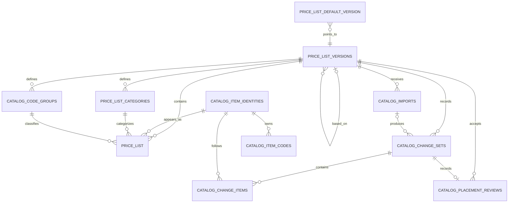

# Phase 4 Database and Security Contract

**Status:** Owner-approved as Phase 4 database/security contract for
implementation/local rehearsal; technical verification and Production
migration approval remain separate gates

**Prepared:** 2026-06-22

**Last updated:** 2026-07-18 to record the P-39 draft-identity/release-number
correction after the WP-6.6 capability/authority hardening from
[Audit #29](./29-phase4-owner-dev-completeness-audit.md), the P-22
[Operator Workflow Correction](./31-phase4-wp66-operator-workflow-correction-plan.md),
and the accepted P-18/WP-7.5 placement extension. Existing migrations remain
append-only. Candidate `020` was amended under P-22
and passed historical G1 DB/concurrency/lint/security evidence on `e463270`.
P-23 first changed operator context/navigation only. Owner-approved P-23.1 then
amended candidate `020` to enforce explicit ADR-003 intent-compatible next-number
planning, including reserved annual identifiers. That content change makes all
prior `020` fingerprints and live DB evidence historical. Repository/static
verification passed on the first 2026-07-13 working-tree candidate. P-24 then
amended the same unapplied candidate with the annual base +1 through +10 guard
and stable `VERSION_EFFECTIVE_YEAR_OUT_OF_RANGE` response; separately approved
G1R later passed on exact clean execution checkout `721c2c2`, including schema,
RLS/grants, concurrency, P-20 input, lint/security advisors, and two required
authority foreign-key covering indexes. The separately approved independent G2
then repeated the clean DB/concurrency/P-20 evidence on the same exact
candidate and the comparator passed. Current advisor-rule warnings are triaged
below. P-36 reproduced them without a security issue or rollout blocker; their
least-privilege/performance minimization remains due before P-12 rather than
being hidden.
P-28/G4 repository approval subsequently placed unchanged accepted `020` in
the canonical Local bootstrap source after `019`. The new `009`-`020` source
chain was then clean-executed under separately owner-approved P-29/G4E on exact
checkout `15b707d443bec701f6b3a86aa7675ca1266604ba`; schema lint, security
advisors, WP-6.6/WP-6.5/P-20/WP-7 evidence, and final Local invariants passed.
Migration `020` has not been applied to Production. P-30 accepted the P-18 V1
rules and authorized a bounded Local-only `021` source candidate. Repository/
static review passed at historical SHA-256 `78359215...`; approved Local live
execution then exposed fail-closed error `42704` because the fixed-search-path
function used an unqualified constraint name. The schema-qualified amendment
is SHA-256 `e4de258756bbfbda0508e55d7b76ba2e907f644625b49bc29d4a4d7ac42fa714`.
A fresh clean Local chain through `020`, separate amended `021` apply, and the
P-32 DB/RLS/concurrency/order/hash/export/browser evidence then passed on source
checkpoint `80b2574` plus UI checkpoint `99fa56c`. Cleanup restored the Local
authority baseline. P-35 now places unchanged amended `021` after `020` in the
canonical Local bootstrap source. P-36 later clean-executed that integrated
path on exact checkout `910cc3cc74660beecf18655d39cd0b0c085d1fc6` and passed
the DB/RLS/concurrency/P-20/WP-7/WP-7.5/advisor/final-invariant technical gates.
It has not been applied to Production. Corrected P-37 intended-admin
interaction/recovery and owner keyboard/focus/presentation UAT passed on
pushed checkpoint `f36d896d672609653de6634e307dcc44bce6d519`; the owner did not
submit the final batch through the UI, and broader independent WP-8 evidence
remains open. See [P-37 UAT/UX Note](./33-phase4-wp8-p37-uat-ux-correction-note.md)
and [Closure Matrix #34](./34-phase4-wp8-p37-closure-matrix.md). These evidence
gaps do not change the accepted database contract.

**P-39R authority amendment:** migration `022` is the forward-only
owner-approved Local lifecycle correction. It gives each draft an immutable internal
reference, stores an immutable target tuple, claims that tuple while the draft
is mutable, issues it on publication, and releases it on audited abandonment.
It enforces one open draft globally; permits only audited abandonment when a
draft is stale; preserves backfilled timestamps; makes terminal rows immutable
even on no-op updates; requires complete publication metadata; records durable
pointer-before/pointer-after and restore draft effect; and removes obsolete
direct-DML policies while retaining least-privilege role/state reads. P-22's
per-base invariant and P-23.1 all-status permanent reservation are historical
and must not govern future execution. See
[Correction Plan #37](./37-phase4-p39-draft-identity-release-number-correction-plan.md).
Incremental P39R-L then found that the code registry policy must match the exact
`(identity_id, item_code)` pair used in an issued snapshot rather than identity
alone. Forward migration `023` owns that policy-only correction without
rewriting applied `022` or mutating catalog business rows, BOQs, or Factor F.

**Owner decision recorded:** 2026-07-04 — approved according to the
recommendation as the technical backbone for Phase 4A and every Phase 4 write
path. The owner accepts the additive `017+` migration contract after production
hotfix `016`, explicit
grants/RLS, private `SECURITY DEFINER` boundary, direct-write revocation,
publish/restore lock order, Factor F/BOQ immutability boundary, required local
DB/security/advisor verification, and forward-fix-only migration recovery. This
approval does not authorize Production migration.

**Production project:** `otlssvssvgkohqwuuiir`

**Applies to:** Phase 4A additive database foundation and every Phase 4 write
path. Factor F changes are governed by
[ADR-005](../../02_architecture/ADR/ADR-005-versioned-factor-f-reference.md)
and the separate
[Factor F Change Request](../factor-f/01-versioned-factor-f-change-request.md);
this contract records only the boundary with Master Catalog work.

## 1. Purpose and authority

This document is the implementation-level database contract beneath
[ADR-004](../../02_architecture/ADR/ADR-004-phase4-catalog-governance-and-official-publication.md)
and the
[Phase 4 architecture plan](./08-phase4-architecture-ci-plan.md). It converts
the approved architecture into explicit tables, constraints, indexes, grants,
RLS behavior, function boundaries, transaction order, and migration gates.

If this contract conflicts with an approved ADR, the ADR wins and this contract
must be revised before implementation. SQL, generated database types, tests,
and verification evidence must remain consistent with the approved revision of
this document.

This document does not authorize a Production migration.

Supabase MCP verified Production on 2026-06-29 after Factor F rollout: root
migrations `012`, `013`, `014`, and `015` were applied for Factor F, current
default Factor F is `2569.0.0`, and legacy BOQs were not version-backfilled.
Production hotfix `016` was then applied on 2026-07-06 to preserve approved BOQ
item suffix labels in `save_boq_with_routes`. Master Catalog Phase 4 database
migrations start at `017+`.

## 2. Verified Production baseline

Read-only Supabase MCP inspection on 2026-06-22 confirmed:

| Object | Current state |
|---|---|
| `price_list_versions` | 1 row; `2568.0.0` is `active` and legacy `is_default = true` |
| `price_list_default_version` | Singleton row points to `2568.0.0` |
| `price_list` | 710 rows; `version_id NOT NULL`; `UNIQUE (version_id, item_code)` |
| `price_list_audit_logs` | Exists but empty; legacy three-action contract |
| RLS | Enabled on current catalog tables |
| Current catalog read | `authenticated` may read versions, pointer, and price rows |
| Current catalog write | Active admins currently have direct table-write policy |
| Current costs | No null required cost and no unit-cost mismatch in baseline |
| Current row identity | `price_list.id` is version-row UUID, not stable cross-version identity |

Current `price_list` has nullable cost, `is_active`, and timestamp declarations
at schema level even though verified rows are populated. Phase 4 must harden the
official write path and may harden these columns only after preflight and Local
rehearsal pass.

The current direct active-admin table-write policies are compatible with the
baseline but are not sufficient for Phase 4 audit guarantees. Phase 4 replaces
catalog mutation with exact functions and revokes direct application writes.

Current Factor F version tables remain separate reference data outside
`price_list_versions`. Do not change Factor F values under this Master Catalog
contract. Factor F work is outside the Master Catalog Phase 4 approval path.

Phase 4 implementation must treat the Factor F rollout as existing Production
state and hotfix `016` as an already-applied BOQ save contract. Migration
`017+` may depend on the presence of
`boq.factor_reference_version_id`, but must not change its values, drop its
foreign key/index, disable its immutability trigger, or repoint
`factor_reference_default_version`.

## 3. Logical model


```mermaid
erDiagram
    PRICE_LIST_VERSIONS ||--o{ PRICE_LIST : contains
    PRICE_LIST_VERSIONS ||--o{ PRICE_LIST_CATEGORIES : defines
    PRICE_LIST_VERSIONS ||--o{ CATALOG_CODE_GROUPS : defines
    PRICE_LIST_VERSIONS ||--o{ CATALOG_IMPORTS : receives
    PRICE_LIST_VERSIONS ||--o{ CATALOG_CHANGE_SETS : records
    PRICE_LIST_VERSIONS o|--o{ PRICE_LIST_VERSIONS : based_on
    PRICE_LIST_DEFAULT_VERSION }o--|| PRICE_LIST_VERSIONS : points_to
    CATALOG_ITEM_IDENTITIES ||--o{ CATALOG_ITEM_CODES : owns
    CATALOG_ITEM_IDENTITIES ||--o{ PRICE_LIST : appears_as
    PRICE_LIST_CATEGORIES ||--o{ PRICE_LIST : categorizes
    CATALOG_CODE_GROUPS ||--o{ PRICE_LIST : classifies
    CATALOG_IMPORTS o|--o{ CATALOG_CHANGE_SETS : produces
    CATALOG_CHANGE_SETS ||--o{ CATALOG_CHANGE_ITEMS : contains
    CATALOG_ITEM_IDENTITIES ||--o{ CATALOG_CHANGE_ITEMS : follows
    PRICE_LIST_VERSIONS ||--o{ CATALOG_PLACEMENT_REVIEWS : accepts
    CATALOG_CHANGE_SETS ||--o| CATALOG_PLACEMENT_REVIEWS : records
```

The diagram is semantic. `CATALOG_PLACEMENT_REVIEWS` exists in the current
Local schema because amended `021` passed P-32 separately and P-36 later passed
the integrated bootstrap through `021`. The object does not exist in
Production. Exact foreign keys and deletion behavior are defined below.

## 4. Design principles

1. Published database versions are authoritative and immutable.
2. Draft mutation is possible only through reviewed functions.
3. Stable item identity is separate from the version-row UUID and business code.
4. Codes are append-only reservations and cannot move between identities.
5. The singleton pointer is the authoritative current-default source.
6. Legacy `is_default` is a temporary mirror synchronized transactionally.
7. Direct writes to import/audit/catalog tables are unavailable to application
   roles.
8. Explicit grants and RLS are separate required controls.
9. Privileged functions live in an unexposed `private` schema.
10. External calls, workbook parsing, and export generation never occur while
    database locks are held.
11. Every foreign key and common RLS/filter path is indexed.
12. No partitioning, background jobs, `pg_trgm`, or generic workflow engine is
    added at the current scale.

### 4.1 Factor F companion boundary

Master Catalog tables do not own Factor F rows. The target Factor F foundation
belongs to the separate Factor F change track:

| Object | Contract |
|---|---|
| `factor_reference_versions` | Published Factor F metadata, source/effective date, approval evidence, row count, dataset hash; Production currently has active `2566.0.0` and default `2569.0.0` |
| `factor_reference_rows` | Immutable published Factor F rows scoped by `version_id` |
| `factor_reference_default_version` | Singleton pointer for new BOQs |
| `boq.factor_reference_version_id` | Nullable FK; required for new BOQs after F1, left null for legacy snapshot-only BOQs unless exact evidence exists |

Rules:

- Do not update published Factor F rows in place.
- Do not backfill historical BOQs with a factor version by assumption.
- Do not auto-reprice old, submitted, approved, printed, or exported BOQs.
- New BOQs after the Factor F foundation bind the factor default pointer at
  creation time.
- Version-bound BOQ calculation reads the bound factor version. Legacy
  snapshot-only calculation uses valid saved snapshots or fails closed.
- The BOQ multiplier is `factor`, sourced from the Thai column
  `รวมในรูป Factor`. The Thai column `Factor F` is stored as `factor_f` for
  reference/provenance and must not be substituted as the main multiplier.
- The 26 June 2026 Factor F source-table annex belongs to the Factor F track;
  missing row-level component percentages must not be invented to satisfy a
  legacy shape.
- No Factor F publication may be hidden inside a Master Catalog migration or
  catalog publish transaction.
- If Phase 4 replaces or wraps `save_boq_with_routes`, it must preserve the
  existing BOQ Factor F contract: do not update
  `boq.factor_reference_version_id`, keep the bound version immutable, save
  snapshot fields only from the BOQ's bound version, and fail closed for legacy
  BOQs that have no usable snapshot.
- It must also preserve the hotfix `016` BOQ item-label contract: approved item
  suffix labels such as `(Main Duct)` and `(Riser)` remain on saved BOQ items,
  while catalog-backed unit, price, and category values remain authoritative.
- New BOQ creation must bind both independent references: the current price
  catalog pointer and the current Factor F pointer. These bindings are not
  derived from each other.
- BOQ duplicate/preserve keeps both bindings and saved snapshots. BOQ
  duplicate/reprice intentionally creates a new BOQ with a selected active
  Factor F version and reset Factor F snapshot fields; it must not mutate the
  source BOQ.

## 5. Changes to existing tables

### 5.1 `price_list_versions`

Add:

| Column | Type/nullability | Contract |
|---|---|---|
| `based_on_version_id` | `uuid null` | Self-FK, `ON DELETE RESTRICT`; required for Phase 4-created drafts |
| `effective_date` | `date null` | Required before publish |
| `approval_reference` | `text null` | Trimmed, bounded, required before publish |
| `approval_document_date` | `date null` | Required before publish |
| `published_at` | `timestamptz null` | Set only by publish function |
| `published_by` | `uuid null` | FK to `auth.users(id) ON DELETE SET NULL` |
| `published_by_display_name` | `text null` | Immutable readable actor snapshot derived from the authenticated active-admin profile; never caller-authored actor evidence |
| `physical_archive_reference` | `text null` | Trimmed/bounded version-level filing reference; required for Phase 4-created publication even without import |
| `dataset_hash` | `text null` | `sha256:` plus 64 lowercase hex characters |
| `item_count` | `integer null` | Positive count computed by publish function |
| `lock_version` | `integer not null default 0` | Optimistic concurrency token; nonnegative |
| `target_major/minor/patch` | `integer not null` | Immutable publication target retained for every draft attempt and published version |
| `target_version_string` | generated `text` | Display/audit form of the immutable target tuple |
| `draft_attempt` | `integer null` | Positive target-scoped attempt ordinal; required and immutable for `draft`/`abandoned`; retained after publication |
| `draft_reference` | generated `text` | `{target_version_string}-D{attempt padded to at least 3 digits without truncation}`; retained after publication; the pre-Phase-4 baseline may be null |

Rules:

- Existing version-number uniqueness remains `UNIQUE (major, minor, patch)`.
  Official/claimed segments are nullable only after abandonment; target
  segments remain non-null.
- `draft_attempt` is allocated under a target-scoped transaction advisory lock
  from persisted attempts. The generated `draft_reference` is a unique audit
  identity such as `2568.1.0-D001`; no lifecycle rule parses this display text.
- Reusable draft/publish functions accept and validate ADR-003 CalVer-first
  annual/revision/patch versions. `2568.1.0` is an exact rehearsal candidate,
  not a hardcoded function constraint.
- The create UI records explicit annual/revision/patch business intent and the
  annual owner-designated effective year. It plans from a complete registry of
  issued or currently claimed tuples; raw version segments are not the primary
  operator input.
- An annual effective year must be greater than the base year and no more than
  10 years after it. UI `min`/`max` is guidance; the Server Action and private
  transition helper enforce the same rule, with the stable safe code
  `VERSION_EFFECTIVE_YEAR_OUT_OF_RANGE` for an out-of-range guarded create.
- A mutable draft claims its target under `UNIQUE (major, minor, patch)`. The
  guarded create path requires the next issued-or-claimed tuple in the selected
  transition lane and returns `VERSION_SEQUENCE_STALE` when another operation
  claimed the reviewed target. Publication makes the claim official;
  abandonment releases only the official/claimed tuple and retains the target.
- A year-changing annual candidate has patch `0`. Its revision is normally `0`
  and increases only when lower identifiers for that target year are published,
  archived, or currently claimed; an abandoned unissued target is reusable.
  A year-changing nonzero patch is invalid.
- Status is `draft`, `active`, `archived`, or `abandoned` in Phase 4 Core.
- Phase 4 Core publishes to `active` and does not expose a new archive
  transition. Former current versions remain active/published; the singleton
  pointer alone identifies Current. Existing archived rows remain
  readable/immutable. Archive mutation is deferred to Phase 4.2 or a separate
  owner-approved maintenance contract.
- Phase 4-created drafts require a valid `based_on_version_id` referencing a
  published version.
- At most one mutable `draft` may exist globally, enforced by a partial unique
  index on `status = 'draft'`. A pointer restore may make that one draft stale;
  it remains inspectable and every command is denied except audited
  abandonment. A never-published current or stale draft may move only from
  `draft` to `abandoned` through the audited function contract; it is never
  deleted or relabelled `archived` to make room for a replacement.
- Abandoned versions retain rows and audit history, cannot be mutated,
  published, restored, or officially exported, and cannot transition back to
  `draft`.
- A newly active/archived Phase 4 version requires complete publication
  metadata, hash, count, approval evidence, and version-level physical archive
  reference.
- Publish derives `published_by` and `published_by_display_name` from the same
  authenticated profile context used for the change set. If business later
  requires a separate approver name, add a separately named/authorized field;
  do not overload the actor snapshot.
- Current legacy `2568.0.0` must receive owner-approved baseline metadata before
  the new publication-completeness constraint is validated. Do not invent an
  approval reference or effective date.
- P-08 owner decision records the legacy baseline metadata to backfill:
  `effective_date = 2026-01-01`, `approval_reference = เอ็นที วทฐฐ./405
  ลงวันที่ 27 พ.ย. 2568`, `approval_document_date = 2025-11-27`, and
  `published_by_display_name = ผู้จัดการฝ่ายท่อร้อยสาย (ทฐฐ.)`. For this
  legacy backfill, `published_at`, `item_count`, and `dataset_hash` are produced
  by trusted migration/backfill code; do not fabricate a historical publish
  timestamp and do not reuse Factor F approval evidence.
- Published metadata is immutable except an audited pointer restore does not
  mutate it.
- `updated_at` changes only for allowed draft metadata changes and the publish
  transition.

### 5.2 `price_list`

Add:

| Column | Type/nullability | Contract |
|---|---|---|
| `identity_id` | `uuid` | Stable identity FK; backfill all 710 rows before `NOT NULL` |
| `category_id` | `uuid` | Version-safe category FK; backfill before structured publish |
| `code_group_id` | `uuid null` | May remain null for legacy `2568.0.0`; required for structured versions except approved temporary legacy-code exceptions |
| `display_order` | `integer` | Explicit nonnegative presentation order; never physical row order |

Keep during the first stable Production cycle:

- `price_list.category` compatibility text;
- `price_list.is_active`;
- `price_list_versions.is_default` and its legacy check/index;
- the legacy `price_list_audit_logs` table, read-only and unused by new writes.

Constraints after verified backfill:

- `UNIQUE (version_id, identity_id)`;
- existing `UNIQUE (version_id, item_code)`;
- composite FK `(item_code, identity_id)` to the code registry;
- composite FK `(version_id, category_id)` to versioned category;
- composite FK `(version_id, code_group_id)` to versioned code group;
- structured-version `code_group_id` is required for active rows except a
  recorded temporary legacy-code exception. For P-06, the only approved
  exception is `ITEM-0139` in `2568.1.0`, backed by P-02/P-04/P-06 owner
  decisions. Publish validation must assert exactly that exception and fail if
  any other active structured-version row has `code_group_id is null`. WP-6.5
  must make this explicit at the publish boundary; exposing a
  `legacyActiveRows` quality count is not sufficient by itself;
- nonnegative material/labor/unit costs;
- `unit_cost = material_cost + labor_cost`;
- nonnegative `display_order`;
- required official text rejects blank-after-trim through server validation and
  publish validation.

Backfill `display_order` for `2568.0.0` from the numeric suffix of `ITEM-####`
after confirming all 710 codes match and suffixes have complete unique
coverage. Clones preserve the value; a new item receives
`max(display_order) + 1`. Do not use database physical order or workbook row
order, and do not add a Phase 4 Core reorder UI.

This rule is deliberately mechanical: it reproduces the legacy business code
sequence without treating an unstable source row position as authority.
It is a draft allocation fallback, not publication approval. For a draft whose
`price_list.identity_id` does not exist in its `based_on_version_id` rows,
`publish_catalog_version` must require a matching accepted review for the
current placement revision and recheck complete order/base-relative invariants.
Otherwise it returns the stable safe code
`P18_PLACEMENT_REVIEW_REQUIRED`. The separately gated WP-7.5 workflow is
defined in [Review Note #28](./28-phase4-p18-placement-governance-review-note.md).
Its amended source, P-32 Local live evidence, and P-33 technical acceptance
pass, while the existing release hold and hidden Add/Supplement controls remain
until WP-8/P-14.

Phase 4 should set `material_cost`, `labor_cost`, `unit_cost`, `is_active`,
`created_at`, and `updated_at` to `NOT NULL` only after the preflight confirms
zero nulls and Local rehearsal proves current application compatibility.

P-20 approves deterministic baseline identity initialization. Migration `017`
uses each existing immutable Production-derived baseline `price_list.id` as
the one-to-one starting `catalog_item_identities.id`, after non-empty-baseline,
collision, prior-assignment, and coverage assertions, and then reuses that
stable identity for clones. The migration must not rewrite an already assigned
non-deterministic identity; that state requires an approved clean rebuild.
Independent rebuild evidence remains required before the migration fingerprint
is frozen and before WP-6.5 exits/WP-7 starts. Do not alter the applied
Production hotfix `016`, introduce a second Phase 4 hash, or silently remove
`identity_id` from the canonical hash.

## 6. New tables

### 6.1 `catalog_item_identities`

| Column | Type | Constraint |
|---|---|---|
| `id` | `uuid` | PK, `default gen_random_uuid()` |
| `created_at` | `timestamptz` | `not null default now()` |
| `created_by` | `uuid null` | FK `auth.users(id) ON DELETE SET NULL` |

Do not store mutable name, unit, category, price, or current code here.

### 6.2 `catalog_item_codes`

| Column | Type | Constraint |
|---|---|---|
| `item_code` | `text` | PK |
| `identity_id` | `uuid` | FK identity, `ON DELETE RESTRICT`, not null |
| `code_kind` | `text` | `legacy` or `canonical` |
| `first_seen_version_id` | `uuid` | FK version, `ON DELETE RESTRICT` |
| `created_at` | `timestamptz` | `not null default now()` |
| `created_by` | `uuid null` | FK auth user, `ON DELETE SET NULL` |

Additional unique key `(item_code, identity_id)` supports the composite FK from
`price_list`. Registry rows are append-only. There is no normal delete/update
path.

Format checks:

- legacy: `^ITEM-[0-9]{4}$`;
- canonical: `^[A-Z0-9]{3}-[A-Z0-9]{3}-[0-9]{3}$`.

### 6.3 `price_list_categories`

| Column | Type | Constraint |
|---|---|---|
| `id` | `uuid` | PK |
| `version_id` | `uuid` | FK version, `ON DELETE RESTRICT` |
| `code` | `text` | Trimmed nonblank |
| `name` | `text` | Trimmed nonblank |
| `display_order` | `integer` | Nonnegative |

Unique keys: `(version_id, code)` and `(version_id, id)`.

### 6.4 `catalog_code_groups`

| Column | Type | Constraint |
|---|---|---|
| `id` | `uuid` | PK |
| `version_id` | `uuid` | FK version, `ON DELETE RESTRICT` |
| `work_context_code` | `text` | Three uppercase alphanumeric characters |
| `item_type_code` | `text` | Three uppercase alphanumeric characters |
| `work_context_name_th` | `text` | Required |
| `work_context_name_en` | `text null` | Optional |
| `item_type_name_th` | `text` | Required |
| `item_type_name_en` | `text null` | Optional |
| `display_order` | `integer` | Nonnegative |

Unique keys:

- `(version_id, work_context_code, item_type_code)`;
- `(version_id, id)`.

### 6.5 `catalog_imports`

| Column | Type | Constraint |
|---|---|---|
| `id` | `uuid` | PK |
| `version_id` | `uuid` | Draft version FK, `ON DELETE RESTRICT` |
| `mode` | `text` | `full` or `supplement` |
| `parser_profile_id` | `text` | Required; initially `nt-item-master-2568` |
| `parser_profile_version` | `text` | Required; initially `1` |
| `source_filename` | `text` | Required, basename only, escaped on display |
| `source_file_size` | `bigint` | Client-reported; `0 < size <= 20 MB` |
| `source_file_sha256` | `text` | Client-computed supporting fingerprint; 64 lowercase hex characters |
| `physical_archive_reference` | `text` | Required, bounded |
| `retirement_approval_reference` | `text null` | Required when Full-import retirement count reaches the contract threshold |
| `normalized_payload_hash` | `text` | 64 lowercase hex characters |
| `status` | `text` | `validated`, `applied`, or `rejected` |
| `error_summary` | `jsonb null` | Bounded summary only; no raw workbook/payload |
| `request_id` | `uuid` | Unique |
| `created_by` | `uuid` | FK auth user, `ON DELETE RESTRICT` |
| `created_at` | `timestamptz` | `not null default now()` |
| `applied_at` | `timestamptz null` | Set once on successful apply |

Manual-only changes do not create fictional import rows.

Status lifecycle:

- browser-local parsing/preview creates no row;
- a server validation request inserts `validated` or `rejected` using the
  import `request_id`;
- apply accepts only `validated`, uses a separate change-set request ID, and
  transitions the same import once to `applied`;
- apply must resubmit the normalized payload/source metadata, recompute its
  hash, and match the existing `normalized_payload_hash` before mutation; Phase
  4 Core does not add a raw-file store or normalized-row staging table;
- `previewing` is UI state only and is not persisted.

For Full import, every omission is surfaced. When
`retire_count >= max(10, ceil(active_base_item_count * 0.02))`, the server
rejects apply until `retirement_approval_reference` is nonblank and the admin
confirms the exact count. At the verified 710-row baseline the threshold is 15.
Publish rechecks that the version approval covers this retirement total.

Because raw workbook bytes never reach the server, `source_file_size` and
`source_file_sha256` are evidence claims supplied by the authenticated admin,
not server-verifiable file custody. The server validates their type/format and
records the actor. An independent verifier must hash the filed source and
compare it before publication. `normalized_payload_hash` and the published
`dataset_hash` are computed by trusted server/database code and have stronger
integrity meaning.

### 6.6 `catalog_change_sets`

| Column | Type | Constraint |
|---|---|---|
| `id` | `uuid` | PK |
| `version_id` | `uuid` | FK version, `ON DELETE RESTRICT` |
| `import_id` | `uuid null` | FK import, `ON DELETE RESTRICT` |
| `change_type` | `text` | `clone`, `import`, `manual`, `abandon`, `publish`, or `restore` |
| `reason` | `text` | Required, trim-nonblank, bounded |
| `request_id` | `uuid` | Unique |
| `actor_id` | `uuid` | FK auth user, `ON DELETE RESTRICT` |
| `actor_display_name` | `text` | Immutable snapshot |
| `before_lock_version` | `integer null` | Required when a draft existed before action |
| `after_lock_version` | `integer null` | Required when a draft exists after action |
| `created_at` | `timestamptz` | `not null default now()` |

`import_id` is required only when `change_type = 'import'` and prohibited for
other types.

A clone creates one `clone` change set and zero `catalog_change_items` because
unchanged copied rows are lineage, not business additions. An abandon creates
one version-level `abandon` change set and zero item rows because no catalog
item changes. Actual later field changes append item snapshots. This avoids 710
false “add” history entries.

### 6.7 `catalog_change_items`

| Column | Type | Constraint |
|---|---|---|
| `id` | `uuid` | PK |
| `change_set_id` | `uuid` | FK change set, `ON DELETE RESTRICT` |
| `identity_id` | `uuid` | FK identity, `ON DELETE RESTRICT` |
| `action` | `text` | `add`, `update`, `retire`, `recode`, `reactivate`, or `withdraw`; proposed P-18 also adds `place` |
| `old_values` | `jsonb null` | Null only for `add` |
| `new_values` | `jsonb null` | Null only for `retire` or base-absent `withdraw` |

Snapshots use the fixed canonical keys defined in the
[parser/hash specification](./14-phase4-parser-and-canonical-hash-spec.md).
Functions, not ad hoc client code, create these append-only rows.
`reactivate` keeps the same identity/code and records complete old/new
snapshots. `withdraw` is allowed only when the identity does not exist in the
draft base; it atomically removes the provisional draft price row while
retaining the allocated identity, code reservation, change set, and old
snapshot. Neither action edits or deletes prior audit.

### 6.8 Owner-approved `catalog_placement_reviews` (P-18 / WP-7.5)

P-30 accepted the five owner/data-custodian decisions in Review Note #28 on
2026-07-15 01:37 +07. P-32/P-33 proved and accepted the bounded technical
candidate, and P-35 authorizes its bootstrap source integration. Do not weaken
the current new-identity publish guard. P-36 was separately warned, approved,
and passed; any future Local reset/write requires its own current scope and
approval rather than reusing P-36.

Add `price_list_versions.placement_revision integer not null default 0` with a
nonnegative check. Increment it only through reviewed draft functions whenever a
new identity is added or category/order/active state can invalidate an accepted
new-identity placement. Ordinary non-placement edits do not increment it.

Approved V1 table:

| Column | Type | Constraint |
|---|---|---|
| `id` | `uuid` | PK, `default gen_random_uuid()` |
| `version_id` | `uuid` | Draft version FK, `ON DELETE RESTRICT`, not null |
| `placement_revision` | `integer` | Nonnegative; unique with version |
| `change_set_id` | `uuid` | Unique FK to a `placement` change set, `ON DELETE RESTRICT` |
| `new_identity_count` | `integer` | Positive and equal to the reviewed current new-identity set |
| `placement_payload` | `jsonb` | Normalized bounded array containing each new identity, category, inherited anchor, relation, and explicit batch order |
| `affected_row_count` | `integer` | Positive count of new identities and shifted/category-changed rows audited by the change set |
| `affected_start_order` | `integer` | First zero-based order included in the audited affected range |
| `affected_end_order` | `integer` | Last zero-based order included in the audited affected range; not before the start |
| `request_id` | `uuid` | Unique idempotency key/fingerprint authority |
| `actor_id` | `uuid` | FK auth user, `ON DELETE RESTRICT` |
| `actor_display_name` | `text` | Immutable bounded snapshot |
| `reason` | `text` | Trimmed nonblank, bounded |
| `created_at` | `timestamptz` | `not null default now()` |

The table is append-only. The normalized payload is retained so readiness and
publication can reconstruct the accepted sequence instead of trusting only a
counter or opaque request hash. Pending placement is represented by a draft whose
current `placement_revision` has no matching accepted review; do not add a
mutable client-controlled approval flag. Extend `catalog_change_sets.change_type`
with `placement` and `catalog_change_items.action` with `place` for explicitly
placed new identities and every inherited row whose `display_order` changes.
Each changed row retains the normal complete old/new snapshot contract; do not
hide deterministic shifts from audit. The review/change set records the affected
range/count and resulting accepted revision.

Add a deferrable unique constraint on `(version_id, display_order)` so an atomic
renumber can defer intermediate collisions until transaction end. Placement and
publish also validate `min(display_order) = 0`,
`max(display_order) = row_count - 1`, and distinct-order count equals row count.
The placement function must prove that filtering the candidate to base identities
produces the same relative order as the base version. Existing rows after an
insertion may receive different numeric `display_order` values; those shifts are
expected and every changed row receives a `place` audit snapshot.

## 7. Index contract

Create and verify at minimum:

| Table | Index |
|---|---|
| `price_list_versions` | `(based_on_version_id)` |
| `catalog_item_codes` | `(identity_id)`, `(first_seen_version_id)` |
| `price_list` | unique `(version_id, identity_id)`, `(version_id, category_id)`, `(version_id, code_group_id)`, `(version_id, is_active, display_order, item_code)` |
| `price_list_categories` | unique `(version_id, code)`, index `(version_id, display_order)` |
| `catalog_code_groups` | unique `(version_id, work_context_code, item_type_code)`, index `(version_id, display_order)` |
| `catalog_imports` | `(version_id, created_at desc)`, unique `(request_id)` |
| `catalog_change_sets` | `(version_id, created_at desc)`, `(import_id)`, unique `(request_id)` |
| `catalog_change_items` | `(change_set_id)`, `(identity_id, change_set_id)` |
| Proposed `catalog_placement_reviews` | unique `(version_id, placement_revision)`, unique `(change_set_id)`, unique `(request_id)`, `(actor_id)` |

Every new FK must be checked for a supporting index after migration. Avoid
duplicate indexes already covered by a unique key or another leftmost prefix.

At the current size, ordinary transactional `CREATE INDEX` is acceptable in
Local rehearsal and likely Production. Use a separate concurrent-index runbook
only when preflight lock/availability evidence justifies the extra operational
complexity.

## 8. Grants and RLS contract

All new `public` tables enable RLS. Migration SQL grants access explicitly;
automatic Data API exposure is never assumed.

| Object group | `anon` | Authenticated staff | Active admin | Direct write |
|---|---:|---:|---:|---:|
| Published versions/pointer/items/categories/groups | No rows | Select published/current permitted | Select all permitted | None |
| Draft catalog data | No | No | Select permitted | None |
| Identities/code registry | No | Select identities used by published/archived history and only exact identity/code pairs used by those issued snapshots | Select all | None |
| Imports/change sets/change items | No | No | Select | None |
| Placement reviews (`021`) | No | No | Select through approved P-18/WP-7.5 path | None |
| Public wrapper functions | No execute | No high-impact execute unless wrapper self-check rejects | Exact execute | Function-controlled |
| Private schema/functions | No access | No Data API exposure | Invoked only through exact wrapper path | Function-controlled |

Policy requirements:

- active admin means `user_profiles.role = 'admin'` and
  `user_profiles.status = 'active'` for `(select auth.uid())`;
- never use editable `user_metadata` for authorization;
- wrap stable auth functions in `select` where appropriate for RLS performance;
- ensure `user_profiles.id` remains indexed by its primary key;
- UPDATE policies require matching SELECT visibility, though normal application
  table UPDATE is revoked;
- the seven public catalog read tables above have an exact one-policy-per-table
  allowlist; migration preflight and postconditions reject any extra permissive
  or restrictive policy name so an out-of-band policy cannot silently widen
  access;
- any view exposed to the API uses `security_invoker = true` or is not granted
  to application roles;
- audit/import tables have no application UPDATE/DELETE policy;
- table owner/service roles are not used by browser clients.

Recommended migration posture:

```text
PUBLIC/anon: no catalog table/function privileges
authenticated: SELECT only on approved public catalog tables
authenticated: EXECUTE only on exact public wrapper signatures
private schema: not exposed in Data API settings
secret/service role: server-only, never NEXT_PUBLIC; no user-command RPC execute
```

The `service_role` remains available only for separately reviewed server-side
maintenance and evidence collection that operates through an explicit operator
runbook. It is deliberately denied `EXECUTE` on user-command catalog RPCs such
as create, abandon, publish, restore, and version-page reads: those calls need a
real `authenticated` actor so the function can enforce the active-admin check
and write an attributable audit record. Do not treat `service_role` as a
surrogate admin user or add it to wrapper/private-implementation grants. A
future unattended maintenance job needs its own narrowly scoped function,
credential, audit contract, and owner approval.

## 9. Function boundary

Exact SQL types may be refined before migration review, but names, authority,
idempotency, and transaction behavior are locked by this contract.

The application caller creates one operation UUID before first submission and
reuses it for the same payload after an uncertain response. Public/private
functions return the prior safe result for a completed same-payload request and
reject reuse with a different operation payload. A fresh server-generated UUID
on every retry does not satisfy this contract.

### Public wrappers

| Function | Purpose | Minimum inputs |
|---|---|---|
| `public.create_catalog_draft` | Clone a published base into a new draft | base/version numbers, name, reason, request ID |
| `public.abandon_catalog_draft` | Atomically make one never-published draft immutable while retaining all rows/audit | exact version ID, expected lock, reason, request ID |
| `public.apply_catalog_changes` | Apply validated manual/import add/update/retire/recode/reactivate/withdraw changes | exact version ID, change JSON or import payload hash, expected lock, reason, request ID, optional import ID |
| `public.publish_catalog_version` | Validate/hash/publish/move pointer | version ID, expected lock, approval metadata, reason, request ID |
| `public.get_catalog_publish_readiness` | Return stale-base state, complete canonical dataset quality, P-18, structured-code, and P-19 filing-warning counts from the exact private result consumed by publish | version ID |
| Proposed `public.place_catalog_items` | Validate and confirm one batch of pending new-identity placements in a draft | version ID, expected lock, ordered new-identity/category/anchor/relation payload, reason, request ID |
| `public.restore_catalog_pointer` | Move pointer to prior published version | target version ID, reason, request ID |

Mutation wrappers are thin `SECURITY INVOKER` functions with schema-qualified
calls and are granted only to `authenticated`. The read-only readiness RPC is a
bounded `SECURITY DEFINER` facade because its private helper is intentionally not
executable by application roles; it repeats active-admin and feature-flag checks,
uses `SET search_path = ''`, and exposes counts/status only. These functions do not trust caller-supplied actor
ID/display name. They derive identity from the authenticated request and
current profile. Concurrency safety comes from explicit row/advisory locks,
constraints, lock versions, and idempotency; this contract does not falsely
assume a wrapper can change the surrounding PostgREST transaction isolation.

### Private privileged functions

The transactional implementation lives in the unexposed `private` schema and
uses `SECURITY DEFINER`, `SET search_path = ''`, fully qualified relations,
internal active-admin/feature-flag checks, and exact execution grants.

Revoke `EXECUTE` from `PUBLIC` and `anon` on every signature. Grant only the
minimum `private` schema usage/function execution necessary for the public
wrapper call path. Verify that `private` is not an exposed Data API schema.

### Function output

Return stable machine codes and identifiers. Map them to the application
`CatalogActionResult<T>` error contract. Do not return SQL text, stack traces,
secret values, raw workbook cells, or internal policy details.

## 10. Transaction and lock order

### Draft create

1. Authorize active admin and feature flag.
2. Claim request ID or return the prior idempotent result.
3. Acquire the existing catalog-operation advisory lock, then lock the
   singleton pointer and base version in the established order.
4. Require the requested base to be Current and reject any existing mutable
   draft globally with stable code `DRAFT_ALREADY_EXISTS`. The partial
   unique index is the final concurrent backstop; rejection creates no partial
   clone or audit rows.
5. Derive the transition from base/candidate, require the candidate to be the
   next issued-or-claimed target in that lane, and reject a stale sequence
   before cloning. Same-request replay is resolved before this check.
6. Allocate the immutable `draft_reference`, copy the target into immutable
   target columns, then insert versioned categories/groups/items in deterministic
   order.
7. Insert one clone change set; do not insert unchanged rows as artificial
   `add` change items.
8. Commit; no file parsing or external call occurs inside the transaction.

### Draft abandon

1. Authorize active admin and feature flag, then claim/fingerprint the request
   ID under the same per-request advisory-lock contract.
2. Lock the exact version and compare expected/stored `lock_version`.
3. Require `status = 'draft'`. Permit either a current-base or stale draft to be
   abandoned; reject active/published, archived, or already abandoned targets
   without any write. No other stale-draft command is permitted.
4. Append one bounded-reason `abandon` change set and atomically transition the
   version to `abandoned`; release the official/claimed tuple while retaining
   the immutable draft reference, target, every price row, identity, code, and
   prior audit row.
5. Same-request/same-payload replay returns the original result. Request reuse
   with different payload, concurrent abandon, or any post-write failure rolls
   back the transition and audit together.

### Draft mutation/import apply

1. Authorize and claim request ID. Enforce default-false
   `catalog_new_identity_enabled` for `add` and
   `catalog_retirement_enabled` for explicit/full-omission retirement effects;
   these are release/RPC gates, not substitutes for P-18/P-19 decisions.
2. Lock draft version.
3. Compare expected and stored `lock_version`.
4. Lock affected identity/code rows in ascending identity/code order.
5. Validate draft status and current base. Resolve category/group IDs only from
   the approved versioned dictionary; ordinary item mutation must reject unknown
   taxonomy rather than create it from caller text. Initial mapping authority is
   frozen in reviewed seed/database data, not read from a runtime `docs/*draft.csv`
   file. Validate costs and mode. For
   Full import, enforce the exact mass-retirement threshold and persist the
   approval reference plus exact server-computed omission set.
6. Reject duplicate desired canonical codes before the first write. For normal
   add/recode, lock the approved `AAA/TTT` group and allocate the next
   never-issued sequence; do not fill retired gaps and stop before sequence 900.
   A frozen exact first-rollout mapping is accepted only through its separately
   reviewed reconciliation/import contract.
7. Apply item rows in deterministic order inside a nested PL/pgSQL transaction
   block. Any structured rejection after the change-set insert raises a local
   abort; the exception handler returns a safe action error only after all rows,
   code/identity allocations, and audit writes in that block roll back.
8. Append change set/items and increment lock version. `reactivate` keeps the
   identity/code; `withdraw` is limited to an identity absent from the base and
   preserves identity/code/audit while removing only its draft price row.
9. Mark import applied when applicable.

### Publish

1. Authorize, check feature flag, and claim request ID.
2. Acquire a transaction-scoped advisory lock using a constant publish key.
3. Lock singleton pointer, then draft version, using the same order everywhere.
4. Reject stale base or a lock version different from the exact state reviewed
   by the operator. Any mutation after final snapshot review increments the
   lock and requires a fresh review.
5. Load the exact shared readiness result and validate current base,
   reconciliation, codes, identities, approved categories/groups, prices,
   version-level archive reference, server-derived actor snapshot, row count,
   complete canonical quality, semantically valid calendar dates, and no K
   fields. Invalid date text returns a stable validation error before any cast.
6. Enforce the P-18 publish guard: reject any target draft row whose
   `identity_id` is absent from the base version rows with
   `P18_PLACEMENT_REVIEW_REQUIRED`. Do not infer this solely from
   `catalog_change_sets.change_type`.
7. Enforce the structured-code legacy exception guard when the target draft has
   at least one active canonical `AAA-TTT-NNN` row. In that rollout state,
   active legacy `ITEM-####` rows must be exactly the approved `ITEM-0139`
   exception. A legacy-only unchanged clone does not activate this guard.
8. Read canonical rows in deterministic order and compute count/hash.
9. Set immutable publication metadata and `active` status.
10. Update singleton pointer.
11. Set all legacy `is_default = false`, then target `true`, inside the same
   transaction.
12. Append publish change set and commit.

Amended `021` replaces step 6 in the separately proved P-32 Local state with
the reviewed rule:
when new identities exist, require the current nonnegative placement revision to
have a matching append-only review; validate exact new-identity coverage,
unique/contiguous order, same-category anchors, and unchanged inherited relative
order. A later new identity or placement-relevant mutation increments the
revision and makes the old review stale. The safe error code remains
`P18_PLACEMENT_REVIEW_REQUIRED` for missing/stale review and uses separate stable
codes for malformed order or scope violations.

### Owner-approved placement confirmation (WP-7.5)

1. Authorize active admin, feature flag, and accepted P-18 capability.
2. Claim/fingerprint the request ID under the existing per-request advisory lock.
3. Lock the draft version and compare expected `lock_version`.
4. Load base/candidate identities and validate complete unique pending-new-item
   input, categories, same-category anchors inherited from the draft base,
   before/after relations, and a unique contiguous zero-based batch order.
5. Construct the resulting total order while preserving inherited relative
   order. For new identities sharing one anchor/relation, use the submitted
   batch order; it orders only those new identities and cannot reorder inherited
   rows. Assign contiguous zero-based values; shifted inherited numeric values
   are expected.
6. Update all changed draft rows under the deferrable unique-order constraint,
   append complete `place` old/new snapshots for every shifted row, append the
   placement change set/review, and increment both placement and draft lock
   versions in one short transaction.
7. Return the accepted revision and prior idempotent result when replayed with
   the same payload. Any rejection rolls back rows, revisions, audit, and review.

### Pointer restore

Use the same advisory lock and pointer/version lock order as publish. Target
must already be published. Update pointer and legacy flags, append restore
change set, and never mutate price rows or historical BOQs.

Set migration DDL timeouts and runtime function timeouts separately. The Local
implementation uses `lock_timeout = '5s'` and `statement_timeout = '30s'` on
private create/abandon/apply/publish/restore functions. Keep transactions short;
a runtime timeout is an uncertain client outcome and must reuse the same
request ID on retry.

## 11. Immutability and append-only enforcement

Database triggers/functions reject:

- update/delete of active, archived, or abandoned `price_list` rows;
- update of publication metadata after publish;
- update/delete of code-registry rows;
- update/delete of change sets/items;
- update/delete of applied import evidence except narrowly defined status
  transition inside the apply transaction;
- direct mutation that bypasses the expected audit path.

The trigger implementation must use invoker-safe comparison logic when no
privileged read is required. Privileged helper functions remain private.

## 12. Migration construction and order

When implementation begins:

1. Create the migration with the installed Supabase CLI `migration new`
   command discovered through `--help`; do not invent a timestamp.
2. Recheck current Production schema/policies/grants and migration ledger.
3. Add schema/tables/nullable columns and explicit grants/RLS.
4. Backfill identities, legacy codes, categories, and display order from the
   approved reconciliation.
5. Backfill owner-approved `2568.0.0` publication metadata.
6. Add constraints with catalog checks because PostgreSQL does not support
   `ADD CONSTRAINT IF NOT EXISTS`.
7. Use `NOT VALID`/`VALIDATE CONSTRAINT` where it reduces lock risk and is
   supported; set `NOT NULL` only after zero-null assertions.
8. Install private/public functions and immutability guards.
9. Revoke direct catalog writes and obsolete function execution.
10. Generate current TypeScript database types.
11. Run Local reset, DB tests, RLS matrix, advisors, and query-plan checks.
12. Record migration SHA-256 and obtain separate Production approval.

Implement the accepted Audit #29 and P-22 DB corrections only in candidate
migration `020_master_catalog_phase4_admin_workflow_hardening.sql`. It owns the
WP-6.6 authority/readiness/correction/constraint changes, the replacement draft
create implementation, the partial unique index, and the audited abandon path;
it must not rewrite `017`-`019`, hotfix `016`, BOQ behavior, or Factor F state.
Its prior `3bfc74e` and `e463270` Local evidence is historical and superseded for
the P-23.1 candidate. Final G1R/G2 passed on exact `721c2c2` with migration SHA-256
`e07e0c4161077efba7bc4f6ebf95518d0cc1bc7e4628a43a128dd899bd1aef93`.
P-28/G4 recorded that closeout and placed unchanged `020` in
`scripts/bootstrap-local-db.sh`; P-29/G4E passed the combined clean chain.

P-18 is accepted and the placement extension is implemented only in append-only
migration `021_master_catalog_phase4_placement_governance.sql`. Do not edit or
renumber `017`-`020`. P-32 passed separate Local apply/order/RLS/concurrency/
hash/export/browser evidence, and P-33 accepted that bounded technical scope.
P-35 adds unchanged `021` to bootstrap source. After the separately warned and
approved P-36 decision, P-20, WP-7, WP-7.5, advisors, and the integrated
technical rehearsal passed on exact `910cc3c`. Corrected live client recovery
and complete owner keyboard/focus/presentation UAT later passed on exact
`f36d896d672609653de6634e307dcc44bce6d519`; the final owner UI submission and
broader independent WP-8 closure remain under Note #34 before P-37 acceptance.

Do not edit an applied migration file. Forward-fix with a new reviewed
migration.

## 13. Required pre/post assertions

### Before Phase 4 migration

- 710 Production rows and 710 distinct item codes, or refreshed approved count;
- zero required-value/cost gaps;
- zero unit-cost mismatch;
- one active/default version and one singleton pointer;
- zero duplicate legacy codes;
- reconciliation covers every Production UUID;
- approved display-order coverage and uniqueness;
- owner-approved baseline publication metadata exists.

### After Phase 4A Local and Production

- identity/legacy-code coverage equals current Production rows;
- every FK has a supporting index;
- zero invalid version/identity, category, or group reference;
- direct authenticated table writes fail;
- anonymous reads/writes and function calls fail;
- staff see only approved published data;
- active admins see drafts/audit and can mutate only through functions;
- at most one open draft exists globally; a stale draft is readable and may be
  audited-abandoned but cannot otherwise mutate; abandoned drafts are immutable,
  replacement requires audited abandon, and no
  import/mutation silently chooses a different draft;
- Production-derived versioned categories and approved P-06 code groups are
  frozen/resolved without free-form creation,
  and server allocation never reuses a retired sequence;
- readiness and publish agree on stale-base and complete dataset quality;
- Phase 4-created publication stores a version-level archive reference and
  authenticated actor snapshot;
- reactivate/base-absent-withdraw correction paths preserve identity/code/audit
  and are atomic;
- pointer and legacy `is_default` mirror agree;
- current app flows remain unchanged while feature flag is disabled;
- clean-reset identity/hash output matches the P-20 approved portability model;
- reusable version functions pass ADR-003 fixtures beyond `2568.1.0`;
- annual/revision/patch planning uses the complete issued-or-claimed registry,
  reuses an abandoned unissued target under a new draft reference, never reuses
  published/archived identifiers, and rejects an out-of-sequence create;
- same-ID timeout/retry and two-session publish/restore behavior pass live Local
  DB tests;
- duplicate/current-base creation, two-session creation, abandon replay/race,
  role denial, rollback, and zero-partial-clone/audit assertions pass live Local
  DB tests;
- after P-18/WP-7.5, valid placement shifts numeric positions atomically while
  preserving inherited relative order; invalid/stale/concurrent placement has no
  partial row, audit, revision, pointer, BOQ, or Factor F effect;
- security/performance advisors have no unresolved blocker.

The current Local Studio advisor rule set used at G2 reports eight
authenticated-callable `SECURITY DEFINER` warnings. All eight deny anonymous
execution. Seven are pre-existing application RPCs; the one Master Catalog RPC
is `get_catalog_publish_readiness`, whose public facade requires the feature
flag and active-admin private context. This is not a new untriaged G2 blocker,
and P-36 reproduced the current rules without a security issue. Whether every
authenticated grant remains necessary, especially for baseline `get_user_role`
and `is_admin`, remains a least-privilege minimization task before P-12. The 24
Studio performance warnings and seven unindexed-FK information findings are
pre-existing baseline items; both new frozen-authority foreign keys have valid
covering indexes.

## 14. Retention and deletion

- Published versions, identities, codes, applied imports, change sets, and
  change items are retained as official history and are not normally deleted.
- Rejected import records retain only bounded metadata/error summary, never raw
  workbook bytes or normalized payload rows.
- Physical source/approval retention follows the owner's external filing rule.
- User accounts referenced by official audit should be deactivated rather than
  hard deleted; actor display-name snapshots preserve readability.
- A future legal/records-retention requirement may add archival/export rules,
  but automatic deletion jobs are outside Phase 4 Core.

## 15. Explicit non-goals

- No Supabase Storage or signed upload
- No K-formula schema/publication
- No BOQ Rebase
- No paid Supabase branch/project
- No generic spreadsheet mapper
- No event sourcing framework beyond the three lean audit tables
- No server pagination or table partitioning at 710 rows
- No automatic destructive rollback
- No arbitrary reorder of identities inherited from the base version under the
  proposed P-18 V1 extension

## 16. Approval record

| Role | Name | Decision | Timestamp | Note |
|---|---|---|---|---|
| Owner | Owner | Approved for implementation/local rehearsal | 2026-07-04 | Production migration remains separate; technical verification still required |
| Owner | Owner | Approved P-18 V1 for bounded WP-7.5 Local-only source implementation | 2026-07-15 01:37 +07 | P-30; no bootstrap inclusion, Local apply/reset, WP-8, or Production authorization |
| Database reviewer |  | Pending |  |  |
| Security/RLS reviewer |  | Pending |  |  |
| Application reviewer |  | Pending |  |  |

## References

- [Supabase: Securing your API](https://supabase.com/docs/guides/api/securing-your-api)
- [Supabase: Row Level Security](https://supabase.com/docs/guides/database/postgres/row-level-security)
- [PostgreSQL constraints](https://www.postgresql.org/docs/current/ddl-constraints.html)
- [PostgreSQL explicit locking](https://www.postgresql.org/docs/current/explicit-locking.html)
- [Parser and canonical hash specification](./14-phase4-parser-and-canonical-hash-spec.md)
- [Phase 4 verification report](./13-phase4-verification-report.md)
- [Post-Factor-F adjustment plan](./22-phase4-post-factor-f-adjustment-plan.md)
