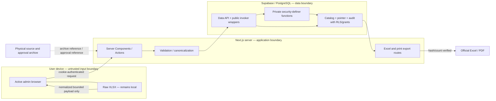

# Phase 4 Lean Threat Model

**Status:** Draft for owner and security review

**Prepared:** 2026-06-22

**Applies to:** Master Catalog administration, local Excel parsing, draft
changes, publication, history, and official Excel/PDF exports

## 1. Purpose and scope

This document records realistic abuse cases and the minimum controls required
before Phase 4 can reach Production. It is deliberately lean: it protects the
official catalog, approval evidence, audit history, and exports without adding
a separate workflow engine, online file store, or enterprise SIEM.

This model complements the
[Database and Security Contract](./17-phase4-database-security-contract.md).
It does not authorize implementation or a Production change.

In scope:

- authenticated catalog reads;
- active-admin draft creation and manual changes;
- browser-local parsing of the approved Excel profile;
- normalized import payload validation and apply;
- publish and pointer restore;
- item history and change evidence;
- server-generated official Excel and print/PDF output;
- Supabase Data API, RLS, grants, and function boundaries.

Out of scope for Phase 4 Core:

- Supabase Storage and raw-file upload;
- K-formula publication;
- BOQ Rebase;
- generic spreadsheet mapping;
- organization-wide identity-provider or monitoring redesign.

## 2. Assets and security objectives

| Asset | Required property | Why it matters |
|---|---|---|
| Published catalog rows | Integrity, immutability, availability | They are the official operational price reference |
| Current-version pointer | Integrity, atomicity | It determines the catalog used by new work |
| Draft and reconciliation | Integrity, confidentiality to admins | An incorrect diff can become an official publication |
| Stable identities and code registry | Integrity, append-only history | Recode history must not silently point to another item |
| Approval metadata | Integrity, traceability | It connects publication to business authority |
| Change sets/items | Integrity, append-only history | They explain who changed what, when, and why |
| User identity and role/status | Authenticity, least privilege | Only an active admin may mutate or publish |
| Dataset hash and item count | Integrity, reproducibility | They prove an export represents the published dataset |
| Raw workbook and physical filing reference | Confidentiality outside system, traceability | The owner retains original evidence outside the application |
| Supabase keys/cookies | Confidentiality | Exposure can bypass intended application boundaries |

## 3. Actors and trust assumptions

| Actor | Trust level | Allowed behavior |
|---|---|---|
| Anonymous visitor | Untrusted | No catalog/admin API access |
| Authenticated staff | Partially trusted | Read approved published catalog only |
| Active admin | Privileged but fallible | Create/review drafts and use controlled write functions |
| Inactive/disabled admin | Untrusted for new actions | No administrative mutation or publication |
| Application server | Trusted only with validated code/config | Authenticate, validate, query, and generate exports |
| Browser/imported workbook | Untrusted input | Parse locally; never decides authorization or validity |
| Database owner/service/secret key | Highly privileged | Server/operations only; never browser-accessible |
| Physical records custodian | External control | Retains original workbook and approval evidence |

An active-admin role does not make workbook data or client-supplied actor fields
trusted. The server and database independently validate every high-impact
operation.

## 4. Data flow and trust boundaries

Important boundaries:

1. The browser is not an authorization or validation boundary.
2. Raw workbook bytes never cross into Supabase or the application server.
3. Normalized JSON is still untrusted after client parsing.
4. Public wrappers do not directly own privileged table access.
5. Official exports are regenerated from a selected database version, never
   from browser state or the raw workbook.
6. A physical archive reference is evidence metadata, not proof by itself;
   publication still requires an authorized human decision.

## 5. Threat and control register

Risk is the residual risk after the listed controls are implemented and tested.

| ID | Threat / abuse case | Required controls | Verification evidence | Residual risk |
|---|---|---|---|---|
| T-01 | A user changes role/actor fields in the browser payload | Derive actor from authenticated server request; query active profile; repeat authorization inside DB function; never trust `user_metadata` or caller actor ID | Negative Server Action and RPC tests for staff, inactive admin, missing session, forged actor | Low |
| T-02 | A publish/import request is replayed after timeout | Unique `request_id`; idempotent prior-result behavior; expected `lock_version`; same request ID cannot represent different payload | Replay the same request and a modified payload using the same ID | Low |
| T-03 | Two admins overwrite each other or publish competing drafts | Optimistic lock on draft; stale-base comparison; transaction-scoped publish advisory lock; singleton pointer row lock | Concurrent mutation/publish test; one deterministic winner, one stable conflict code | Low |
| T-04 | Direct Data API writes bypass audit | Revoke table writes from application roles; no write RLS policy; exact wrapper grants only; database immutability/append-only guards | Grant/policy snapshot plus direct INSERT/UPDATE/DELETE denial tests | Low |
| T-05 | `SECURITY DEFINER` is hijacked through `search_path` or broad EXECUTE | Functions in unexposed `private`; `SET search_path = ''`; fully qualified objects; owner not mutable by app roles; revoke PUBLIC/anon; exact signatures | Function-definition and privilege assertions; unauthorized RPC tests | Low |
| T-06 | RLS exists but grants expose too much, or grants exist but RLS is absent | Treat grants and RLS as separate controls; enable RLS on every public Phase 4 table; explicit privilege matrix in migration | Automated role matrix and Supabase security advisor review | Low |
| T-07 | Tampered normalized payload changes prices/codes after client preview | Server revalidates schema, lengths, formats, arithmetic, cross-row uniqueness, identities, code ownership, mode rules, and payload hash; Production prices win in first rollout | Golden payload, single-field tamper, duplicate code, price-change and malformed-row tests | Low |
| T-08 | Oversized/pathological workbook or wrong Full source exhausts the app or proposes mass retirement | Client file limit 20 MB; normalized request limit 750 KB; explicit row/cell/text limits; fixed parser profile; every omission diffed; mass retirement at greater-of-10-or-2% requires typed count and owner reference | Boundary/malformed fixtures and below/at-threshold retirement tests | Medium |
| T-09 | Workbook content becomes an Excel/CSV formula injection | Read values only; never execute macros; exported data cells use explicit string/number types and never ExcelJS formula objects; no CSV export in Core; future CSV must escape `=`, `+`, `-`, `@`, tab, and CR prefixes | Malicious-cell fixture opened in Excel/LibreOffice; confirm no formula/external link | Low |
| T-10 | Workbook filename/path or displayed text causes traversal/XSS | Accept basename metadata only; bounded allowlist for extension; never construct server read paths from it; React escaping; safe `Content-Disposition` filename | Traversal/control-character/HTML filename and text tests | Low |
| T-11 | Raw workbook, formulas, or excessive error detail leaks into DB/logs | Parse locally; store only hashes, basename, archive reference, bounded error codes/counts; redact server logs; never persist raw cells/payload in error summary | DB/log inspection after failed import fixture | Low |
| T-12 | A published row, audit record, or code reservation is altered/deleted | Published-row immutability; append-only code/audit/import evidence; no app UPDATE/DELETE privilege; correction creates a new version/change set | Direct and function-path mutation denial tests | Low |
| T-13 | A retired code is assigned to a different logical item | Append-only code registry; composite `(item_code, identity_id)` FK; stable UUID identity; recode is audited | Attempt code transfer/reuse and cross-identity import | Low |
| T-14 | Export is mislabeled, stale, or generated from another version | Route accepts explicit selected version; requery server-side; compute canonical row count/hash before render; stamp version/status/effective date/hash; fail closed | Golden Excel/PDF, old-version export, changed-client-state and hash-mismatch tests | Low |
| T-15 | An official-looking draft is circulated | Admin-only draft export; prominent `DRAFT – ห้ามใช้อ้างอิง` on every page/sheet; never use Published label or approval stamp | Visual QA for Excel/PDF and print screenshots | Medium |
| T-16 | Server secret/service key is bundled into client or misused as bearer token | Browser uses publishable key only; secret key is server-only; build-time bundle scan; environment separation; no privileged key in browser Authorization header | Source/build scan, browser network inspection, deployment environment review | Low |
| T-17 | Approval/archive references or client-computed source fingerprints are invented, missing, or altered | Required bounded metadata before publish; owner-approved baseline backfill; immutable publication metadata; independent verifier rehashes the filed source; release note and physical filing check | Publish-negative tests, fingerprint comparison, and signed release checklist | Medium — human evidence remains external |
| T-18 | Lock order or long transaction causes deadlock/outage | Fixed pointer/version/identity lock order; bounded timeouts; parse/export outside transaction; deterministic item order; no external calls under lock | Concurrent rehearsal, timeout behavior, query duration evidence | Low |
| T-19 | Dependency or parser behavior changes and silently normalizes differently | Pin dependencies; fixed parser profile ID/version; golden workbook fixtures; normalized payload hash; review dependency upgrades separately | Lockfile diff review and parser/hash golden tests | Low |
| T-20 | Deleting a user makes official history unreadable | Prefer account deactivation; actor FK deletion rules; immutable actor display-name snapshot in publication/change set | User deactivation/deletion rehearsal on copied Local data | Low |
| T-21 | Feature flag is mistaken for authorization | Server and DB authorize every operation even when flag is enabled; seed boolean `false`; staff cannot invoke hidden functions directly | Direct RPC tests with flag both states and each role | Low |
| T-22 | Pointer restore rewrites published data or historical BOQs | Restore moves only singleton pointer and legacy mirror, requires active admin/reason/request ID, and appends audit; no price-row mutation | Restore rehearsal and before/after BOQ version checks | Low |

## 6. Validation boundaries and safe limits

The exact parser contract remains authoritative in
[the parser/hash specification](./14-phase4-parser-and-canonical-hash-spec.md).
Security-relevant minimums are:

- allow `.xlsx` only in Phase 4 Core;
- reject password-protected, corrupt, or unrecognized-profile workbooks;
- do not execute VBA, formulas, external links, images, or embedded objects;
- cap raw file size at 20 MB before parsing;
- cap normalized request payload at 750 KB;
- require fixed field keys; reject unknown security-sensitive fields;
- bound row count, text length, error count, and diff size;
- parse money without locale ambiguity and recompute unit cost server-side;
- normalize text deterministically for comparison/hash, while keeping approved
  display text explicit;
- reject duplicate item codes, duplicate identities, invalid group/category
  references, and attempted K-formula fields;
- return stable error codes and row/field locations, not SQL or stack traces.

The 20 MB browser file limit is not a promise that every 20 MB workbook will be
accepted. Normalized-payload and row/profile rules may reject it earlier.

## 7. Export-specific safety

1. Excel generation uses explicit cell types. Item text is never assigned as a
   formula, hyperlink, rich-text script, or external reference.
2. No official data sheet contains executable formulas; totals/counts used for
   verification are computed by the server.
3. PDF/print HTML escapes all database text and uses no untrusted HTML.
4. `Content-Disposition` uses a server-constructed safe filename, not a source
   filename supplied by the workbook.
5. Export responses use authenticated authorization, `nosniff`, and
   non-public/private cache behavior appropriate to the existing application.
6. The selected published version is explicit. Current-default state is a
   separate stamp and may change after the file is generated.
7. Binary file SHA-256 and canonical dataset SHA-256 are different controls;
   the [official export specification](./20-phase4-official-export-spec.md)
   defines both.

## 8. Logging and incident evidence

Phase 4 Core records durable business audit evidence in change sets/items,
imports, version publication metadata, and restore actions. Application logs
should contain request ID, stable operation code, outcome, duration, version
ID, and bounded counts—but no catalog payload, raw cell content, cookie, key,
or approval document contents.

Minimum response procedure:

1. disable `catalog_admin_enabled` when mutation behavior is suspect;
2. preserve the database version, change-set IDs, request IDs, relevant logs,
   exports, and physical approval evidence;
3. do not delete or edit a published version to conceal the event;
4. restore the pointer only through the audited restore function when required;
5. fix forward with a reviewed migration or correction catalog version;
6. record the incident and verification result in the release/incident record.

No new external monitoring product is required for Phase 4. Add one only when
measured operational or compliance needs justify it.

## 9. Required security tests before Production

- authorization matrix: anonymous, staff, inactive admin, active admin;
- direct table write denial for every application role;
- exact function EXECUTE grants and private-schema exposure check;
- RLS and view `security_invoker` assertions;
- definer-function `search_path`, ownership, and schema qualification review;
- malicious/malformed/oversized workbook fixtures;
- formula/external-link export fixture;
- replay, stale-lock, stale-base, and concurrent publish tests;
- immutable published rows, code registry, audit, and import evidence tests;
- export row-count/hash mismatch fail-closed tests;
- secret/client-bundle and browser-network inspection;
- Supabase security advisor review with no unresolved blocker.

Evidence belongs in the
[Phase 4 Verification Report](./13-phase4-verification-report.md), not only in
terminal history.

## 10. Review triggers

Re-review this model when any of these changes:

- new parser profile or CSV import/export;
- Supabase Storage or online approval-file handling;
- multi-step approval workflow or more administrative roles;
- K-formula or other pricing logic;
- public/anonymous catalog access;
- BOQ Rebase;
- secret/API key architecture;
- payload grows beyond the current limits or server-side parsing is introduced;
- new external integration, webhook, scheduled job, or background worker;
- a security incident, advisor blocker, or control failure.

## 11. Approval record

| Role | Name | Decision | Timestamp | Note |
|---|---|---|---|---|
| Owner |  | Pending |  |  |
| Security/RLS reviewer |  | Pending |  |  |
| Application reviewer |  | Pending |  |  |

## References

- [NIST Secure Software Development Framework (SP 800-218)](https://csrc.nist.gov/pubs/sp/800/218/final)
- [OWASP Threat Modeling Process](https://owasp.org/www-community/Threat_Modeling_Process)
- [Supabase: Securing your API](https://supabase.com/docs/guides/api/securing-your-api)
- [Supabase: Row Level Security](https://supabase.com/docs/guides/database/postgres/row-level-security)
- [Database and Security Contract](./17-phase4-database-security-contract.md)
- [ADR-004](../../02_architecture/ADR/ADR-004-phase4-catalog-governance-and-official-publication.md)
