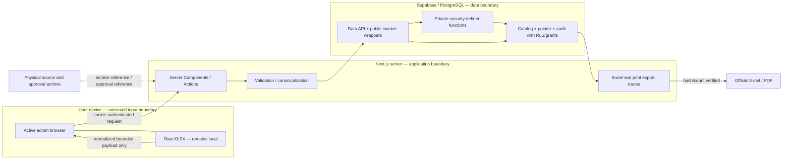

# Phase 4 Lean Threat Model

**Status:** Owner-approved as Phase 4 threat/control baseline for
implementation/local rehearsal; security/RLS and application reviewer
verification remain separate gates

**Prepared:** 2026-06-22

**Owner decision recorded:** 2026-07-04 — approved according to the
recommendation. The owner accepts the original threat/control baseline, residual
Medium risk framing, incident-response procedure, required security tests, and
re-review triggers. Required security tests, Supabase advisors, RLS/grants and
function checks, import/export malicious fixtures, BOQ/Factor F regression,
residual-risk acceptance, and re-review triggers are mandatory gates before
Production. This approval does not authorize Production change.

**P-18 threat amendment proposed:** 2026-07-12 — T-33 through T-36 define the
minimum controls for proposed WP-7.5 and the owner-found comprehension
gap. P-18 business acceptance and implementation remain pending; no Local reset
or Production action is authorized.

**Capability-audit amendment:** 2026-07-12 — T-37 through T-42 add the WP-6.6
operator/authority threats found by
[Audit #29](./29-phase4-owner-dev-completeness-audit.md). These are release
gates, not evidence that Production has been touched or that migration `020` is
implemented.

**Applies to:** Master Catalog administration, local Excel parsing, draft
changes, publication, history, and official Excel/PDF exports

## 1. Purpose and scope

This document records realistic abuse cases and the minimum controls required
before Phase 4 can reach Production. It is deliberately lean: it protects the
official catalog, approval evidence, audit history, and exports without adding
a separate workflow engine, online file store, or enterprise SIEM.

This model complements the
[Database and Security Contract](./17-phase4-database-security-contract.md).
It does not authorize implementation or a Production change.

In scope:

- authenticated catalog reads;
- active-admin draft creation and manual changes;
- browser-local parsing of the approved Excel profile;
- normalized import payload validation and apply;
- publish and pointer restore;
- item history and change evidence;
- proposed new-identity placement confirmation after P-18 acceptance;
- server-generated official Excel and print/PDF output;
- Supabase Data API, RLS, grants, and function boundaries.

Out of scope for Phase 4 Core:

- Supabase Storage and raw-file upload;
- K-formula publication;
- BOQ Rebase;
- generic spreadsheet mapping;
- organization-wide identity-provider or monitoring redesign.

## 2. Assets and security objectives

| Asset | Required property | Why it matters |
|---|---|---|
| Published catalog rows | Integrity, immutability, availability | They are the official operational price reference |
| Current-version pointer | Integrity, atomicity | It determines the catalog used by new work |
| Draft and reconciliation | Integrity, confidentiality to admins | An incorrect diff can become an official publication |
| Stable identities and code registry | Integrity, append-only history | Recode history must not silently point to another item |
| Approval metadata | Integrity, traceability | It connects publication to business authority |
| Change sets/items | Integrity, append-only history | They explain who changed what, when, and why |
| User identity and role/status | Authenticity, least privilege | Only an active admin may mutate or publish |
| Dataset hash and item count | Integrity, reproducibility | They prove an export represents the published dataset |
| Raw workbook and physical filing reference | Confidentiality outside system, traceability | The owner retains original evidence outside the application |
| Supabase keys/cookies | Confidentiality | Exposure can bypass intended application boundaries |

## 3. Actors and trust assumptions

| Actor | Trust level | Allowed behavior |
|---|---|---|
| Anonymous visitor | Untrusted | No catalog/admin API access |
| Authenticated staff | Partially trusted | Read approved published catalog only |
| Active admin | Privileged but fallible | Create/review drafts and use controlled write functions |
| Inactive/disabled admin | Untrusted for new actions | No administrative mutation or publication |
| Application server | Trusted only with validated code/config | Authenticate, validate, query, and generate exports |
| Browser/imported workbook | Untrusted input | Parse locally; never decides authorization or validity |
| Database owner/service/secret key | Highly privileged | Server/operations only; never browser-accessible |
| Physical records custodian | External control | Retains original workbook and approval evidence |

An active-admin role does not make workbook data or client-supplied actor fields
trusted. The server and database independently validate every high-impact
operation.

## 4. Data flow and trust boundaries

```mermaid
flowchart LR
    subgraph U["User device — untrusted input boundary"]
        A["Active admin browser"]
        X["Raw XLSX — remains local"]
        A --- X
    end

    subgraph S["Next.js server — application boundary"]
        R["Server Components / Actions"]
        E["Excel and print export routes"]
        V["Validation / canonicalization"]
    end

    subgraph D["Supabase / PostgreSQL — data boundary"]
        API["Data API + public invoker wrappers"]
        P["Private security-definer functions"]
        DB["Catalog + pointer + audit with RLS/grants"]
        API --> P --> DB
        API --> DB
    end

    F["Official Excel / PDF"]
    C["Physical source and approval archive"]

    X -->|"normalized bounded payload only"| A
    A -->|"cookie-authenticated request"| R
    R --> V --> API
    DB --> E -->|"hash/count verified"| F
    C -.->|"archive reference / approval reference"| R
```

Important boundaries:

1. The browser is not an authorization or validation boundary.
2. Raw workbook bytes never cross into Supabase or the application server.
3. Normalized JSON is still untrusted after client parsing.
4. Public wrappers do not directly own privileged table access.
5. Official exports are regenerated from a selected database version, never
   from browser state or the raw workbook.
6. A physical archive reference is evidence metadata, not proof by itself;
   publication still requires an authorized human decision.

## 5. Threat and control register

Risk is the residual risk after the listed controls are implemented and tested.

| ID | Threat / abuse case | Required controls | Verification evidence | Residual risk |
|---|---|---|---|---|
| T-01 | A user changes role/actor fields in the browser payload | Derive actor from authenticated server request; query active profile; repeat authorization inside DB function; never trust `user_metadata` or caller actor ID | Negative Server Action and RPC tests for staff, inactive admin, missing session, forged actor | Low |
| T-02 | A publish/import request is replayed after timeout | Client/form owns one `request_id` until a definitive result; uncertain retry reuses it; database returns prior same-payload result; expected `lock_version`; same ID cannot represent different payload | Simulate timeout after commit, retry through UI/action with the same ID, then replay a modified payload using that ID | Low |
| T-03 | Two admins overwrite each other or publish competing drafts | Optimistic lock on draft; stale-base comparison; transaction-scoped publish advisory lock; singleton pointer row lock; bounded lock timeout | Two independent DB sessions run competing mutation/publish/restore operations; one deterministic winner, one stable conflict/timeout code, one pointer | Low |
| T-04 | Direct Data API writes bypass audit | Revoke table writes from application roles; no write RLS policy; exact wrapper grants only; database immutability/append-only guards | Grant/policy snapshot plus direct INSERT/UPDATE/DELETE denial tests | Low |
| T-05 | `SECURITY DEFINER` is hijacked through `search_path` or broad EXECUTE | Functions in unexposed `private`; `SET search_path = ''`; fully qualified objects; owner not mutable by app roles; revoke PUBLIC/anon; exact signatures | Function-definition and privilege assertions; unauthorized RPC tests | Low |
| T-06 | RLS exists but grants expose too much, or grants exist but RLS is absent | Treat grants and RLS as separate controls; enable RLS on every public Phase 4 table; explicit privilege matrix in migration | Automated role matrix and Supabase security advisor review | Low |
| T-07 | Tampered normalized payload changes prices/codes after client preview | Server revalidates schema, lengths, formats, arithmetic, cross-row uniqueness, identities, code ownership, mode rules, and payload hash; Production prices win in first rollout | Golden payload, single-field tamper, duplicate code, price-change and malformed-row tests | Low |
| T-08 | Oversized/pathological workbook or wrong Full source exhausts the app or proposes mass retirement | Client file limit 20 MB; normalized request limit 750 KB; explicit row/cell/text limits; fixed parser profile; every omission diffed; mass retirement at greater-of-10-or-2% requires typed count and owner reference | Boundary/malformed fixtures and below/at-threshold retirement tests | Medium |
| T-09 | Workbook content becomes an Excel/CSV formula injection | Read values only; never execute macros; exported data cells use explicit string/number types and never ExcelJS formula objects; no CSV export in Core; future CSV must escape `=`, `+`, `-`, `@`, tab, and CR prefixes | Malicious-cell fixture opened in Excel/LibreOffice; confirm no formula/external link | Low |
| T-10 | Workbook filename/path or displayed text causes traversal/XSS | Accept basename metadata only; bounded allowlist for extension; never construct server read paths from it; React escaping; safe `Content-Disposition` filename | Traversal/control-character/HTML filename and text tests | Low |
| T-11 | Raw workbook, formulas, or excessive error detail leaks into DB/logs | Parse locally; store only hashes, basename, archive reference, bounded error codes/counts; redact server logs; never persist raw cells/payload in error summary | DB/log inspection after failed import fixture | Low |
| T-12 | A published row, audit record, or code reservation is altered/deleted | Published-row immutability; append-only code/audit/import evidence; no app UPDATE/DELETE privilege; correction creates a new version/change set | Direct and function-path mutation denial tests | Low |
| T-13 | A retired code is assigned to a different logical item | Append-only code registry; composite `(item_code, identity_id)` FK; stable UUID identity; recode is audited | Attempt code transfer/reuse and cross-identity import | Low |
| T-14 | Export is mislabeled, stale, or generated from another version | Route accepts explicit selected version; requery server-side; compute canonical row count/hash before render; stamp version/status/effective date/hash; fail closed; tracked semantic verifier avoids fixed row coordinates | Golden Excel/PDF, old-version export, changed-client-state/hash-mismatch tests, title-row movement and missing-header fixtures | Low |
| T-15 | An official-looking draft is circulated | Admin-only draft export; prominent `DRAFT – ห้ามใช้อ้างอิง` on every page/sheet; never use Published label or approval stamp | Visual QA for Excel/PDF and print screenshots | Medium |
| T-16 | Server secret/service key is bundled into client or misused as bearer token | Browser uses publishable key only; secret key is server-only; build-time bundle scan; environment separation; no privileged key in browser Authorization header | Source/build scan, browser network inspection, deployment environment review | Low |
| T-17 | Approval/archive references or client-computed source fingerprints are invented, missing, or altered | Required bounded metadata before publish; owner-approved baseline backfill; immutable publication metadata; independent verifier rehashes the filed source; release note and physical filing check | Publish-negative tests, fingerprint comparison, and signed release checklist | Medium — human evidence remains external |
| T-18 | Lock order or long transaction causes deadlock/outage | Fixed pointer/version/identity/code lock order; per-request/per-code advisory locks; bounded `5s` lock and `30s` statement settings on runtime private functions; parse/export outside transaction; deterministic item order; no external calls under lock | Concurrent rehearsal, timeout behavior, query duration evidence | Low after live WP-6.5 evidence |
| T-19 | Dependency or parser behavior changes and silently normalizes differently | Pin dependencies; fixed parser profile ID/version; golden workbook fixtures; normalized payload hash; review dependency upgrades separately | Lockfile diff review and parser/hash golden tests | Low |
| T-20 | Deleting a user makes official history unreadable | Prefer account deactivation; actor FK deletion rules; immutable actor display-name snapshot in publication/change set | User deactivation/deletion rehearsal on copied Local data | Low |
| T-21 | Feature flag is mistaken for authorization | Server and DB authorize every operation even when flag is enabled; seed boolean `false`; staff cannot invoke hidden functions directly | Direct RPC tests with flag both states and each role | Low |
| T-22 | Pointer restore rewrites published data or historical BOQs | Restore moves only singleton pointer and legacy mirror, requires active admin/reason/request ID, and appends audit; no price-row mutation | Restore rehearsal and before/after BOQ version checks | Low |
| T-23 | Master Catalog migration accidentally changes the completed Factor F baseline | Phase 4 SQL does not write Factor F tables, default pointer, grants, RLS, or BOQ factor bindings; run before/after assertions for Factor F pointer, active versions, row counts, dataset hashes, and immutability triggers | Migration contract test plus pre/post Factor F checksum and grant/policy snapshot | Low |
| T-24 | Catalog export/hash includes Factor F data because catalog and Factor F versions look similar | Treat catalog and Factor F as independent namespaces; official export route builds the dataset only from selected catalog rows; stamp says Catalog version and never substitutes Factor F version | Golden export/hash test confirms Factor F rows/metadata and BOQ snapshots are excluded | Low |
| T-25 | Legacy BOQs are silently bound to the current Factor F version or existing BOQ factor bindings mutate | Do not backfill old BOQs without exact evidence; preserve `boq.factor_reference_version_id`; use the explicit copy-to-selected-Factor-F path when a user chooses a new BOQ | Regression tests for legacy snapshot-only, version-bound, missing-snapshot fail-closed, duplicate, and selected-Factor-F copy states | Low |
| T-26 | A Factor F change is mistakenly treated as part of Master Catalog Phase 4 | Runbook stop condition says no Factor F pointer/value movement is scheduled or bundled into the Master Catalog window; any Factor F write under this CR is a blocker | Release checklist, migration ledger review, and before/after pointer evidence show the completed Factor F baseline was preserved | Low |
| T-27 | Clean environments contain the same business catalog but produce unrelated hashes because baseline identities are random | Approved P-20 maps each baseline identity from immutable Production-derived `price_list.id`, keeps it in the lineage hash, and fails closed on prior mismatch/collision/coverage defects; do not claim equivalence before independent rebuild proof | Two clean approved environments/rebuilds reproduce the selected identity mapping and canonical hash | Medium until WP-6.5C evidence closes |
| T-28 | The first future supplement/year requires a code or migration hotfix because reusable paths hardcode `2568.1.0` | ADR-003 version validation is generic; exact candidate values exist only in fixtures/approved release metadata | Create/publish rehearsal for another valid annual/revision/patch version plus duplicate/invalid cases | Medium until WP-6.5 closes |
| T-29 | An admin completes a draft/import and learns only at publish or filing that placement, structured-code completeness, or retirement policy blocks it | Read P-18/structured counts from the same DB helper used by publish; mirror warnings in import preview/readiness with Thai remediation; expose inactive-row P-19 filing warning without inventing a new publish rule; DB remains final invariant | UAT adds/new identities, begins structured recode, and retires rows; sees blockers/warnings before final publish/filing and preserves a reviewable draft | Medium until P-18/P-19 workflow gates close |
| T-30 | Status, migration order, hashes, or rollback instructions drift across documents | Tracker authority/evidence index; single-owner facts; docs consistency check; fix-forward wording in migration/runbook authority | Automated authority-link/order/decision check plus reviewer grep/diff | Low after WP-6.5 |
| T-31 | Hotfix `016` appears protected because SQL text tests pass while live BOQ save behavior regresses | Permanent Local DB/RPC suite covers all approved suffixes, catalog-authoritative fields, role/version negatives, and atomic rollback; run on relevant PR/rehearsal gates | Execute real `save_boq_with_routes` scenarios and Factor F/BOQ before/after snapshots | Medium until WP-7 closes |
| T-32 | A multi-row mutation returns a safe validation error after an earlier row/change set already committed | Validate full payload before writes; fingerprint request/payload; lock desired codes; mutation writes run in a nested transaction block whose structured abort rolls back item, identity, code, and audit writes before returning the error | Live duplicate/collision and injected mutation-time failure prove row/code/change-set counts and lock version remain unchanged | Low after WP-6.5 live rollback evidence |
| T-33 | A UI or privileged caller changes `display_order` without accepted placement governance, reorders inherited identities, or creates duplicate/gapped order | Direct writes revoked; exact placement RPC; active-admin check; deferrable unique `(version_id, display_order)`; contiguous-range and inherited-relative-order validation; publish rechecks the same invariants | Direct-write denial plus valid insertion, inherited swap, duplicate, gap, and cross-category anchor tests | Low after P-18/WP-7.5 |
| T-34 | A placement was accepted, then a new identity/category/order change makes it stale while readiness still reports green | DB-owned placement revision increments on every placement-relevant mutation; append-only review must match current revision and exact new-identity coverage; publish uses the same private helper | Confirm placement, then add/change a row; readiness and publish return `P18_PLACEMENT_REVIEW_REQUIRED` until reconfirmed | Low after P-18/WP-7.5 |
| T-35 | Inserting one row shifts hundreds of inherited numeric positions and partially commits, loses audit, or races another admin | One short transaction; draft/version lock plus request fingerprint and expected lock; deferrable uniqueness; deterministic renumber; complete old/new `place` snapshots for every shifted row; rollback on any rejection | Concurrent and injected-failure tests prove one outcome and zero partial rows/revisions/reviews/change items; performance measured at 710+ rows | Low after P-18/WP-7.5 |
| T-36 | Technically safe UI language, rehearsal defaults, or prominent UUID/lock details cause an admin to mistake draft save for publication or submit fictional evidence | Thai-first labels/actions/status; no WP/local placeholder defaults; clear draft-save versus whole-version publish hierarchy; support details demoted but copyable; intended-admin comprehension UAT | Browser review and UAT explain version/draft/publish, complete one save, recover from an error, and identify real required evidence without developer help | Medium until WP-6.6/WP-8 UAT close |
| T-37 | A partial 20-row view or hidden automatic draft choice causes the admin to miss an item, edit the wrong draft, or discover stale base only after submit | Full-catalog read within measured threshold; exact item/draft selection; all current/stale drafts visible; stale drafts read-only; server still verifies exact version/base/lock | Browser/UAT search first/middle/last rows, switch two drafts, and prove stale controls are disabled before submit | Medium until WP-6.6 |
| T-38 | Free-form category/group names or caller-selected codes create unapproved taxonomy, collide, or refill a retired sequence | Freeze Production-derived versioned categories and P-06 code groups; resolve existing IDs only; locked server allocator uses next never-issued sequence and stops at 900; future dictionary authoring is separate governance | Unknown category/group denial, concurrent allocation, retired-gap, collision, capacity, and exact frozen-rollout fixtures | Medium until WP-6.6 |
| T-39 | Client preview omits exact effects/omissions, runtime treats a draft docs CSV as authority, or no supported new-row price evidence exists, so approval is uninformed or Supplement cannot complete | Freeze first-rollout mapping in reviewed implementation/database authority; future reconciliation uses exact draft/dictionaries; server-recomputed complete diff/omission set; persisted preview fingerprint; bounded batch authority with per-row override only when needed | Evidence-file non-authority, add/update/recode/retire/unchanged, below/at-threshold omission, and approved/missing/mismatched authority tests | Medium until WP-6.6 |
| T-40 | Caller types a misleading publisher name, impossible date escapes stable validation, manual-only publication lacks an archive reference, or preliminary readiness reports green while final publish rejects quality/stale base | Derive actor snapshot from authenticated profile; semantically parse dates; require version archive reference; one private readiness result owns stale-base/full-quality/P-18/structured counts and is consumed by UI and publish | Caller actor spoof, invalid-calendar-date, manual-only archive negative/positive, and readiness/publish parity fixtures | Medium until WP-6.6 |
| T-41 | Mistaken retire or never-published add has no correction path, encouraging direct SQL, audit deletion, or needless draft reconstruction | Explicit audited reactivate; base-absent withdraw removes only draft row while preserving identity/code/audit; direct writes remain denied | Valid/invalid correction, published/base identity denial, replay, stale lock, rollback, and history tests | Medium until WP-6.6 |
| T-42 | Nullable required price/order fields or duplicate/gapped order survive ordinary writes and fail only at publication | Post-preflight fix-forward nullability/order constraints plus shared quality checks; P-18 adds deferrable unique/contiguous placement order when accepted | Zero-null preflight, constraint violation, compatibility, clone, import, publication, and placement tests | Medium until WP-6.6/P-18 |

## 6. Validation boundaries and safe limits

The exact parser contract remains authoritative in
[the parser/hash specification](./14-phase4-parser-and-canonical-hash-spec.md).
Security-relevant minimums are:

- allow `.xlsx` only in Phase 4 Core;
- reject password-protected, corrupt, or unrecognized-profile workbooks;
- do not execute VBA, formulas, external links, images, or embedded objects;
- cap raw file size at 20 MB before parsing;
- cap normalized request payload at 750 KB;
- require fixed field keys; reject unknown security-sensitive fields;
- bound row count, text length, error count, and diff size;
- parse money without locale ambiguity and recompute unit cost server-side;
- normalize text deterministically for comparison/hash, while keeping approved
  display text explicit;
- reject duplicate item codes, duplicate identities, invalid group/category
  references, and attempted K-formula fields;
- return stable error codes and row/field locations, not SQL or stack traces.

The 20 MB browser file limit is not a promise that every 20 MB workbook will be
accepted. Normalized-payload and row/profile rules may reject it earlier.

## 7. Export-specific safety

1. Excel generation uses explicit cell types. Item text is never assigned as a
   formula, hyperlink, rich-text script, or external reference.
2. No official data sheet contains executable formulas; totals/counts used for
   verification are computed by the server.
3. PDF/print HTML escapes all database text and uses no untrusted HTML.
4. `Content-Disposition` uses a server-constructed safe filename, not a source
   filename supplied by the workbook.
5. Export responses use authenticated authorization, `nosniff`, and
   non-public/private cache behavior appropriate to the existing application.
6. The selected published version is explicit. Admin/Excel may record
   current-default state, which can change after generation; the field-facing
   PDF omits the technical field and uses the P-11 Thai retrospective warning
   when the selected published version is non-current.
7. Binary file SHA-256 and canonical dataset SHA-256 are different controls;
   the [official export specification](./20-phase4-official-export-spec.md)
   defines both.

## 8. Logging and incident evidence

Phase 4 Core records durable business audit evidence in change sets/items,
imports, version publication metadata, and restore actions. Application logs
should contain request ID, stable operation code, outcome, duration, version
ID, and bounded counts—but no catalog payload, raw cell content, cookie, key,
or approval document contents.

Minimum response procedure:

1. disable `catalog_admin_enabled` when mutation behavior is suspect;
2. preserve the database version, change-set IDs, request IDs, relevant logs,
   exports, and physical approval evidence;
3. do not delete or edit a published version to conceal the event;
4. restore the pointer only through the audited restore function when required;
5. fix forward with a reviewed migration or correction catalog version;
6. record the incident and verification result in the release/incident record.

No new external monitoring product is required for Phase 4. Add one only when
measured operational or compliance needs justify it.

## 9. Required security tests before Production

- authorization matrix: anonymous, staff, inactive admin, active admin;
- direct table write denial for every application role;
- exact function EXECUTE grants and private-schema exposure check;
- RLS and view `security_invoker` assertions;
- definer-function `search_path`, ownership, and schema qualification review;
- malicious/malformed/oversized workbook fixtures;
- formula/external-link export fixture;
- replay, stale-lock, stale-base, and concurrent publish tests;
- full-catalog browse/history and explicit multi-draft/stale read-only tests;
- versioned-category/P-06-group resolve-only and next-never-issued allocator role/race/capacity
  tests;
- complete import diff/omission and price-authority evidence tests;
- authenticated publisher/version-archive/readiness-publish parity tests;
- reactivate/withdraw identity-code-audit preservation and schema-constraint
  tests;
- after P-18 acceptance, placement role/direct-write, stale-review, invalid
  anchor/order, inherited-relative-order, full shifted-row audit, rollback, and
  concurrent confirmation tests;
- immutable published rows, code registry, audit, and import evidence tests;
- export row-count/hash mismatch fail-closed tests;
- secret/client-bundle and browser-network inspection;
- Supabase security advisor review with no unresolved blocker.

Evidence belongs in the
[Phase 4 Verification Report](./13-phase4-verification-report.md), not only in
terminal history.

## 10. Review triggers

Re-review this model when any of these changes:

- new parser profile or CSV import/export;
- Supabase Storage or online approval-file handling;
- multi-step approval workflow or more administrative roles;
- K-formula or other pricing logic;
- public/anonymous catalog access;
- BOQ Rebase;
- secret/API key architecture;
- payload grows beyond the current limits or server-side parsing is introduced;
- new external integration, webhook, scheduled job, or background worker;
- a security incident, advisor blocker, or control failure.
- new placement/reorder scope, a second approver role, or permission to reorder
  inherited identities.

## 11. Approval record

| Role | Name | Decision | Timestamp | Note |
|---|---|---|---|---|
| Owner | Owner | Approved for implementation/local rehearsal | 2026-07-04 | Production change remains separate; reviewer verification still required |
| Security/RLS reviewer |  | Pending |  |  |
| Application reviewer |  | Pending |  |  |

## References

- [NIST Secure Software Development Framework (SP 800-218)](https://csrc.nist.gov/pubs/sp/800/218/final)
- [OWASP Threat Modeling Process](https://owasp.org/www-community/Threat_Modeling_Process)
- [Supabase: Securing your API](https://supabase.com/docs/guides/api/securing-your-api)
- [Supabase: Row Level Security](https://supabase.com/docs/guides/database/postgres/row-level-security)
- [Database and Security Contract](./17-phase4-database-security-contract.md)
- [ADR-004](../../02_architecture/ADR/ADR-004-phase4-catalog-governance-and-official-publication.md)
